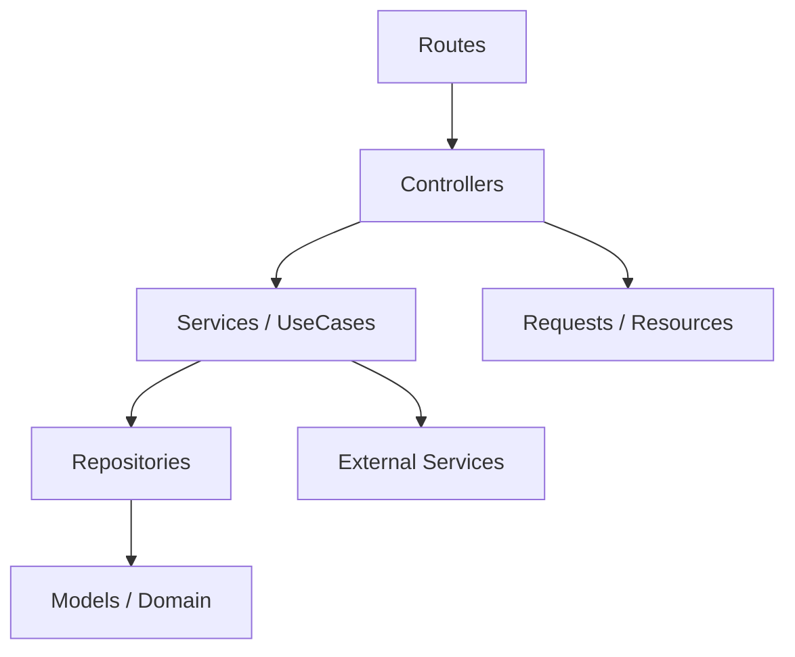
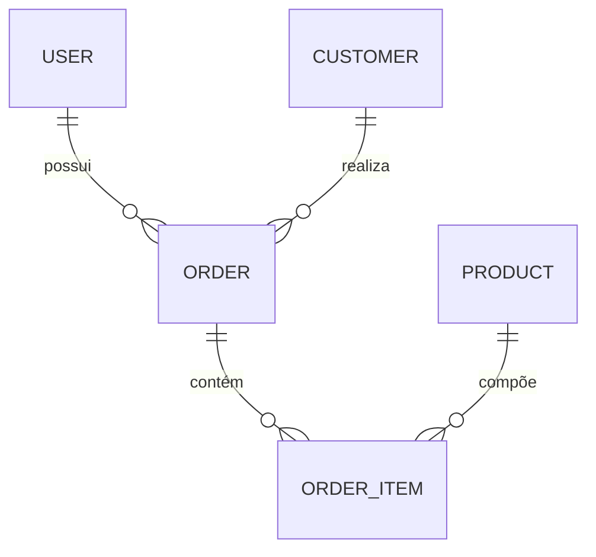
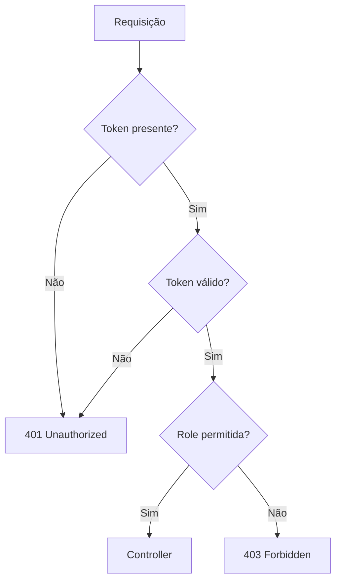
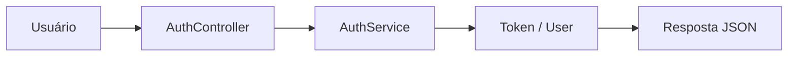
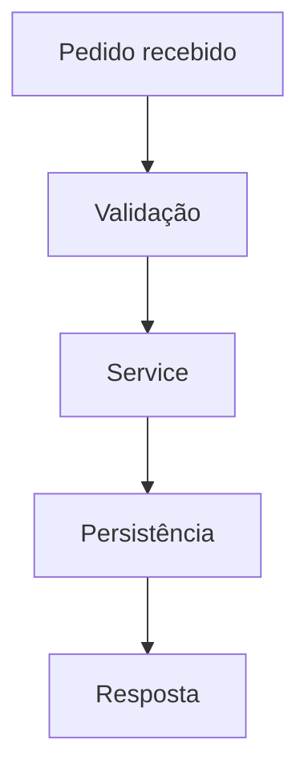

# SimplyFood Backend - Technical Guide

<!--
Este documento consolida a visão técnica do backend do projeto Simplify Food.
Ele serve como referência principal para arquitetura, fluxo de desenvolvimento,
API, autenticação, modelos de dados e convenções de manutenção.
-->

## 1. Project Overview

### Objetivo
O backend do SimplyFood é responsável por fornecer a API principal do sistema, concentrando a regra de negócio, autenticação, validação, persistência e integração com serviços externos.

### Escopo
- autenticação e autorização
- gestão de clientes
- gestão de produtos
- gestão de pedidos
- integração com serviços externos
- exposição de endpoints JSON para o frontend

### Arquitetura geral
O backend segue uma abordagem de arquitetura limpa com separação em camadas:



### Responsabilidades do Backend
- processar requisições HTTP
- validar entradas
- aplicar regras de negócio em Services/UseCases
- persistir dados via Eloquent
- proteger endpoints por middleware e papéis
- padronizar respostas da API

### Convenções adotadas
- controllers finos
- services para regras de negócio
- models como camada de domínio
- repositories para abstração de persistência
- testes obrigatórios via TDD

---

## 2. Sprints

### Sprint 01 - Fundação e autenticação
- ID: S01
- Nome: Foundation & Auth
- Objetivo: estruturar a base da API e disponibilizar autenticação inicial
- Status: Em andamento
- Responsável: Backend Team
- Dependências: Laravel, Docker, banco de dados
- Checklist:
  - [x] estrutura base do Laravel
  - [x] rotas públicas de autenticação
  - [x] middleware de validação de token
  - [ ] cobertura completa de testes de auth
- Prioridade: Alta
- Entregues: login, registro, health check
- Pendentes: testes e refinamento de permissões
- Riscos: inconsistência entre papéis e permissões
- Bloqueios: nenhum

### Sprint 02 - Gestão operacional
- ID: S02
- Nome: Customers, Products and Orders
- Objetivo: disponibilizar os fluxos principais de gestão operacional
- Status: Planejado
- Responsável: Backend Team
- Dependências: S01
- Checklist:
  - [ ] CRUD de clientes
  - [ ] CRUD de produtos
  - [ ] fluxo de pedidos
  - [ ] alteração de status de pedido
- Prioridade: Alta
- Entregues: estrutura inicial
- Pendentes: implementação completa
- Riscos: mudanças de regra de negócio
- Bloqueios: dependência de integração com frontend

---

## 3. Features

<!--
Cada feature abaixo representa um fluxo funcional documentado para manutenção.
Não alterar a responsabilidade de cada módulo sem revisar os impactos de autenticação,
validação e contratos de API.
-->

### Feature 1 - Health Check
- Nome: Health Check
- Descrição: endpoint para verificar a disponibilidade da API
- Objetivo: validar se a aplicação responde corretamente
- Fluxo: requisição simples -> resposta JSON
- Dependências: nenhuma
- Arquivos envolvidos: routes/api.php
- Controllers: nenhum
- Services: nenhum
- Models: nenhum
- Endpoints: GET /api/health
- Status: Ativo

### Feature 2 - Autenticação
- Nome: Authentication
- Descrição: login e registro do sistema
- Objetivo: gerar sessão/autenticação para uso das rotas protegidas
- Fluxo: cliente envia credenciais -> AuthController -> AuthService -> token/usuário
- Dependências: banco de dados, usuário
- Arquivos envolvidos: app/Http/Controllers/AuthController.php, app/Application/Services/AuthService.php
- Controllers: AuthController
- Services: AuthService
- Models: User
- Endpoints: POST /api/auth/login, POST /api/auth/register
- Status: Ativo

### Feature 3 - Gestão de Clientes
- Nome: Customer Management
- Descrição: cadastro, consulta e atualização de clientes
- Objetivo: centralizar dados de clientes para operações comerciais
- Fluxo: requisição -> controller -> service -> repository -> model
- Dependências: autenticação, permissões por role
- Arquivos envolvidos: app/Http/Controllers/CustomerController.php, app/Application/Services/CustomerService.php
- Controllers: CustomerController
- Services: CustomerService
- Models: Customer
- Endpoints: GET /api/customers, GET /api/customers/{id}, PUT /api/customers/{id}, DELETE /api/customers/{id}
- Status: Parcialmente implementado

### Feature 4 - Gestão de Produtos
- Nome: Product Management
- Descrição: manipulação de catálogo de produtos
- Objetivo: permitir manutenção do cardápio ou catálogo base
- Fluxo: requisição -> controller -> service -> persistence
- Dependências: autenticação e papéis
- Arquivos envolvidos: app/Http/Controllers/ProductController.php
- Controllers: ProductController
- Services: ProductService
- Models: Product
- Endpoints: GET /api/products, GET /api/products/active, POST /api/products
- Status: Parcialmente implementado

### Feature 5 - Gestão de Pedidos
- Nome: Order Management
- Descrição: criação, consulta e atualização de pedidos
- Objetivo: controlar ciclo operacional e status do pedido
- Fluxo: pedido criado -> status alterado -> consulta do pedido
- Dependências: clientes, produtos, autenticação
- Arquivos envolvidos: app/Http/Controllers/OrderController.php, app/Application/Services/OrderService.php
- Controllers: OrderController
- Services: OrderService
- Models: Order
- Endpoints: GET /api/orders, GET /api/orders/{id}, POST /api/orders, PATCH /api/orders/{id}/status
- Status: Parcialmente implementado

---

## 4. Acceptance Criteria

### Autenticação
- Given um usuário válido
- When enviar credenciais corretas
- Then deve receber token e dados do usuário

- Given credenciais inválidas
- When tentar autenticar
- Then deve receber 401 Unauthorized

- Given usuário sem permissão
- When acessar rota protegida
- Then deve receber 403 Forbidden

### Gestão de Clientes
- Checklist funcional:
  - [ ] cadastro com dados válidos
  - [ ] rejeição de dados inválidos
  - [ ] consulta por identificador
  - [ ] atualização de dados
  - [ ] remoção lógica ou física conforme regra vigente

### Gestão de Pedidos
- Checklist funcional:
  - [ ] pedido criado com sucesso
  - [ ] status alterado corretamente
  - [ ] validação de status inválido
  - [ ] resposta semântica em caso de erro

---

## 5. API Specification

### Endpoints principais

| Endpoint | Method | Controller | Action | Middleware | Autenticação |
| --- | --- | --- | --- | --- | --- |
| /api/health | GET | - | closure | - | Pública |
| /api/auth/login | POST | AuthController | login | - | Pública |
| /api/auth/register | POST | AuthController | register | - | Pública |
| /api/customers | GET | CustomerController | get | token.valid, auth.system | Privada |
| /api/customers/{id} | GET | CustomerController | show | token.valid, auth.system | Privada |
| /api/products | GET | ProductController | get | token.valid, auth.system | Privada |
| /api/products/active | GET | ProductController | getActive | token.valid, auth.system | Privada |
| /api/orders | GET | OrderController | get | token.valid, auth.system | Privada |
| /api/orders/{id}/status | PATCH | OrderController | changeStatus | token.valid, auth.system | Privada |

### Payload example - Login
```json
{
  "email": "admin@email.com",
  "password": "********"
}
```

### Response example - Login
```json
{
  "status": "success",
  "data": {
    "token": "...",
    "user": {
      "id": 1,
      "name": "Administrador",
      "email": "admin@email.com",
      "role": "ADMIN"
    }
  },
  "message": "Login realizado com sucesso!"
}
```

### Status codes
- 200 OK: sucesso em consultas e autenticações válidas
- 201 Created: criação realizada com sucesso
- 204 No Content: quando aplicável
- 400 Bad Request: payload inválido ou erro de cadastro
- 401 Unauthorized: token ausente ou inválido
- 403 Forbidden: sem permissão para o papel exigido
- 404 Not Found: recurso inexistente
- 422 Unprocessable Entity: payload semântico inválido
- 500 Internal Server Error: erro inesperado

---

## 6. Data Models

### Modelos principais
- User
- Customer
- Product
- Order
- OrderItem

### Relacionamentos principais


### Model - User
- atributos: id, name, email, password, role
- constraints: email único, senha obrigatória
- regras: autenticação e autorização por role

### Model - Customer
- atributos: id, name, email, phone, whatsapp, cpf_cnpj
- constraints: campos obrigatórios conforme regra de negócio
- relacionamentos: possui pedidos

### Model - Product
- atributos: id, name, price, description, status
- regras: catálogo e disponibilidade

### Model - Order
- atributos: id, customer_id, status, total
- regras: fluxo de status e validação

---

## 7. Stack

### Backend
- Laravel 12
- PHP 8.2+
- Composer
- MySQL
- Docker Compose

### Infraestrutura
- Docker
- Nginx
- Redis
- Git
- GitHub

### Qualidade
- Pest
- PHPUnit
- Pint

---

## 8. Coder Agent

### Backend Agent
- Agent ID: BACKEND-AGENT
- Nome: Backend Engineer
- Responsabilidade: manter APIs, services, controllers, models e regras de negócio
- Escopo: app/, routes/, database/, tests/
- Permissões: leitura e escrita em código funcional
- Arquivos protegidos: rotas críticas, middlewares, políticas de segurança
- Prioridade: Alta

### Documentation Agent
- Agent ID: DOC-AGENT
- Nome: Documentation Maintainer
- Responsabilidade: manter esta documentação atualizada
- Escopo: AGENTS.md, README.md, DOCKER.md, HOW_TO_USE.md
- Permissões: editar documentação
- Arquivos protegidos: documentação de arquitetura e políticas
- Prioridade: Média

---

## 9. File Structure

```text
backend/
  app/
    Application/
    Domains/
    Http/
    Infrastructure/
    Shared/
  database/
  routes/
  tests/
  public/
  config/
  resources/
```

### Comentários de estrutura
- app/Application: orchestration e regras de aplicação
- app/Domains: entidades e regras de domínio
- app/Http: controllers, requests, middleware, resources
- app/Infrastructure: integrações e persistência abstrata
- database: migrations e seeders
- routes: definição de endpoints HTTP
- tests: testes unitários e feature

---

## 10. Authentication

### Fluxo de autenticação


### Regras atuais
- rotas públicas: /api/health, /api/auth/login, /api/auth/register
- rotas protegidas: customers, products, orders
- middleware: token.valid e auth.system:ADMIN,MANAGER,OPERATOR

### Respostas esperadas
- 401 Unauthorized: token ausente ou inválido
- 403 Forbidden: papel não autorizado

---

## 11. Validation

### Validações de autenticação
- email: required, email
- password: required, string

### Validações de cadastro
- name: required
- email: required, email, unique
- password: required, min:6

### Validações de pedidos
- status: obrigatório quando houver alteração
- payload: deve ser semanticamente válido

---

## 12. Fluxos principais

### Fluxo de login


### Fluxo de pedido


---

## 13. Arquitetura

### Arquitetura Backend
- camada de entrada: routes + controllers
- camada de aplicação: services/use cases
- camada de domínio: models e regras centrais
- camada de infraestrutura: repositories e integrações externas

### Comunicação entre camadas
- controllers não devem conter regra de negócio
- services orquestram o fluxo principal
- repositories isolam acesso à persistência
- middleware protege entradas sensíveis

---

## 14. Auditoria Estrutural do Projeto

### Relatório de auditoria recomendada
| Arquivo | Motivo | Dependências | Impacto | Pode ser removido? |
| --- | --- | --- | --- | --- |
| arquivos temporários | geralmente gerados por execução local | dependem do ambiente | baixo | Sim, se não forem funcionais |
| caches de build | artefatos de compilação | não devem ser versionados | baixo | Sim |
| arquivos de ambiente locais | segredos e configuração local | não devem ser compartilhados | alto | Não, sem revisão |
| arquivos de storage público | podem ser gerados automaticamente | dependem do runtime | médio | Sim, se não forem parte do source |

### Limpeza estrutural
- remover apenas diretórios vazios, caches, artefatos temporários e arquivos gerados automaticamente
- não remover arquivos funcionais sem confirmação explícita
- priorizar segurança e preservação da estrutura atual

### 8.4. Códigos de erro possíveis nas autenticações e retornos

- `401 Unauthorized`
  - Utilizado quando o token não é enviado, é inválido ou não passa pela validação de `token.valid`.
  - Exemplo de retorno:
    ```json
    {
      "message": "Unauthorized: Token is missing or invalid.",
      "status": "error"
    }
    ```

- `401 Unauthorized` nas rotas de autenticação
  - O controller de login retorna `401` quando as credenciais são inválidas ou a autenticação falha.

- `400 Bad Request`
  - Utilizado no endpoint de registro quando os dados enviados não passam na validação ou no fluxo de criação.

- `403 Forbidden`
  - Esperado quando o usuário está autenticado, mas não possui um dos papéis permitidos (`ADMIN`, `MANAGER` ou `OPERATOR`) para acessar uma rota protegida.

- `422 Unprocessable Entity`
  - Utilizado em operações específicas, como alteração de status de pedido, quando o payload recebido é semanticamente inválido.

### 8.5. Regras de negócio para as rotas protegidas

- As rotas protegidas devem sempre ser tratadas como operações sensíveis e exigirem autenticação explícita.
- A validação de token ocorre antes de qualquer execução de controller.
- A autorização por role ocorre depois da validação de identidade.
- Controllers continuam finos; a lógica de negócio deve permanecer em Services/UseCases.

---

## 9. Camada TDD (Test-Driven Development)

### Princípios do TDD no SimplifyFood

1. **Red → Green → Refactor**
2. Testes como Especificação Executável
3. Isolamento total com Mocks
4. Cobertura mínima de 80% em Application e Domain
5. Todo novo código deve ser precedido por testes

## 10. Variáveis Recomendadas no .env (Exemplo) 

# ==================== APP CONFIG ====================
APP_NAME=SimplifyFood
APP_ENV=local                    # Opções: local | homologacao | production | testing
APP_KEY=
APP_DEBUG=true
APP_URL=http://localhost
APP_TIMEZONE=America/Sao_Paulo

# ==================== DATABASE ====================
DB_CONNECTION=pgsql
DB_HOST=127.0.0.1
DB_PORT=5432
DB_DATABASE=simplifyfood
DB_USERNAME=postgres
DB_PASSWORD=password

# ==================== CACHE & QUEUE ====================
CACHE_DRIVER=redis
QUEUE_CONNECTION=redis
SESSION_DRIVER=redis

# ==================== REDIS ====================
REDIS_HOST=127.0.0.1
REDIS_PASSWORD=null
REDIS_PORT=6379

# ==================== EXTERNAL SERVICES ====================
VIACEP_BASE_URL=https://viacep.com.br/ws
MERCADOPAGO_PUBLIC_KEY=TEST-...
MERCADOPAGO_ACCESS_TOKEN=TEST-...

# ==================== LOGGING ====================
LOG_CHANNEL=stack
LOG_DEPRECATIONS_CHANNEL=null
LOG_LEVEL=debug

# ==================== MAIL ====================
MAIL_MAILER=smtp
MAIL_HOST=smtp.mailtrap.io
MAIL_PORT=2525
MAIL_USERNAME=null
MAIL_PASSWORD=null
MAIL_ENCRYPTION=null
MAIL_FROM_ADDRESS="no-reply@simplifyfood.com.br"
MAIL_FROM_NAME="${APP_NAME}"

# ==================== SANCTUM / AUTH ====================
SANCTUM_STATEFUL_DOMAINS=localhost:3000,127.0.0.1:8000

# ==================== TESTING ====================
TEST_DB_DATABASE=simplifyfood_test
TEST_DB_USERNAME=postgres
TEST_DB_PASSWORD=password


### Estrutura Recomendada de Testes

```bash
tests/
├── Unit/
│   ├── Application/
│   │   ├── Services/
│   │   │   ├── CustomerServiceTest.php
│   │   │   ├── OrderServiceTest.php
│   │   │   └── PaymentServiceTest.php
│   │   └── UseCases/
│   │       └── ProcessPaymentUseCaseTest.php
│   ├── Domains/
│   │   ├── Customer/
│   │   │   ├── CustomerTest.php
│   │   │   └── AddressTest.php
│   │   └── Order/
│   │       └── OrderTest.php
│   └── Infrastructure/
│       └── Repositories/
│           └── CustomerRepositoryTest.php
├── Feature/
│   ├── Customer/
│   │   └── CustomerApiTest.php
│   ├── Order/
│   │   └── OrderApiTest.php
│   └── Payment/
│       └── PaymentFlowTest.php
└── Architecture/
    └── CleanArchitectureTest.php
```

### Exemplo Completo: CustomerServiceTest.php

```php
<?php

namespace Tests\Unit\Application\Services;

use App\Application\Services\CustomerService;
use App\Infrastructure\Repositories\CustomerRepository;
use App\Domains\Customer\Customer;
use Illuminate\Support\Facades\Http;
use Mockery;
use Tests\TestCase;

class CustomerServiceTest extends TestCase
{
    protected CustomerService $service;
    protected CustomerRepository $repository;

    protected function setUp(): void
    {
        parent::setUp();
        $this->repository = Mockery::mock(CustomerRepository::class);
        $this->service = new CustomerService($this->repository);
    }

    /** @test */
    public function it_creates_a_new_customer_and_fetches_address_via_viacep()
    {
        // Arrange
        $data = [
            'name' => 'João Silva',
            'email' => 'joao@test.com',
            'phone' => '11999999999',
            'whatsapp' => '11999999999',
            'cpf_cnpj' => '12345678901',
            'cep' => '01001000'
        ];

        $mockedAddress = ['logradouro' => 'Praça da Sé', 'bairro' => 'Sé', 'localidade' => 'São Paulo'];

        Http::fake([
            'viacep.com.br/*' => Http::response($mockedAddress, 200)
        ]);

        $this->repository->shouldReceive('create')
            ->once()
            ->with(Mockery::subset($data))
            ->andReturn(new Customer($data));

        // Act
        $customer = $this->service->create($data);

        // Assert
        $this->assertInstanceOf(Customer::class, $customer);
        $this->assertEquals('João Silva', $customer->name);
    }

    /** @test */
    public function it_throws_exception_when_customer_already_exists_by_whatsapp()
    {
        $this->expectException(\Exception::class);

        $this->repository->shouldReceive('findByWhatsapp')
            ->once()
            ->andReturn(new Customer(['whatsapp' => '11999999999']));

        $this->service->create(['whatsapp' => '11999999999']);
    }
}
```

### Exemplo Feature Test: CustomerApiTest.php

```php
<?php

namespace Tests\Feature\Customer;

use Tests\TestCase;

class CustomerApiTest extends TestCase
{
    /** @test */
    public function it_can_create_a_customer_via_api()
    {
        $payload = [
            'name' => 'Maria Oliveira',
            'email' => 'maria@test.com',
            'whatsapp' => '11988888888',
            'cpf_cnpj' => '98765432100'
        ];

        $response = $this->postJson('/api/customers', $payload);

        $response->assertStatus(201)
                 ->assertJsonStructure([
                     'data' => ['id', 'name', 'email', 'whatsapp'],
                     'message'
                 ]);

        $this->assertDatabaseHas('customers', ['email' => 'maria@test.com']);
    }
}
```

---

### Comandos Úteis

```bash
# Testes Unitários
php artisan test --filter CustomerServiceTest

# Testes de Feature
php artisan test --testsuite=Feature

# Cobertura de Código
php artisan test --coverage

# Watch mode (com Pest)
./vendor/bin/pest --watch
```

**Recomendações de Pacotes:**
- `pestphp/pest` + `pestphp/pest-plugin-arch`
- `mockery/mockery`
- `phpstan/phpstan` (opcional para análise estática)

---

## 10. Segregação e Configuração de Ambientes

O projeto suporta a segregação completa entre os ambientes: `local`, `homologacao`, `production` e `testing`.

### Diretrizes de Segurança e Configurações Customizadas

Para garantir a segregação e robustez entre os ambientes no nível do framework, foram aplicadas as seguintes lógicas customizadas:

- **Timezone e Segurança em [config/app.php](file:///c:/Users/MITALO/Desktop/simplyfood/backend/config/app.php)**:
  - O timezone da aplicação lê dinamicamente a variável `APP_TIMEZONE` do `.env` (com fallback para `'America/Sao_Paulo'`).
  - A opção `debug` é forçada a `false` em ambiente de produção (`APP_ENV === 'production'`), independente do que estiver definido em `APP_DEBUG`, evitando exibição indesejada de dados sensíveis.

- **Banco de Dados em [config/database.php](file:///c:/Users/MITALO/Desktop/simplyfood/backend/config/database.php)**:
  - A conexão `mysql` detecta se o ambiente atual é `testing`. Caso afirmativo, ela substitui dinamicamente o banco, o usuário e a senha pelas variáveis `TEST_DB_DATABASE`, `TEST_DB_USERNAME` e `TEST_DB_PASSWORD`.

- **Mapeamento de Testes em [phpunit.xml](file:///c:/Users/MITALO/Desktop/simplyfood/backend/phpunit.xml)**:
  - A suíte de testes padrão usa SQLite em memória (`:memory:`) por questões de performance.
  - Para rodar testes no PostgreSQL real (como em pipelines de CI ou homologação), os desenvolvedores podem criar um arquivo `.env.testing` baseado em `.env.testing.example`, cujas variáveis sobrescreverão as do `phpunit.xml`.

---

### Comandos de Configuração por Ambiente

#### Ambiente Local
```bash
# 1. Copiar as variáveis de ambiente
cp .env.example .env

# 2. Instalar dependências
composer install

# 3. Gerar a chave da aplicação
php artisan key:generate

# 4. Rodar as migrações locais
php artisan migrate
```

#### Ambiente de Homologação / Produção
```bash
# 1. Copiar variáveis de ambiente do respectivo ambiente
cp .env.example .env # E preencher com as credenciais reais

# 2. Instalar dependências otimizadas (sem dev)
composer install --no-dev --optimize-autoloader

# 3. Otimizar carregamento de arquivos do Laravel
php artisan config:cache
php artisan route:cache
php artisan view:cache

# 4. Rodar as migrações de produção com segurança (force)
php artisan migrate --force
```

#### Ambiente de Testes
```bash
# Execução padrão (SQLite em memória)
php artisan test

# Opcional: Execução no PostgreSQL real de testes
# 1. Copiar variáveis de ambiente de teste
cp .env.testing.example .env.testing # E ajustar credenciais se necessário
# 2. Rodar testes
php artisan test
```

---