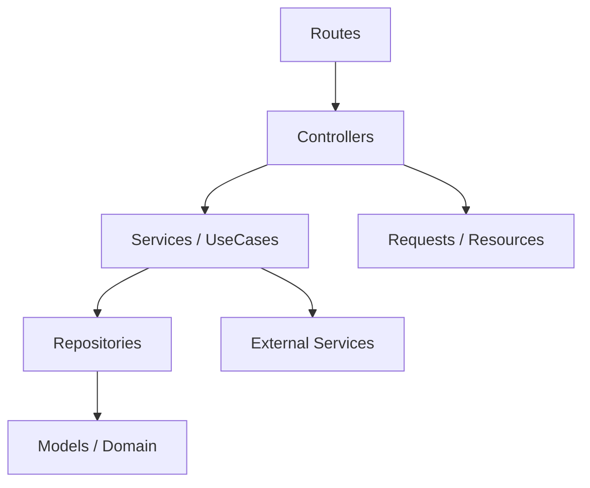
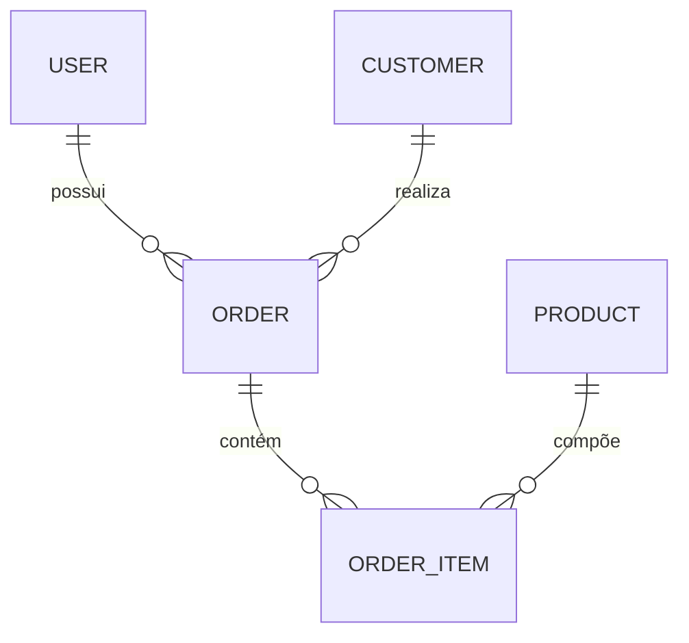
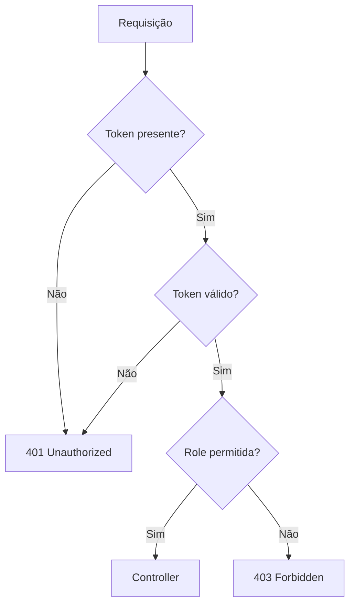
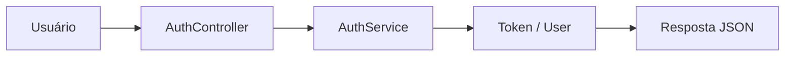
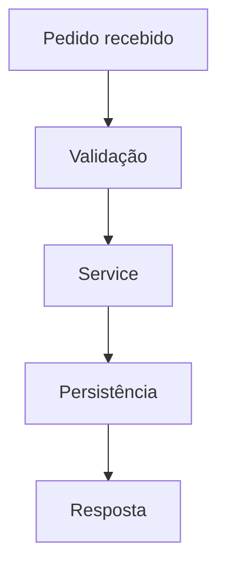
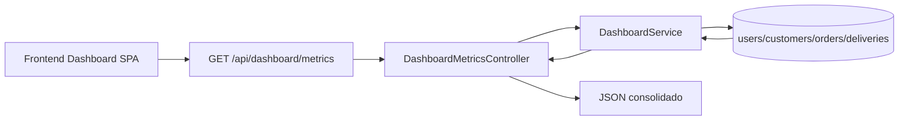

# SimplyFood Backend - Technical Guide

<!--
Este documento consolida a visão técnica do backend do projeto SimplyFood.
Ele serve como referência principal para arquitetura, fluxo de desenvolvimento,
API, autenticação, modelos de dados, testes e convenções de manutenção.
-->

## 1. Project Overview

### Objetivo
O backend do SimplyFood é responsável por fornecer a API principal do sistema, concentrando a regra de negócio, autenticação, validação, persistência e integração com serviços externos.

### Escopo
- autenticação e autorização
- gestão de clientes
- gestão de produtos
- gestão de pedidos
- integração com serviços externos
- exposição de endpoints JSON para o frontend

### Arquitetura geral
O backend segue uma abordagem de arquitetura limpa com separação em camadas, priorizando controllers finos, services para regra de negócio e abstração de persistência.



### Responsabilidades do Backend
- processar requisições HTTP
- validar entradas
- aplicar regras de negócio em Services/UseCases
- persistir dados via Eloquent
- proteger endpoints por middleware e papéis
- padronizar respostas da API

### Convenções adotadas
- controllers finos
- services para regras de negócio
- models como camada de domínio
- repositories para abstração de persistência
- testes obrigatórios via TDD

### Baseline SDD (Spec-Driven Development)
<!--
Este AGENTS.md é a especificação técnica viva do backend.
A evolução deve manter rastreabilidade entre Sprint -> Feature -> API -> Modelos -> Testes.
-->
- Fonte de verdade de endpoints: routes/api.php
- Fonte de verdade de middleware/aliases: bootstrap/app.php
- Fonte de verdade de fluxos de negócio: app/Application/Services
- Fonte de verdade de contratos HTTP: app/Http/Controllers, app/Http/Requests, app/Http/Resources
- Fonte de verdade de persistência: app/Infrastructure/Repositories

---

## 2. Sprints

### Sprint 01 - Fundação e autenticação
- ID: S01
- Nome: Foundation & Auth
- Objetivo: estruturar a base da API e disponibilizar autenticação inicial
- Status: Em andamento
- Responsável: Backend Team
- Dependências: Laravel, Docker, banco de dados
- Checklist:
  - [x] estrutura base do Laravel
  - [x] rotas públicas de autenticação
  - [x] middleware de validação de token
  - [x] cobertura completa de testes de auth
- Prioridade: Alta
- Entregues: login, registro, health check
- Pendentes: refinamento de permissões
- Riscos: inconsistência entre papéis e permissões
- Bloqueios: nenhum

### Sprint 02 - Gestão operacional
- ID: S02
- Nome: Customers, Products and Orders
- Objetivo: disponibilizar os fluxos principais de gestão operacional
- Status: Planejado
- Responsável: Backend Team
- Dependências: S01
- Checklist:
  - [ ] CRUD de clientes
  - [ ] CRUD de produtos
  - [ ] fluxo de pedidos
  - [ ] alteração de status de pedido
- Prioridade: Alta
- Entregues: estrutura inicial
- Pendentes: implementação completa
- Riscos: mudanças de regra de negócio
- Bloqueios: dependência de integração com frontend

### Sprint 02.1 - Cadastro Corporativo de Produtos
- ID: S02.1
- Nome: Product Quick Create
- Objetivo: entregar cadastro rápido corporativo para produtos com expansão segura para cadastro avançado
- Status: Ativo
- Responsável: Backend Team
- Dependências: S02, ProductService, ProductController, ProductResource
- Checklist:
  - [x] modal rápido com integração API
  - [x] validações de campos essenciais no backend
  - [x] retorno de erros por campo para UX orientada a operação
  - [x] estrutura preparada para expansão futura
- Prioridade: Alta
- Riscos: divergência entre payload legado e payload corporativo
- Mitigação: manter `preco` legado compatível com `preco_venda`

### Backlog consolidado (Sprints)
- S01: manter e evoluir cobertura de testes para autenticação
- S02: consolidar CRUD completo de customers/products/orders com critérios de aceite
- S02: reduzir riscos de divergência de contratos entre API e frontend

### Roadmap incremental (Sprints)
- Curto prazo: estabilização de autenticação e autorização por role
- Médio prazo: fechamento dos fluxos operacionais principais
- Evolução contínua: atualização da matriz SDD a cada endpoint ou teste novo

### Exemplo de rastreabilidade em JSON
```json
{
  "sprint": "S02",
  "feature": "FEAT-BE-003",
  "endpoints": ["POST /api/customers", "GET /api/customers/{id}"],
  "camadas": ["Presentation", "Application", "Domain", "Infrastructure"],
  "status": "parcialmente implementado"
}
```

---

## 3. Features

<!--
Cada feature abaixo representa um fluxo funcional documentado para manutenção.
Não alterar a responsabilidade de cada módulo sem revisar os impactos de autenticação,
validação e contratos de API.
-->

### Feature 1 - Health Check
- Nome: Health Check
- ID de rastreio: FEAT-BE-001
- Descrição: endpoint para verificar a disponibilidade da API
- Objetivo: validar se a aplicação responde corretamente
- Escopo: verificação simples de disponibilidade da aplicação
- Fluxo: requisição simples -> resposta JSON
- Dependências: nenhuma
- Arquivos envolvidos: routes/api.php
- Controllers: nenhum
- Services: nenhum
- Models: nenhum
- Endpoints: GET /api/health
- Status: Ativo

### Feature 2 - Autenticação
- Nome: Authentication
- ID de rastreio: FEAT-BE-002
- Descrição: login e registro do sistema
- Objetivo: gerar sessão/autenticação para uso das rotas protegidas
- Escopo: autenticação, geração de token e controle de acesso
- Fluxo: cliente envia credenciais -> AuthController -> AuthService -> token/usuário
- Dependências: banco de dados, usuário
- Arquivos envolvidos: app/Http/Controllers/AuthController.php, app/Application/Services/AuthService.php
- Controllers: AuthController
- Services: AuthService
- Models: User
- Endpoints: POST /api/auth/login, POST /api/auth/register
- Status: Ativo

### Feature 3 - Gestão de Clientes
- Nome: Customer Management
- ID de rastreio: FEAT-BE-003
- Descrição: cadastro, consulta e atualização de clientes
- Objetivo: centralizar dados de clientes para operações comerciais
- Escopo: CRUD de clientes com validação e autorização
- Fluxo: requisição -> controller -> service -> repository -> model
- Dependências: autenticação, permissões por role
- Arquivos envolvidos: app/Http/Controllers/CustomerController.php, app/Application/Services/CustomerService.php
- Controllers: CustomerController
- Services: CustomerService
- Models: Customer
- Endpoints: GET /api/customers, GET /api/customers/{id}, PUT /api/customers/{id}, DELETE /api/customers/{id}
- Status: Parcialmente implementado

### Feature 4 - Gestão de Produtos
- Nome: Product Management
- ID de rastreio: FEAT-BE-004
- Descrição: manipulação de catálogo de produtos
- Objetivo: permitir manutenção do cardápio ou catálogo base
- Escopo: listagem, ativação e cadastro de produtos
- Fluxo: requisição -> controller -> service -> persistence
- Dependências: autenticação e papéis
- Arquivos envolvidos: app/Http/Controllers/ProductController.php
- Controllers: ProductController
- Services: ProductService
- Models: Product
- Endpoints: GET /api/products, GET /api/products/active, POST /api/products
- Status: Parcialmente implementado

### Feature 5 - Gestão de Pedidos
- Nome: Order Management
- ID de rastreio: FEAT-BE-005
- Descrição: criação, consulta e atualização de pedidos
- Objetivo: controlar ciclo operacional e status do pedido
- Escopo: criação, consulta e alteração de status em pedidos
- Fluxo: pedido criado -> status alterado -> consulta do pedido
- Dependências: clientes, produtos, autenticação
- Arquivos envolvidos: app/Http/Controllers/OrderController.php, app/Application/Services/OrderService.php
- Controllers: OrderController
- Services: OrderService
- Models: Order
- Endpoints: GET /api/orders, GET /api/orders/{id}, POST /api/orders, PATCH /api/orders/{id}/status
- Status: Parcialmente implementado

### Feature 6 - Cadastro Corporativo de Produtos
- Nome: Corporate Product Quick Create
- ID de rastreio: FEAT-BE-006
- Descrição: cadastro rápido de produtos orientado a operação de food service
- Objetivo: permitir criação de produto em fluxo inferior a 30 segundos, sem sobrecarga visual
- Escopo: criação imediata com campos essenciais, validações robustas e compatibilidade com evolução futura
- Fluxo: modal frontend -> ProductController -> StoreProductRequest -> ProductService -> ProductResource
- Dependências: autenticação, categories ativas, policies de produto
- Arquivos envolvidos: ProductController, ProductService, StoreProductRequest, ProductResource, migration incremental de produtos
- Controllers: ProductController
- Services: ProductService
- Models: Product
- Endpoints: GET /api/products/quick-create/options, POST /api/products, PUT/PATCH /api/products/{id}
- Inertia (web): GET /products/quick-create com payload dinâmico de categorias/unidades/defaults/permissões
- Critérios de aceitação:
  - cadastro rápido em modal;
  - criação imediata do produto;
  - validações backend;
  - integração completa com Inertia/API contracts;
  - retorno de erros por campo;
  - suporte à expansão futura.
- Status: Ativo

## Módulo Produtos

### Cadastro Rápido
O cadastro inicial deve conter apenas os campos essenciais para operação diária.

Após salvar, o produto estará apto para utilização no sistema.

Configurações fiscais, produção, fornecedores e ficha técnica deverão permanecer no cadastro avançado.

Princípios do módulo:
- simplicidade operacional;
- menor quantidade possível de campos obrigatórios;
- fluxo de cadastro inferior a 30 segundos;
- UX corporativa;
- evitar sobrecarga visual.

---

## 4. Feature Layer

<!--
A Feature Layer organiza cada fluxo funcional em um conjunto coeso de arquivos e responsabilidades.
Essa abordagem facilita rastreabilidade entre requisito, API e implementação sem misturar regra de negócio com transporte HTTP.
-->

### Padrão adotado
Cada feature deve manter um escopo claro e reutilizável, com foco em:
- Objetivo
- Escopo
- Fluxo
- Componentes envolvidos
- Services
- Controllers
- Requests
- Models
- Repositories
- Interfaces
- Rotas relacionadas
- Dependências
- Responsabilidades

### Estrutura sugerida por feature
- Presentation: controllers, requests e resources
- Application: services e use cases
- Domain: models, value objects e regras centrais
- Infrastructure: repositories, integrations e persistência

### Exemplo de contrato de feature em JSON
```json
{
  "featureId": "FEAT-BE-005",
  "name": "Order Management",
  "flow": [
    "OrderController",
    "OrderService",
    "OrderRepository",
    "Order model"
  ],
  "statusTransition": "PATCH /api/orders/{id}/status"
}
```

### Feature map detalhado (estado atual)

#### Feature FEAT-BE-001 - Health Check
<!--
Feature de observabilidade mínima para disponibilidade de API.
Não concentra regra de negócio.
-->
- Objetivo: verificar disponibilidade básica da API
- Escopo: resposta JSON simples
- Fluxo: request -> closure route -> JSON
- Componentes envolvidos: routes/api.php
- Services: N/A
- Controllers: N/A
- Requests: N/A
- Models: N/A
- Repositories: N/A
- Interfaces: N/A
- Rotas relacionadas: GET /api/health
- Dependências: framework HTTP do Laravel
- Responsabilidades: health probe para integração e monitoramento

#### Feature FEAT-BE-002 - Authentication
<!--
Feature responsável por login/registro e emissão de token mock (valid-{id}).
Controllers devem apenas validar entrada e delegar ao service.
-->
- Objetivo: autenticar e registrar usuários
- Escopo: login, register e retorno de token/user
- Fluxo: route -> AuthController -> AuthService -> User model -> response
- Componentes envolvidos: AuthController, AuthService
- Services: AuthService
- Controllers: AuthController
- Requests: validação inline no controller (Request::validate)
- Models: User (app/Domains/Auth/User/User.php)
- Repositories: N/A dedicado no fluxo atual
- Interfaces: N/A dedicada no fluxo atual
- Rotas relacionadas: POST /api/auth/login, POST /api/auth/register, POST /api/login, POST /api/register
- Dependências: Hash, banco de usuários
- Responsabilidades: autenticação e criação de usuário

#### Feature FEAT-BE-003 - Customer Management
<!--
Feature de clientes com criação pública e operações protegidas.
Regras de negócio permanecem em CustomerService.
-->
- Objetivo: gerenciar ciclo de vida de clientes
- Escopo: create, list, show, update e delete
- Fluxo: route -> CustomerController -> CustomerService -> CustomerRepository -> model/resource
- Componentes envolvidos: CustomerController, StoreCustomerRequest, CustomerResource
- Services: CustomerService
- Controllers: CustomerController
- Requests: StoreCustomerRequest
- Models: Customer (domínio de Customer)
- Repositories: CustomerRepository, AddressRepository
- Interfaces: N/A dedicada no fluxo atual
- Rotas relacionadas: POST /api/customers (pública), GET/PUT/PATCH/DELETE /api/customers/{id} (protegidas)
- Dependências: middleware token.valid e auth.system
- Responsabilidades: persistência de cliente e resposta padronizada

##### Atualização incremental - Escopo por usuário no ambiente autenticado
- Objetivo: garantir que o menu Clientes opere sobre registros associados ao usuário autenticado.
- Alterações arquiteturais:
  - migration adicionada: `database/migrations/2026_07_31_000011_add_user_id_to_customers_table.php`.
  - model atualizado: `Customer` com `user_id` no fillable e relacionamento `belongsTo(User)`.
  - service atualizado: `CustomerService` com métodos `getByUser`, `findByUserOrFail`, `updateByUser`, `deleteByUser`.
  - repository atualizado: consultas e mutações com escopo por `user_id`.
  - controller atualizado: `get/show/update/deleted` usam escopo por usuário quando autenticado.
- Fluxo protegido atualizado: `GET|PUT|PATCH|DELETE /api/customers*` retorna/altera/exclui apenas clientes do usuário autenticado.
- Fluxo público preservado: `POST /api/customers` continua disponível para cadastro sem exigir token.

##### Atualização incremental - Associação de cliente ao usuário no create público autenticado
<!--
Garantia de rastreabilidade de ownership sem quebrar contrato público da rota de criação.
-->
- Contexto: `POST /api/customers` é rota pública por contrato, mas pode receber `Authorization` no fluxo autenticado do dashboard.
- Ajuste aplicado em `CustomerController`:
  - resolução de usuário autenticado via `request->user()` quando disponível;
  - fallback seguro para bearer token no padrão `valid-{id}` para associar `user_id` quando houver contexto autenticado.
- Compatibilidade preservada:
  - criação pública sem token continua funcional;
  - criação autenticada passa a persistir relacionamento `customers.user_id` com o usuário da sessão/token.
- Cobertura de teste adicionada:
  - `tests/Feature/Customer/CustomerApiTest.php` valida associação de `user_id` ao criar cliente com bearer token válido.

##### Atualização incremental de arquitetura (Service Layer Audit)
<!--
Auditoria realizada para alinhar Controller/Service ao contrato da BaseService sem alterar regras de negócio.
-->
- Problema identificado: `CustomerController::store` chamava `create()`, método fora do contrato comum de `BaseService`.
- Causa raiz: divergência entre convenção base (`post`) e implementação específica de Customer (`create`).
- Correção aplicada:
  - `CustomerService` passou a sobrescrever `post(array $data)` (mantendo regras de whatsapp e ViaCEP).
  - `CustomerController::store` passou a orquestrar criação via `service->post(...)`.
  - Testes unitários de service ajustados para o contrato `post(...)`.
- Decisão arquitetural: não adicionar `create()` em `BaseService` para evitar expansão indevida da API base e impacto nas demais features.
- Compatibilidade: contrato HTTP da rota `POST /api/customers` preservado (payload e resposta sem breaking change).

#### Feature FEAT-BE-004 - Product Management
<!--
Feature de catálogo com operações protegidas e filtro de ativos.
-->
- Objetivo: gerenciar produtos e disponibilidade
- Escopo: get, getActive, show, post, update e delete
- Fluxo: route -> ProductController -> ProductService -> ProductRepository -> model
- Componentes envolvidos: ProductController
- Services: ProductService
- Controllers: ProductController
- Requests: StoreProductRequest (quando aplicável no fluxo de criação/edição)
- Models: Product (domínio de Product)
- Repositories: ProductRepository, CategoryRepository
- Interfaces: N/A dedicada no fluxo atual
- Rotas relacionadas: GET /api/products, GET /api/products/active, GET /api/products/{id}, POST /api/products, PUT/PATCH /api/products/{id}, DELETE /api/products/{id}
- Dependências: autenticação e autorização por role
- Responsabilidades: catálogo, disponibilidade e atualização de produtos

#### Feature FEAT-BE-005 - Order Management
<!--
Feature operacional de pedidos com alteração de status e validação semântica.
-->
- Objetivo: gerenciar pedidos e transições de status
- Escopo: get, show, post, update, changeStatus e delete
- Fluxo: route -> OrderController -> OrderService -> OrderRepository/OrderItemRepository -> model
- Componentes envolvidos: OrderController
- Services: OrderService
- Controllers: OrderController
- Requests: StoreOrderRequest (quando aplicável no fluxo de criação/edição)
- Models: Order, OrderItem (domínio de Order)
- Repositories: OrderRepository, OrderItemRepository
- Interfaces: N/A dedicada no fluxo atual
- Rotas relacionadas: GET /api/orders, GET /api/orders/{id}, POST /api/orders, PUT/PATCH /api/orders/{id}, PATCH /api/orders/{id}/status, DELETE /api/orders/{id}
- Dependências: clientes, produtos, autenticação e autorização
- Responsabilidades: ciclo operacional do pedido e consistência de status

##### Atualização incremental - Orders por usuário autenticado
- Objetivo: garantir que cada pedido pertença a um usuário e que operações sejam isoladas por ambiente autenticado.
- Alterações arquiteturais:
  - migration adicionada: `database/migrations/2026_07_31_000012_add_user_id_to_orders_table.php`.
  - model atualizado: `Order` com `user_id` no fillable e relacionamento `belongsTo(User)`.
  - model atualizado: `User` com relacionamento `orders()`.
  - service atualizado: `OrderService` com métodos `postByUser`, `getByUser`, `findByUserOrFail`, `updateByUser`, `deleteByUser`, `updateStatusByUser` e recálculo de total por itens.
  - repository atualizado: `OrderRepository` com `getByUser` e `findByUser`.
  - controller atualizado: `OrderController` passa a usar escopo por usuário em `get/show/post/update/deleted/changeStatus`.
- Fluxo protegido atualizado:
  - `GET /api/orders` retorna apenas pedidos do usuário autenticado.
  - `GET /api/orders/{id}` bloqueia acesso a pedidos de outros usuários.
  - `POST /api/orders` exige cliente pertencente ao usuário autenticado.
  - `PUT/PATCH /api/orders/{id}` atualiza apenas pedidos do usuário autenticado.
  - `DELETE /api/orders/{id}` remove apenas pedidos do usuário autenticado.

##### Atualização incremental - Dashboard Pedidos Hoje por usuário
- Contexto: métrica `orders_today` do dashboard agora respeita escopo do usuário autenticado.
- Alteração: `DashboardService::buildUserDashboard` aplica filtro `where('user_id', $user->id)` na contagem diária de pedidos.
- Complemento: faturamento diário e média de entrega também passam a considerar somente pedidos do usuário autenticado.
- Benefício: cada operador visualiza métricas operacionais isoladas do próprio ambiente.

##### Atualização incremental - Reorganização de UX (Dashboard x Módulos)
<!--
Mudança de experiência no frontend para separar ações rápidas e gestão completa.
Backend mantido compatível e sem alteração de contratos de API.
-->
- Impacto na API: nenhum endpoint novo/removido; contratos HTTP preservados.
- Autenticação/autorização: sem enfraquecimento de segurança.
  - rotas protegidas continuam no grupo `token.valid` + `auth.system:ADMIN,MANAGER,OPERATOR`.
  - criação pública de cliente (`POST /api/customers`) mantida conforme fluxo já existente.
- Compatibilidade: módulos Customers e Orders continuam consumindo os mesmos endpoints protegidos para gestão completa.
- Decisão arquitetural: reorganização restrita à camada de apresentação, preservando Services, regras de negócio e middlewares.

##### Atualização incremental - Fluxo direto de criação (confirmação de impacto)
<!--
Refino de navegação do frontend para abrir criação direta de cliente/pedido a partir do Dashboard.
Sem alterações de backend por se tratar de comportamento de apresentação e roteamento SPA.
-->
- Rotas backend: inalteradas.
- Permissões e segurança: inalteradas (`token.valid` + `auth.system`).
- Contratos Orders/Customers: inalterados (POST/GET/PUT/PATCH/DELETE mantidos).
- Compatibilidade: pedidos e clientes criados no fluxo rápido continuam disponíveis automaticamente nos módulos de gerenciamento via consultas já existentes.

##### Atualização incremental - Retorno automático pós-criação (UX)
<!--
Ajuste estritamente no frontend para redirecionar ao gerenciamento com destaque do registro recém-criado.
-->
- Impacto backend: nenhum.
- Rotas, middlewares e contratos API permanecem inalterados.
- Disponibilidade do registro após criação continua garantida pelos endpoints existentes de listagem.

##### Atualização incremental - Produto no fluxo de criação de Pedido
<!--
O frontend passou a acionar criação de produto a partir do fluxo Novo Pedido, sem alterar backend.
-->
- Impacto em API: nenhum endpoint novo.
- Endpoint reutilizado: `POST /api/products` (protegido por `token.valid` + `auth.system`).
- Compatibilidade preservada:
  - itens do pedido continuam validando `product_id` existente;
  - após criar produto, o fluxo usa listagem de produtos ativos para associação no pedido.

##### Atualização incremental - Otimização de persistência por indexação
<!--
Estratégia de performance orientada por padrões reais de consulta (Dashboard, Customers, Orders, Products).
Sem alterações de contrato, sem alteração de regras de negócio e sem edição de migrations históricas.
-->
- Nova migration: `database/migrations/2026_07_31_000013_add_performance_indexes_for_dashboard_and_management.php`.
- Índices adicionados e justificativa técnica:
  - `customers_user_whatsapp_idx` em `(user_id, whatsapp)`:
    - otimiza lookup de unicidade por usuário (`findByWhatsappForUser`) e validações de criação.
  - `customers_whatsapp_idx` em `(whatsapp)`:
    - otimiza lookup global de whatsapp (`findByWhatsapp`) em fluxos sem contexto de usuário.
  - `orders_user_status_created_at_idx` em `(user_id, status, created_at)`:
    - otimiza listagens de pedidos por usuário com filtro de status + ordenação temporal.
  - `orders_user_customer_created_at_idx` em `(user_id, customer_id, created_at)`:
    - otimiza listagens de pedidos por usuário com filtro de customer + ordenação temporal.
  - `products_active_deleted_idx` em `(ativo, deleted_at)`:
    - otimiza leitura de produtos ativos considerando soft delete.
  - `deliveries_delivered_order_idx` em `(delivered_at, order_id)`:
    - otimiza cálculo de métricas de entrega por janela temporal e associação com pedido.
- Consultas otimizadas:
  - `DashboardService` substituiu `whereDate(...)` por `whereBetween(...)` em `created_at` e `delivered_at`.
  - ganho esperado: melhor aproveitamento de índices em consultas de intervalo diário para métricas.
- Segurança e compatibilidade:
  - sem mudança de autenticação/autorização;
  - sem alteração de nomes de tabela/coluna;
  - sem alteração de relacionamentos, Services, Controllers ou contratos API.

##### Atualização incremental - Auditoria de conformidade arquitetural (SDD)
<!--
Fechamento de auditoria para validar aderência entre especificação AGENTS e implementação executável.
-->
- Validação de rotas e contratos:
  - `php artisan route:list` confirmou 33 rotas esperadas, incluindo `/api/dashboard/metrics`, `/api/customers*`, `/api/products*` e `/api/orders*`.
- Validação de middleware/aliases:
  - `bootstrap/app.php` mantém aliases oficiais `token.valid` -> `UserTokenValid` e `auth.system` -> `AuthSystem`.
  - nomenclatura consolidada da classe de autorização: `app/Http/Middleware/AuthSystem.php`.
- Compatibilidade funcional:
  - nenhuma alteração de endpoint, payload ou response foi necessária neste ciclo de auditoria.
  - correções pós-auditoria ficaram restritas ao frontend (camada de apresentação), preservando Services e regras de negócio do backend.

#### Feature FEAT-BE-006 - Dashboard Metrics API
<!--
Feature de agregacao de indicadores operacionais para dashboard do frontend SPA.
Reutiliza DashboardService para evitar duplicacao de logica de negocio.
-->
- Objetivo: consolidar metricas reais de dashboard em um unico payload
- Escopo: total de clientes, pedidos do dia, faturamento diario e tempo medio de entrega
- Fluxo: route -> DashboardMetricsController -> DashboardService -> models -> JSON
- Componentes envolvidos: DashboardMetricsController, DashboardService
- Services: DashboardService (reutilizado)
- Controllers: DashboardMetricsController
- Requests: N/A dedicado (request autenticada)
- Models: User, Customer, Order, Delivery
- Repositories: N/A dedicado no fluxo atual (Eloquent via Service)
- Interfaces: N/A dedicada no fluxo atual
- Rotas relacionadas: GET /api/dashboard/metrics (protegida)
- Dependências: middleware token.valid e auth.system
- Responsabilidades: agregacao de indicadores e contrato consolidado para UI

##### Atualização incremental - Dashboard Metrics Refinement (S02)
<!--
Refinamento evolutivo para aderência ao estágio atual do MVP, sem quebra de contrato HTTP.
-->
- Sprint afetada: S02 (Gestão operacional)
- Feature afetada: FEAT-BE-006 (Dashboard Metrics API)
- Regras de negócio atualizadas:
  - métricas consolidadas por usuário autenticado com escopo exclusivo de dados do operador;
  - substituição da métrica `Tempo Médio Entrega` por `Ticket Médio`;
  - indicador de pedidos migrado para `Pedidos Ativos` (WAITING_PAYMENT, PAID, PREPARING, OUT_FOR_DELIVERY);
  - faturamento consolidado em `Faturamento Total` com exclusão de pedidos cancelados.
- Ajustes arquiteturais:
  - `DashboardService` deixou de consultar Models diretamente e passou a orquestrar métricas via Repository Layer;
  - `CustomerRepository` recebeu `countActiveByUser(int $userId)`;
  - `OrderRepository` recebeu `getDashboardAggregatesByUser(int $userId)` com agregações SQL otimizadas em consulta única.
- Soft delete e consistência:
  - métricas aplicam filtro de ativos (`whereNull('deleted_at')`) para entidades com SoftDeletes;
  - alinhamento com os módulos operacionais de Customers e Orders para evitar fontes divergentes.
- Performance:
  - redução de múltiplas consultas por métrica para agregação consolidada no repositório de pedidos;
  - seleção apenas dos agregados necessários (contagem/soma/média), sem eager loading desnecessário.
- Endpoints impactados:
  - `GET /api/dashboard/metrics` (sem alteração de contrato de resposta, apenas atualização semântica dos cards).
- Data models impactados:
  - `Customer` (contagem ativa por usuário);
  - `Order` (agregação por status com exclusão de cancelados e soft deleted).
- Critérios de aceite atendidos:
  - dashboard exibe dados reais da base;
  - escopo do usuário autenticado respeitado;
  - métrica operacional compatível com funcionalidades do MVP;
  - regras concentradas em Service + Repository (Clean Architecture).

### Comentário de arquitetura
<!--
Controllers devem permanecer finos; regras de negócio devem residir em services ou use cases.
Persistência e integrações externas devem ser isoladas em repositories e adapters.
-->

---

## 5. Acceptance Criteria

### Autenticação
- Given um usuário válido
- When enviar credenciais corretas
- Then deve receber token e dados do usuário

- Given credenciais inválidas
- When tentar autenticar
- Then deve receber 401 Unauthorized

- Given usuário sem permissão
- When acessar rota protegida
- Then deve receber 403 Forbidden

### Gestão de Clientes
- Checklist funcional:
  - [ ] cadastro com dados válidos
  - [ ] rejeição de dados inválidos
  - [ ] consulta por identificador
  - [ ] atualização de dados
  - [ ] remoção lógica ou física conforme regra vigente

### Gestão de Pedidos
- Checklist funcional:
  - [ ] pedido criado com sucesso
  - [ ] status alterado corretamente
  - [ ] validação de status inválido
  - [ ] resposta semântica em caso de erro

---

## 6. API Specification

### Endpoints principais

| Endpoint | Method | Controller | Action | Middleware | Autenticação |
| --- | --- | --- | --- | --- | --- |
| /api/health | GET | - | closure | - | Pública |
| /api/auth/login | POST | AuthController | login | - | Pública |
| /api/auth/register | POST | AuthController | register | - | Pública |
| /api/login | POST | AuthController | login | - | Pública |
| /api/register | POST | AuthController | register | - | Pública |
| /api/customers | POST | CustomerController | store | - | Pública |
| /api/customers | GET | CustomerController | get | token.valid, auth.system | Privada |
| /api/customers/{id} | GET | CustomerController | show | token.valid, auth.system | Privada |
| /api/customers/{id} | PUT | CustomerController | update | token.valid, auth.system | Privada |
| /api/customers/{id} | PATCH | CustomerController | update | token.valid, auth.system | Privada |
| /api/customers/{id} | DELETE | CustomerController | deleted | token.valid, auth.system | Privada |
| /api/products | GET | ProductController | get | token.valid, auth.system | Privada |
| /api/products/active | GET | ProductController | getActive | token.valid, auth.system | Privada |
| /api/products/{id} | GET | ProductController | show | token.valid, auth.system | Privada |
| /api/products | POST | ProductController | post | token.valid, auth.system | Privada |
| /api/products/{id} | PUT | ProductController | update | token.valid, auth.system | Privada |
| /api/products/{id} | PATCH | ProductController | update | token.valid, auth.system | Privada |
| /api/products/{id} | DELETE | ProductController | deleted | token.valid, auth.system | Privada |
| /api/orders | GET | OrderController | get | token.valid, auth.system | Privada |
| /api/orders/{id} | GET | OrderController | show | token.valid, auth.system | Privada |
| /api/orders | POST | OrderController | post | token.valid, auth.system | Privada |
| /api/orders/{id} | PUT | OrderController | update | token.valid, auth.system | Privada |
| /api/orders/{id} | PATCH | OrderController | update | token.valid, auth.system | Privada |
| /api/orders/{id}/status | PATCH | OrderController | changeStatus | token.valid, auth.system | Privada |
| /api/orders/{id} | DELETE | OrderController | deleted | token.valid, auth.system | Privada |
| /api/dashboard/metrics | GET | DashboardMetricsController | __invoke | token.valid, auth.system | Privada |

### Autenticação e autorização (estado atual)
- token.valid: valida bearer token no request
- auth.system: aplica autorização por role (ADMIN, MANAGER, OPERATOR)
- rotas de autenticação possuem versões com prefixo /auth e sem prefixo

### Payload example - Login
```json
{
  "email": "admin@email.com",
  "password": "********"
}
```

### Response example - Login
```json
{
  "status": "success",
  "data": {
    "token": "...",
    "user": {
      "id": 1,
      "name": "Administrador",
      "email": "admin@email.com",
      "role": "ADMIN"
    }
  },
  "message": "Login realizado com sucesso!"
}
```

### Status codes
- 200 OK: sucesso em consultas e autenticações válidas
- 201 Created: criação realizada com sucesso
- 204 No Content: quando aplicável
- 400 Bad Request: payload inválido ou erro de cadastro
- 401 Unauthorized: token ausente ou inválido
- 403 Forbidden: sem permissão para o papel exigido
- 404 Not Found: recurso inexistente
- 422 Unprocessable Entity: payload semântico inválido
- 500 Internal Server Error: erro inesperado

---

## 7. Data Models

### Modelos principais
- User
- Customer
- Product
- Order
- OrderItem

### Relacionamentos principais


### Model - User
- atributos: id, name, email, password, role
- constraints: email único, senha obrigatória
- regras: autenticação e autorização por role

### Model - Customer
- atributos: id, name, email, phone, whatsapp, cpf_cnpj
- constraints: campos obrigatórios conforme regra de negócio
- relacionamentos: possui pedidos

### Model - Product
- atributos: id, name, price, description, status
- regras: catálogo e disponibilidade

### Model - Order
- atributos: id, customer_id, status, total
- regras: fluxo de status e validação

### Rastreio por camadas (resumo)
- Presentation: controllers + requests + resources
- Application: services em app/Application/Services
- Domain: entidades em app/Domains
- Infrastructure: repositories em app/Infrastructure/Repositories

---

## 8. Stack

### Backend
- Laravel 12
- PHP 8.2+
- Composer
- MySQL
- Docker Compose

### Infraestrutura
- Docker
- Nginx
- Redis
- Git
- GitHub

### Qualidade
- Pest
- PHPUnit
- Pint

---

## 9. Coder Agent

### Backend Agent
- Agent ID: BACKEND-AGENT
- Nome: Backend Engineer
- Responsabilidade: manter APIs, services, controllers, models e regras de negócio
- Escopo: app/, routes/, database/, tests/
- Permissões: leitura e escrita em código funcional
- Arquivos protegidos: rotas críticas, middlewares, políticas de segurança
- Prioridade: Alta

### Documentation Agent
- Agent ID: DOC-AGENT
- Nome: Documentation Maintainer
- Responsabilidade: manter esta documentação atualizada
- Escopo: AGENTS.md, README.md, DOCKER.md, HOW_TO_USE.md
- Permissões: editar documentação
- Arquivos protegidos: documentação de arquitetura e políticas
- Prioridade: Média

---

## 10. File Structure

```text
backend/
  app/
    Application/
    Domains/
    Http/
    Infrastructure/
    Shared/
  database/
  routes/
  tests/
  public/
  config/
  resources/
```

### Comentários de estrutura
- app/Application: orchestration e regras de aplicação
- app/Domains: entidades e regras de domínio
- app/Http: controllers, requests, middleware, resources
- app/Infrastructure: integrações e persistência abstrata
- database: migrations e seeders
- routes: definição de endpoints HTTP
- tests: testes unitários e feature

---

## 11. Authentication

### Fluxo de autenticação


### Regras atuais
- rotas públicas: /api/health, /api/auth/login, /api/auth/register
- rotas protegidas: customers, products, orders
- middleware: token.valid e auth.system:ADMIN,MANAGER,OPERATOR
- aliases de middleware definidos em bootstrap/app.php

### Exemplo de retorno de erro (autorização)
```json
{
  "status": "error",
  "message": "Forbidden: You do not have the required permissions."
}
```

### Respostas esperadas
- 401 Unauthorized: token ausente ou inválido
- 403 Forbidden: papel não autorizado

---

## 12. Validation

### Validações de autenticação
- email: required, email
- password: required, string

### Validações de cadastro
- name: required
- email: required, email, unique
- password: required, min:6

### Validações de pedidos
- status: obrigatório quando houver alteração
- payload: deve ser semanticamente válido

---

## 13. Fluxos principais

### Fluxo de login


### Fluxo de pedido


---

## 14. Clean Architecture

<!--
A arquitetura do backend preserva separação entre entrada HTTP, aplicação, domínio e infraestrutura.
Essa divisão favorece evolução incremental, testes e menor acoplamento entre camadas.
-->

### Presentation Layer
- routes, controllers, requests e resources
- responsabilidade: receber requisições e formatar respostas

### Feature Layer
- fluxos funcionais organizados por feature
- responsabilidade: coordenar services, requests, models e integrações para um caso de uso

### Application Layer
- services e use cases
- responsabilidade: encapsular regras de aplicação e orquestração de fluxo

### Domain Layer
- models, entidades e regras centrais
- responsabilidade: representar o negócio e garantir consistência interna

### Infrastructure Layer
- repositories, adapters e integração com serviços externos
- responsabilidade: isolar dependências tecnológicas e persistência

### Comunicação entre camadas
- controllers não devem conter regra de negócio
- services orquestram o fluxo principal
- repositories isolam acesso à persistência
- middleware protege entradas sensíveis

---

## 15. Auditoria Estrutural do Projeto

### Relatório de auditoria recomendada
| Arquivo | Motivo | Dependências | Impacto | Pode ser removido? |
| --- | --- | --- | --- | --- |
| arquivos temporários | geralmente gerados por execução local | dependem do ambiente | baixo | Sim, se não forem funcionais |
| caches de build | artefatos de compilação | não devem ser versionados | baixo | Sim |
| arquivos de ambiente locais | segredos e configuração local | não devem ser compartilhados | alto | Não, sem revisão |
| arquivos de storage público | podem ser gerados automaticamente | dependem do runtime | médio | Sim, se não forem parte do source |

### Limpeza estrutural
- remover apenas diretórios vazios, caches, artefatos temporários e arquivos gerados automaticamente
- não remover arquivos funcionais sem confirmação explícita
- priorizar segurança e preservação da estrutura atual

### Códigos de erro possíveis nas autenticações e retornos

- 401 Unauthorized
  - Utilizado quando o token não é enviado, é inválido ou não passa pela validação de token.valid.
  - Exemplo de retorno:
    ```json
    {
      "message": "Unauthorized: Token is missing or invalid.",
      "status": "error"
    }
    ```

- 400 Bad Request
  - Utilizado no endpoint de registro quando os dados enviados não passam na validação ou no fluxo de criação.

- 403 Forbidden
  - Esperado quando o usuário está autenticado, mas não possui um dos papéis permitidos (ADMIN, MANAGER ou OPERATOR) para acessar uma rota protegida.

- 422 Unprocessable Entity
  - Utilizado em operações específicas, como alteração de status de pedido, quando o payload recebido é semanticamente inválido.

### Regras de negócio para as rotas protegidas

- As rotas protegidas devem sempre ser tratadas como operações sensíveis e exigirem autenticação explícita.
- A validação de token ocorre antes de qualquer execução de controller.
- A autorização por role ocorre depois da validação de identidade.
- Controllers continuam finos; a lógica de negócio deve permanecer em Services/UseCases.

---

## 16. TDD e Qualidade

### Princípios do TDD no SimplifyFood

1. Red → Green → Refactor
2. Testes como especificação executável
3. Isolamento total com mocks quando necessário
4. Cobertura mínima de 80% em Application e Domain
5. Todo novo código deve ser precedido por testes

### Observação de consistência
<!--
O nome do projeto aparece como SimplyFood e SimplifyFood em partes históricas da documentação.
Para manutenção, considerar SimplyFood como nomenclatura canônica, preservando referências históricas existentes.
-->

### Estrutura Recomendada de Testes

```bash
tests/
├── Unit/
│   ├── Application/
│   │   ├── Services/
│   │   │   ├── CustomerServiceTest.php
│   │   │   ├── OrderServiceTest.php
│   │   │   └── PaymentServiceTest.php
│   │   └── UseCases/
│   │       └── ProcessPaymentUseCaseTest.php
│   ├── Domains/
│   │   ├── Customer/
│   │   │   ├── CustomerTest.php
│   │   │   └── AddressTest.php
│   │   └── Order/
│   │       └── OrderTest.php
│   └── Infrastructure/
│       └── Repositories/
│           └── CustomerRepositoryTest.php
├── Feature/
│   ├── Customer/
│   │   └── CustomerApiTest.php
│   ├── Order/
│   │   └── OrderApiTest.php
│   └── Payment/
│       └── PaymentFlowTest.php
└── Architecture/
    └── CleanArchitectureTest.php
```

### Comandos Úteis

```bash
# Testes Unitários
php artisan test --filter CustomerServiceTest

# Testes de Feature
php artisan test --testsuite=Feature

# Cobertura de Código
php artisan test --coverage

# Watch mode (com Pest)
./vendor/bin/pest --watch
```

---

## 17. Ambiente e Configuração

### Variáveis recomendadas no .env

```env
# App
APP_NAME=SimplifyFood
APP_ENV=local
APP_KEY=
APP_DEBUG=true
APP_URL=http://localhost
APP_TIMEZONE=America/Sao_Paulo

# Database
DB_CONNECTION=pgsql
DB_HOST=127.0.0.1
DB_PORT=5432
DB_DATABASE=simplifyfood
DB_USERNAME=postgres
DB_PASSWORD=password

# Cache / Queue / Session
CACHE_DRIVER=redis
QUEUE_CONNECTION=redis
SESSION_DRIVER=redis

# Redis
REDIS_HOST=127.0.0.1
REDIS_PASSWORD=null
REDIS_PORT=6379

# External services
VIACEP_BASE_URL=https://viacep.com.br/ws
MERCADOPAGO_PUBLIC_KEY=TEST-...
MERCADOPAGO_ACCESS_TOKEN=TEST-...

# Mail
MAIL_MAILER=smtp
MAIL_HOST=smtp.mailtrap.io
MAIL_PORT=2525
MAIL_USERNAME=null
MAIL_PASSWORD=null
MAIL_ENCRYPTION=null
MAIL_FROM_ADDRESS="no-reply@simplifyfood.com.br"
MAIL_FROM_NAME="${APP_NAME}"

# Sanctum / Auth
SANCTUM_STATEFUL_DOMAINS=localhost:3000,127.0.0.1:8000

# Testing
TEST_DB_DATABASE=simplifyfood_test
TEST_DB_USERNAME=postgres
TEST_DB_PASSWORD=password
```

### Comandos de configuração por ambiente

#### Ambiente Local
```bash
cp .env.example .env
composer install
php artisan key:generate
php artisan migrate
```

#### Ambiente de Homologação / Produção
```bash
cp .env.example .env
composer install --no-dev --optimize-autoloader
php artisan config:cache
php artisan route:cache
php artisan view:cache
php artisan migrate --force
```

#### Ambiente de Testes
```bash
php artisan test
```

---

## 18. Matriz de Rastreabilidade (SDD)

| Sprint | Feature | Endpoints principais | Models | Testes relacionados |
| --- | --- | --- | --- | --- |
| S01 | FEAT-BE-001 Health | GET /api/health | N/A | tests/Feature (health quando aplicável) |
| S01 | FEAT-BE-002 Authentication | POST /api/auth/login, /api/auth/register, /api/login, /api/register | User | testes de auth (parciais) |
| S02 | FEAT-BE-003 Customers | /api/customers* | Customer | tests/Feature/Customer/CustomerApiTest.php |
| S02 | FEAT-BE-004 Products | /api/products* | Product | testes pendentes/refinamento |
| S02 | FEAT-BE-005 Orders | /api/orders* | Order, OrderItem | testes pendentes/refinamento |
| S02 | FEAT-BE-006 Dashboard Metrics | /api/dashboard/metrics | User, Customer, Order, Delivery | tests/Feature/Dashboard/DashboardMetricsApiTest.php |

### Diretriz de atualização da matriz
<!--
Sempre atualizar esta matriz quando houver nova rota, alteração de contrato, inclusão de model
ou criação de teste de feature/unit para manter rastreabilidade entre requisito e implementação.
-->

---

## 19. Integração Inertia (Dashboard)

### Objetivo da implementação
- integrar Backend Laravel ao Frontend Vue via Inertia para renderização do painel do usuário
- manter controllers finos e regra de negócio centralizada em service
- preservar autenticação e autorização já existentes

### Arquitetura utilizada
- Presentation: `routes/web.php` e `app/Http/Controllers/DashboardController.php`
- Application: `app/Application/Services/DashboardService.php`
- Frontend Inertia: `resources/js/Pages/Dashboard.vue`
- View raiz Inertia: `resources/views/app.blade.php`

### Fluxo Backend -> Inertia -> Frontend


### Responsabilidades por camada
- `DashboardController`: receber request autenticada e chamar serviço
- `DashboardService`: calcular métricas e montar payload mínimo
- `Dashboard.vue`: renderizar props recebidas sem nova chamada HTTP

### Services utilizados
- `DashboardService` (novo)
- models reutilizados: `Customer`, `Order`, `Delivery`, `User`

### Regras de negócio e segurança
- rota protegida por `token.valid` e `auth.system:ADMIN,MANAGER,OPERATOR`
- payload minimizado: somente `id`, `name`, `role` do usuário e métricas de dashboard
- sem exposição de campos sensíveis (password, token, auditoria)

### Performance
- agregações feitas por consulta (`count`, `sum`)
- cálculo de média de entregas apenas com campos necessários (`created_at`, `delivered_at`)

### Dependências utilizadas
- `inertiajs/inertia-laravel` (Composer)
- `@inertiajs/vue3` (NPM)
- `@heroicons/vue` (NPM)

### Exemplo de uso
```php
return Inertia::render('Dashboard', [
  'user' => $dashboard['user'],
  'metrics' => $dashboard['metrics'],
]);
```

### Extensao API para frontend SPA
- Endpoint adicional criado: `GET /api/dashboard/metrics`
- Controller novo: `app/Http/Controllers/DashboardMetricsController.php`
- Contrato retornado: `status`, `data.user`, `data.metrics`, `message`
- Reuso de servico: `DashboardService::buildUserDashboard()`
- Fluxo ponta a ponta:

- Estrategia de agregacao:
  - clientes totais: `Customer::count()`
  - pedidos do dia: `Order::whereDate(created_at, hoje)->count()`
  - faturamento diario: `Order::whereDate(created_at, hoje)->sum(total)`
  - tempo medio entrega: media de minutos entre `created_at` e `delivered_at` nas entregas concluidas do dia

---

## 20. Consolidacao SDD Incremental (Single Source of Truth)

<!--
Secao incremental para padronizar leitura por topicos obrigatorios sem remover historico.
Este bloco complementa as secoes existentes e deve ser mantido sincronizado com o codigo.
-->

### 1. SPRINTS
- Objetivo: controlar evolucao por entregas de arquitetura e negocio.
- Responsabilidades: rastrear status, riscos, dependencias e impacto tecnico.
- Fluxo: planejamento -> implementacao -> validacao -> atualizacao documental.
- Dependencias: testes de feature/unit, contracts API, migrations.
- Observacoes tecnicas: manter consistencia com secoes 2, 5, 6 e 18.

### 2. FEATURES
- Objetivo: mapear comportamentos de negocio por modulo.
- Responsabilidades: separar claramente fluxo HTTP, service e persistencia.
- Fluxo: route -> controller -> service/use case -> repository -> model/resource.
- Dependencias: middlewares, requests, resources e dominio.
- Observacoes tecnicas: evitar logica de negocio fora de Services.

### 3. ACCEPTANCE CRITERIA
- Objetivo: definir criterio verificavel por endpoint/fluxo.
- Responsabilidades: cobrir sucesso, erro de validacao, erro de autorizacao e erros semanticos.
- Fluxo: Given/When/Then -> teste -> evidencias em CI/local.
- Dependencias: Pest/PHPUnit e dados de fixture.
- Observacoes tecnicas: atualizar criterios quando endpoint evoluir.

### 4. API SPEC
- Objetivo: consolidar contrato REST praticado pelo backend.
- Responsabilidades: documentar endpoint, metodo, payload, response e codigos.
- Fluxo: definicao de rota -> validacao -> resposta padronizada.
- Dependencias: `routes/api.php`, controllers e resources.
- Observacoes tecnicas: preservar backward compatibility quando possivel.

### 5. DATA MODELS
- Objetivo: representar modelo de dados real e estados planejados.
- Responsabilidades: explicitar PK/FK, cardinalidade, soft deletes e indices.
- Fluxo: migration -> model -> repository/service -> endpoint.
- Dependencias: database migrations, Eloquent models.
- Observacoes tecnicas: itens nao implementados devem ser marcados como `Planejado`.

### 6. STACK
- Objetivo: listar stack real de execucao e seus limites atuais.
- Responsabilidades: distinguir stack ativa de capacidades planejadas.
- Fluxo: infraestrutura (Docker) -> Laravel -> API/Jobs -> frontend.
- Dependencias: Composer packages, config e runtime.
- Observacoes tecnicas: projeto esta em Laravel 12 e PHP ^8.2 no momento.

### 7. CODER AGENT ID
- Objetivo: governanca de alteracoes e escopo de responsabilidade.
- Responsabilidades: proteger arquitetura, contratos e seguranca.
- Fluxo: analise -> mudanca incremental -> validacao -> documentacao.
- Dependencias: AGENTS frontend/backend.
- Observacoes tecnicas: IDs atuais permanecem `BACKEND-AGENT` e `DOC-AGENT`.

### 8. FILE STRUCTURE
- Objetivo: garantir navegabilidade e coesao do codigo.
- Responsabilidades: manter separacao entre Application, Domain, HTTP e Infrastructure.
- Fluxo: entrada HTTP -> camada de aplicacao -> dominio -> persistencia.
- Dependencias: PSR-4 e convencoes de pastas.
- Observacoes tecnicas: estrutura atual ja aderente ao padrao modular do projeto.

## 21. Arquitetura Geral por Ambiente

### Ambiente Administrativo
- Objetivo: governanca e controle global do negocio.
- Escopo funcional (estado atual): usuarios (parcial), clientes (ativo), produtos (ativo), pedidos (ativo), dashboard gerencial (ativo/parcial), tickets (parcial).
- Escopo funcional (planejado): cargos/permissoes granulares, categorias avancadas, ingredientes, ficha tecnica, estoque, mesas/comandas, caixa completo, relatorios e configuracoes.
- Responsabilidades: administrar cadastros mestres, auditoria e indicadores.
- Dependencias: roles, policies/gates (planejado), eventos e filas (planejado).
- Observacoes tecnicas: manter segregacao de acesso por role no middleware `auth.system`.

### Ambiente Operacional
- Objetivo: suportar fluxo diario de atendimento e execucao.
- Escopo funcional ativo: dashboard operacional, criacao de clientes, abertura/gestao de pedidos do proprio usuario.
- Escopo funcional planejado: KDS completo, caixa operacional com permissao e sincronizacao realtime.
- Responsabilidades: agilidade de operacao com rastreabilidade minima.
- Fluxo: autenticacao -> dashboard -> pedidos/clientes -> status operacional.
- Dependencias: escopo por `user_id` em customers/orders, indices de leitura e controles de permissao.
- Observacoes tecnicas: isolamento por usuario autenticado e regra consolidada em Services.

## 22. Stack Tecnologica Consolidada

### Backend (estado real)
- Laravel 12
- PHP ^8.2
- REST API
- Inertia Laravel v3 para pagina web `/dashboard`
- Predis/Redis para cache e suporte a fila

### Backend (planejado no roadmap)
- Laravel Reverb e WebSockets
- Event Broadcasting estruturado
- Listeners, Jobs e Queues orientados a dominios operacionais
- Notifications, Policies e Gates expandidos

### Frontend (estado real do ecossistema)
- Vue 3 + Composition API
- Tailwind CSS
- SPA modular principal em `frontend/src`
- Inertia.js em `backend/resources/js` para tela web acoplada

### Banco e Infra
- MySQL 8.4 (Docker)
- Docker e Docker Compose

### Versionamento e metodo
- Git (modelo de branches atual do time)
- Spec-Driven Development (SDD)

## 23. Camadas da Aplicacao (Responsabilidades Expandidas)

### Presentation Layer
- Responsabilidade: controllers, requests e resources HTTP.
- Comunicacao: recebe request e delega para service.
- Dependencias: middleware, validacao e resources.
- Limitacoes: nao concentrar regra de negocio.
- Boas praticas: controller fino e respostas padronizadas.

### Application Layer
- Responsabilidade: orquestrar casos de uso.
- Comunicacao: entrada dos controllers, saida para repositories/models.
- Dependencias: services/use cases.
- Limitacoes: evitar detalhes de infra.
- Boas praticas: metodos focados por acao de negocio.

### Feature Layer
- Responsabilidade: agrupar fluxos por dominio funcional.
- Comunicacao: roteamento para camada de aplicacao.
- Dependencias: requests/resources/services/repos.
- Limitacoes: nao misturar multiplos dominios sem necessidade.
- Boas praticas: coesao por feature.

### Domain Layer
- Responsabilidade: entidades e invariantes do negocio.
- Comunicacao: consumida por Services.
- Dependencias: Eloquent e objetos de dominio.
- Limitacoes: evitar acoplamento com HTTP.
- Boas praticas: nomes e estados orientados ao negocio.

### Infrastructure Layer
- Responsabilidade: repositórios e integrações externas (ex.: ViaCEP).
- Comunicacao: chamada por Services.
- Dependencias: Eloquent, clients externos.
- Limitacoes: sem regra de negocio transversal.
- Boas praticas: encapsular acesso tecnico.

### Persistence Layer
- Responsabilidade: schema, migrations, indices e constraints.
- Comunicacao: consumida pelos repositorios.
- Dependencias: MySQL e migracoes Laravel.
- Limitacoes: nao codificar regras de UI.
- Boas praticas: migrations incrementais e reversiveis.

### Repository Layer
- Responsabilidade: abstrair consultas e mutacoes.
- Comunicacao: service -> repository -> model.
- Dependencias: models e query builder.
- Limitacoes: sem orquestracao de fluxo de negocio.
- Boas praticas: centralizar filtros recorrentes e evitar duplicacao.

### Service Layer
- Responsabilidade: regra de negocio e orquestracao transacional.
- Comunicacao: controllers e repositories.
- Dependencias: repositories, models e DB transaction quando necessario.
- Limitacoes: evitar acoplamento com detalhes de transporte HTTP.
- Boas praticas: single responsibility por caso de uso.

### Validation Layer
- Responsabilidade: validar payload de entrada e regras semanticas.
- Comunicacao: Requests/controllers -> Services.
- Dependencias: Form Requests e validator do Laravel.
- Limitacoes: validacao de request nao substitui invariantes de dominio.
- Boas praticas: mensagens claras e codigos de erro consistentes.

### Security Layer
- Responsabilidade: autenticacao e autorizacao de acesso.
- Comunicacao: middlewares antes de controllers.
- Dependencias: `token.valid`, `auth.system`, user role.
- Limitacoes: roles atuais sao coarse-grained; policies/gates ainda em expansao.
- Boas praticas: negar por padrao e liberar por papel permitido.

### Documentation Layer
- Responsabilidade: manter AGENTS/README alinhados com codigo.
- Comunicacao: atualizacao apos mudanca validada.
- Dependencias: evidencias em rotas, testes e migracoes.
- Limitacoes: nao documentar funcionalidade inexistente como ativa.
- Boas praticas: sinalizar `Planejado` ou `Roadmap` quando aplicavel.

### Exception Layer
- Responsabilidade: padronizar mensagens e codigos de erro.
- Comunicacao: exception -> resposta HTTP sem vazar detalhe sensivel.
- Dependencias: tratamento no controller/service e exceptions Laravel.
- Limitacoes: sem handler custom central dedicado em `app/Exceptions` no estado atual.
- Boas praticas: mapear erros de dominio para 4xx adequados.

## 24. Dominio Food Service (Estado Atual e Planejado)

### Pedidos
- Tipos planejados: Balcao, Delivery, Mesa, Retirada.
- Estado atual: fluxo unificado de pedidos com status e itens.
- Regras ativas:
  - pedido pertence ao usuario autenticado (`user_id`);
  - cliente associado deve pertencer ao mesmo usuario;
  - total recalculado por itens;
  - transicao de status validada em service.

### Clientes
- Estado atual: CRUD com escopo por usuario e filtro por whatsapp/nome/cidade.
- Regras ativas: prevencao de duplicidade de whatsapp (por escopo) e preenchimento de endereco por ViaCEP quando possivel.

### Produtos e Categorias
- Estado atual: catalogo de produtos com `ativo` e soft delete; categorias base ativas.
- Regras ativas: pedidos referenciam produto existente; listagem de ativos para composicao de itens.

### Ingredientes, Ficha Tecnica, Estoque
- Estado atual: Planejado.
- Regra documental: manter modelagem como roadmap, sem inferir implementacao inexistente.

### Caixa
- Estado atual: Planejado (operacao completa de abertura/sangria/suprimento/fechamento cego).

### Comandas e Mesas
- Estado atual: Planejado.

### KDS (Kitchen Display System)
- Estado atual: Planejado (status de producao detalhado e SLA).

### Dashboard e Relatorios
- Estado atual: dashboard com metricas consolidadas por usuario (clientes, pedidos do dia, faturamento, media de entrega).
- Estado planejado: relatorios gerenciais avancados e visoes operacionais realtime.

## 25. Modelagem de Banco de Dados (Inventario Consolidado)

### Tabelas ativas no estado atual
- Users
- Customers
- Addresses
- Categories
- Products
- Orders
- Order Items
- Deliveries
- Payment Transactions
- Tickets
- WhatsApp Messages
- Sessions / Cache / Jobs (infra)

### Tabelas planejadas (nao implementadas)
- Ingredients
- Recipe
- Inventory
- Cash Register
- Transactions (caixa operacional detalhado)
- Tables (mesas)
- Commands (comandas)
- KDS Status
- Orders History

### Relacionamentos e cardinalidade (ativo)
- `users 1:N customers` (nullable FK em customers)
- `users 1:N orders` (nullable FK em orders)
- `customers 1:N orders`
- `orders 1:N order_items`
- `products 1:N order_items`
- `orders 1:1..N deliveries` (modelo atual permite N tecnicamente, uso principal 1:1)
- `orders 1:N payment_transactions`
- `customers 1:N tickets` (nullable)
- `customers 1:N whatsapp_messages` (nullable)

### Chaves e constraints
- PK: `id` bigint auto-increment na maioria das tabelas.
- FK: `customer_id`, `order_id`, `product_id`, `driver_id`, `user_id` conforme migrations.
- Composite keys: nao ha PK composta ativa no estado atual.
- Unique: `users.email`, `failed_jobs.uuid`.
- Soft deletes: `users`, `customers`, `addresses`, `products`, `orders`.

### Indices ativos e justificativa tecnica
- `sessions.user_id`, `sessions.last_activity`: lookup de sessao e atividade.
- `jobs.queue`: consumo de fila por canal.
- `orders (user_id, created_at)`: leitura temporal por usuario.
- `customers_user_whatsapp_idx (user_id, whatsapp)`: busca por whatsapp no escopo do usuario.
- `customers_whatsapp_idx (whatsapp)`: busca global de whatsapp quando necessario.
- `orders_user_status_created_at_idx (user_id, status, created_at)`: listagem por status + ordenacao temporal.
- `orders_user_customer_created_at_idx (user_id, customer_id, created_at)`: listagem por cliente + timeline.
- `products_active_deleted_idx (ativo, deleted_at)`: selecao eficiente de catalogo ativo com soft delete.
- `deliveries_delivered_order_idx (delivered_at, order_id)`: agregacao de metricas diarias de entrega.

## 26. API Spec Expandida (REST)

### Customers
- GET `/api/customers`: lista clientes do usuario autenticado.
- POST `/api/customers`: cria cliente (publico, com associacao ao usuario quando autenticado).
- PUT/PATCH `/api/customers/{id}`: atualiza cliente do usuario.
- DELETE `/api/customers/{id}`: remove cliente do usuario.

### Orders
- GET `/api/orders`: lista pedidos do usuario autenticado.
- POST `/api/orders`: cria pedido com itens e delivery inicial.
- GET `/api/orders/{id}`: detalhe por escopo de usuario.
- PUT/PATCH `/api/orders/{id}`: atualiza pedido por escopo de usuario.
- PATCH `/api/orders/{id}/status`: altera status com validacao semantica.
- DELETE `/api/orders/{id}`: exclui pedido por escopo de usuario.

### Products
- GET `/api/products`: lista catalogo.
- GET `/api/products/active`: lista ativos.
- POST `/api/products`: cria produto.
- PUT/PATCH `/api/products/{id}`: atualiza produto.
- DELETE `/api/products/{id}`: remove produto.

### Dashboard
- GET `/api/dashboard/metrics`: consolidado de metricas por usuario.

### Auth
- POST `/api/auth/login` e `/api/login`
- POST `/api/auth/register` e `/api/register`

### Erros e validacao
- 400/422: payload invalido ou inconsistente
- 401: token ausente/invalido
- 403: role nao autorizada
- 404: recurso fora do escopo/nao encontrado
- 500: falha interna nao prevista

## 27. OpenAPI 3.0 - Caixa (Planejado)

<!--
Especificacao planejada para modulo de caixa ainda nao implementado no codigo.
Mantida aqui como baseline de contrato futuro sem alterar rotas atuais.
-->

```yaml
openapi: 3.0.3
info:
  title: SimplyFood Cash Register API (Planned)
  version: 0.1.0
  description: Contratos planejados para fluxo de caixa operacional.
servers:
  - url: https://api.simplyfood.local
security:
  - bearerAuth: []
paths:
  /cash-register/open:
    post:
      summary: Abrir caixa
      tags: [Cash Register]
      requestBody:
        required: true
        content:
          application/json:
            schema:
              $ref: '#/components/schemas/CashRegisterOpenRequest'
            examples:
              default:
                value:
                  opening_amount: 200.00
                  opened_at: '2026-07-31T08:00:00-03:00'
      responses:
        '201':
          description: Caixa aberto com sucesso.
          content:
            application/json:
              schema:
                $ref: '#/components/schemas/CashRegisterResponse'
        '401':
          description: Nao autenticado.
        '403':
          description: Sem permissao para abrir caixa.
        '422':
          description: Erro de validacao.
  /cash-register/transaction:
    post:
      summary: Registrar transacao no caixa
      tags: [Cash Register]
      requestBody:
        required: true
        content:
          application/json:
            schema:
              $ref: '#/components/schemas/CashTransactionRequest'
            examples:
              pix:
                value:
                  type: SUPRIMENTO
                  amount: 150.00
                  payment_method: PIX
                  note: Aporte inicial de troco
      responses:
        '201':
          description: Transacao registrada.
          content:
            application/json:
              schema:
                $ref: '#/components/schemas/CashTransactionResponse'
        '401':
          description: Nao autenticado.
        '403':
          description: Sem permissao.
        '422':
          description: Erro de validacao.
  /cash-register/close-blind:
    post:
      summary: Fechamento cego de caixa
      tags: [Cash Register]
      requestBody:
        required: true
        content:
          application/json:
            schema:
              $ref: '#/components/schemas/CashRegisterCloseBlindRequest'
            examples:
              close:
                value:
                  counted_amount: 1845.30
                  closed_at: '2026-07-31T23:15:00-03:00'
      responses:
        '200':
          description: Caixa fechado.
          content:
            application/json:
              schema:
                $ref: '#/components/schemas/CashRegisterCloseBlindResponse'
        '401':
          description: Nao autenticado.
        '403':
          description: Sem permissao.
        '422':
          description: Erro de validacao.
components:
  securitySchemes:
    bearerAuth:
      type: http
      scheme: bearer
      bearerFormat: JWT
  schemas:
    CashRegisterOpenRequest:
      type: object
      required: [opening_amount, opened_at]
      properties:
        opening_amount:
          type: number
          format: float
          minimum: 0
        opened_at:
          type: string
          format: date-time
    CashTransactionRequest:
      type: object
      required: [type, amount, payment_method]
      properties:
        type:
          type: string
          enum: [SANGRIA, SUPRIMENTO, VENDA, AJUSTE]
        amount:
          type: number
          format: float
          minimum: 0.01
        payment_method:
          type: string
          enum: [PIX, CARTAO, DINHEIRO]
        note:
          type: string
          maxLength: 255
    CashRegisterCloseBlindRequest:
      type: object
      required: [counted_amount, closed_at]
      properties:
        counted_amount:
          type: number
          format: float
          minimum: 0
        closed_at:
          type: string
          format: date-time
    CashRegisterResponse:
      type: object
      properties:
        status:
          type: string
          example: success
        data:
          type: object
          properties:
            id:
              type: integer
            opening_amount:
              type: number
              format: float
            opened_at:
              type: string
              format: date-time
    CashTransactionResponse:
      type: object
      properties:
        status:
          type: string
          example: success
        data:
          type: object
          properties:
            id:
              type: integer
            type:
              type: string
            amount:
              type: number
              format: float
            payment_method:
              type: string
    CashRegisterCloseBlindResponse:
      type: object
      properties:
        status:
          type: string
          example: success
        data:
          type: object
          properties:
            id:
              type: integer
            counted_amount:
              type: number
              format: float
            divergence:
              type: number
              format: float
```

## 28. Event Driven / Realtime (Estado Atual e Planejado)

### Estado atual
- Events, Listeners e Jobs: pastas existentes, sem implementacoes ativas versionadas.
- Queue: infraestrutura pronta via `config/queue.php` e tabelas `jobs`, `job_batches`, `failed_jobs`.
- Redis: disponivel via Docker para evolucao de fila/cache.

### Estado planejado
- Laravel Reverb e broadcasting para atualizacao de pedidos/KDS/dashboard.
- Fluxo alvo:
  - Operador -> Pedido -> Cozinha -> Dashboard -> Admin.
- Mecanismos previstos: Events + Listeners + Queues + Notifications + WebSockets/SSE.

### Observacoes tecnicas
- Documentacao mantem planejamento sem afirmar ativacao realtime atual.
- Qualquer ativacao futura deve incluir contracts de evento e estrategia de idempotencia.

## 29. Kitchen Display System (Planejado)

- Fluxo alvo de status: Recebido -> Preparando -> Pronto -> Entregue/Cancelado.
- SLA: medicao por timestamps de transicao e alertas por excedente.
- Eventos: emissao por mudanca de status de pedido e consumo por painel operacional.
- Sincronizacao: atualizacao em tempo real (planejada) com fallback de polling.
- Estado atual: nao implementado como modulo dedicado.

## 30. Controle de Caixa (Planejado)

- Abertura: registrar valor inicial e operador.
- Sangria: retirada justificada de numerario.
- Suprimento: aporte de caixa.
- Fechamento cego: confronto entre valor esperado e contado.
- Relatorios: consolidacao por periodo e operador.
- Divergencias: registro de delta e trilha de auditoria.
- Metodos de pagamento: PIX, Cartao e Dinheiro.
- Estado atual: endpoints e entidades ainda nao implementados; baseline em OpenAPI planejada (secao 27).

## 31. Seguranca, Validacao e Excecoes

### Authentication
- Middleware `token.valid` para validar token e fallback de testes.
- Rotas publicas de auth para login/register.

### Authorization
- Middleware `auth.system` com roles permitidas por rota.
- Escopo atual por role: `ADMIN`, `MANAGER`, `OPERATOR` nas rotas protegidas principais.

### Policies e Gates
- Estado atual: Planejado para granularidade fina por recurso.

### JWT / Sanctum
- Estado atual: token custom/fallback para testes e verificacao de guard quando Sanctum existe.
- Diretriz: evolucao para mecanismo unificado deve ser planejada sem breaking changes.

### Rate Limit / CSRF
- API stateless protegida por token em rotas de negocio.
- Rate limiting dedicado: Planejado para endurecimento adicional.

### Tratamento de excecoes
- Estado atual: sem camada custom central em `app/Exceptions`.
- Diretriz: padronizar mapeamento de excecoes de dominio para HTTP em evolucao futura.

## 32. Testing Layer

- Objetivo: preservar comportamento e contratos API.
- Estado atual: suites de feature para Customers, Orders e Dashboard; unitarios em evolucao.
- Responsabilidades:
  - validar escopo por usuario autenticado;
  - validar transicoes de status e retornos semanticos;
  - validar metricas consolidadas do dashboard.
- Dependencias: Pest/PHPUnit, banco de teste e fixtures consistentes.

### Atualização incremental - Cobertura de autenticação
- Testes de feature adicionados em `tests/Feature/Auth/AuthApiTest.php`.
- Cenários cobertos:
  - login com credenciais válidas (retorno de token e usuário);
  - login com credenciais inválidas (401);
  - acesso sem token em rota protegida (401);
  - acesso com role não permitida em rota protegida (403).
- Resultado arquitetural: reforço da Security Layer sem alteração de contratos públicos da API.

## 33. Future Roadmap (Sprints Futuras)

### Sprint S03 - Seguranca e Governanca
- Objetivo: evoluir autorizacao para Policies/Gates e trilha de auditoria.
- Features: matriz de permissoes por recurso e rate limit sensivel por endpoint.
- Criterios de aceite: acesso negado/permitido por politica testada.
- Impacto arquitetural: expansao da Security Layer sem quebrar middlewares existentes.
- Dependencias: mapeamento de perfis e recursos.
- Estimativa tecnica: alta.
- Riscos: regressao de permissao em rotas legadas.

### Sprint S04 - Operacao Realtime
- Objetivo: iniciar arquitetura orientada a eventos para pedidos e KDS.
- Features: eventos de pedido, listeners de notificacao e workers dedicados.
- Criterios de aceite: atualizacao quase em tempo real de estados operacionais.
- Impacto arquitetural: introducao de Event/Queue Layer ativa.
- Dependencias: Reverb/WebSockets, infraestrutura de workers.
- Estimativa tecnica: alta.
- Riscos: consistencia eventual e idempotencia.

### Sprint S05 - Caixa e Relatorios
- Objetivo: implementar modulo de caixa orientado por contrato OpenAPI.
- Features: abertura, transacao, fechamento cego e relatorios basicos.
- Criterios de aceite: fechamento auditavel com divergencia calculada.
- Impacto arquitetural: novos dominios de persistencia e seguranca por permissao.
- Dependencias: definicao final de modelos de caixa e UX operacional.
- Estimativa tecnica: alta.
- Riscos: complexidade de reconciliacao financeira.
- Teste de feature adicionado: `tests/Feature/Dashboard/DashboardMetricsApiTest.php`
- Dependencias adicionadas: nenhuma
- Decisao arquitetural: manter um unico service de agregacao (DashboardService) atendendo Inertia e API para evitar duplicacao de regra.

## 34. Atualizacao Incremental - Refatoracao Funcional de Orders (Management Flow)

<!--
Refatoracao incremental para separar criacao rapida (Dashboard) do gerenciamento completo de pedidos.
Backend passa a oferecer contrato dedicado para listagem operacional com filtros/paginacao e timeline.
-->

### Objetivo
- separar o fluxo de gerenciamento do fluxo de criacao de pedidos
- manter compatibilidade com contratos existentes de criacao/edicao
- reforcar rastreabilidade operacional por eventos de timeline

### Alteracoes de dominio e persistencia
- migration aplicada: `database/migrations/2026_08_02_000015_refactor_orders_management_structure.php`
- tabela adicionada: `order_timelines`
- novos campos em `orders`: `order_type`, `discount`, `surcharge`, `notes`
- indices adicionados em `orders` para gestao operacional:
  - `orders_user_type_status_created_idx`
  - `orders_user_total_created_idx`

### Endpoints incrementais de gerenciamento
- `GET /api/orders/management`: listagem paginada com filtros operacionais
- `GET /api/orders/{id}/timeline`: timeline do pedido por escopo de usuario
- `PATCH /api/orders/{id}/associate-customer`: associacao de cliente em pedido existente
- `PATCH /api/orders/{id}/status`: transicao de status com validacao semantica e trilha de eventos

### Componentes backend adicionados/atualizados
- `OrderController`: action `management`, `timeline`, `associateCustomer`, `changeStatus` e validacoes de filtros
- `OrderService`: `getManagementPageByUser`, `getTimelineByUser`, `associateCustomerByUser`, timeline append em eventos de negocio
- `OrderRepository`: `paginateManagementByUser` com filtros por numero, cliente, operador, status, tipo, data e faixa de valor
- `OrderTimeline` + `OrderTimelineRepository`
- `OrderManagementResource` + `OrderTimelineResource`

### Eventos operacionais rastreados em timeline
- `ORDER_CREATED`
- `CUSTOMER_ASSOCIATED`
- `CUSTOMER_UNASSOCIATED`
- `ITEM_ADDED`
- `ITEM_REMOVED`
- `STATUS_CHANGED`
- `SENT_TO_PRODUCTION`
- `ORDER_FINALIZED`

### Cobertura de testes atualizada
- arquivo: `tests/Feature/Order/OrderApiTest.php`
- cenarios validados:
  - criacao de pedido com escopo autenticado
  - listagem por escopo de usuario
  - listagem de gerenciamento com filtros e paginacao
  - associacao de cliente com registro de timeline
  - alteracao de status com eventos operacionais
  - bloqueio de timeline para pedido fora do escopo do usuario

### Decisao arquitetural
- Clean Architecture preservada: Controller fino, regra de negocio no Service, leitura/filtro no Repository
- Feature Layer reforcada para Orders Management sem quebrar contratos legados de `POST/PUT/PATCH /api/orders`
- separacao funcional consolidada com frontend:
  - Dashboard: criacao rapida
  - modulo Orders: gerenciamento operacional

## 35. Fluxo Operacional de Produtos e Pedidos

<!--
Regra arquitetural para garantir que Produto permaneça independente e que Pedido apenas consuma produtos já cadastrados.
O cadastro rápido de produto é único, compartilhado entre os fluxos do sistema e não deve ser duplicado por modulo.
-->

### Objetivo
- manter Produto como entidade independente do fluxo de Pedido
- impedir que o fluxo principal de Pedido seja usado como origem de cadastro de Produto
- garantir um único componente de cadastro rápido de Produto reutilizado pelo sistema inteiro

### Regras de negócio consolidadas
- Produto é uma entidade independente e pertence ao módulo Produtos
- Pedido consome produtos previamente cadastrados e ativos
- o fluxo principal de Pedido não inicia cadastro de produto
- o cadastro rápido de produto é reutilizado por Dashboard e pelos fluxos operacionais que precisem da mesma funcionalidade
- nenhum módulo deve criar outra implementação de cadastro de produto
- todo cadastro rápido deve reutilizar exatamente o mesmo componente e os mesmos contratos de API

### Feature correspondente
- **FEAT-BE-007 - Cadastro Corporativo de Produtos**
- escopo: cadastro rápido, modal reutilizável, validação backend, atualização automática das listagens e base preparada para expansão futura
- contratos relevantes: `GET /api/products/quick-create/options`, `POST /api/products`, `GET /api/products/active`

### Sprint correspondente
- **S02.2 - Fluxo Operacional de Produtos e Pedidos**
- objetivo: consolidar a separação entre criação de produto e criação/gestão de pedido
- foco: garantir que o pedido apenas consuma produtos existentes e que o modal de produto seja compartilhado sem duplicação

### Impacto arquitetural
- reforço da Feature Layer de Produtos e Orders sem criação de fluxos paralelos
- preservação do contrato backend atual para produtos e pedidos
- compatibilidade total com o modal corporativo já consolidado no frontend
