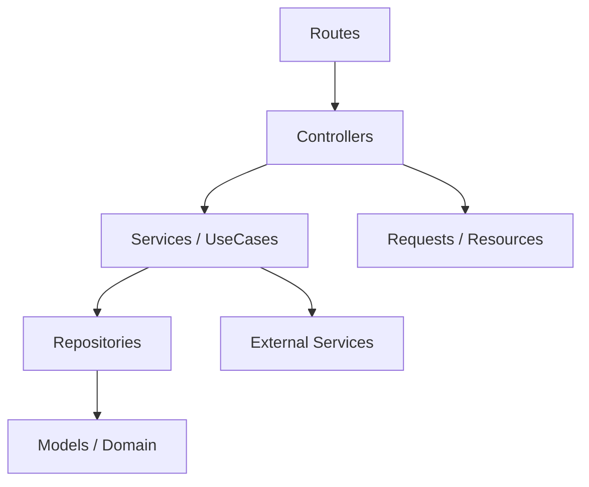
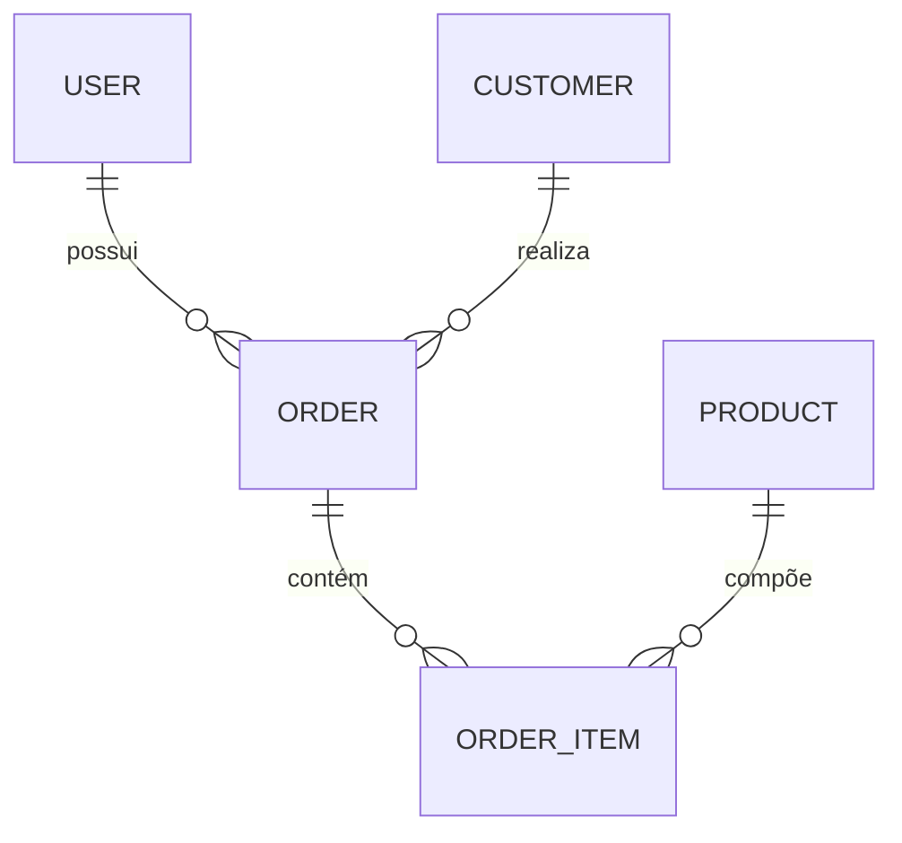
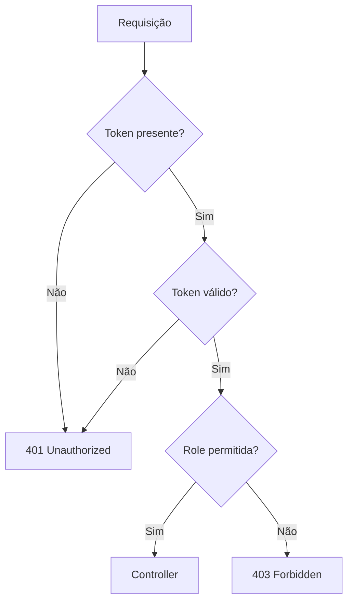
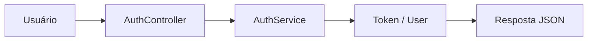
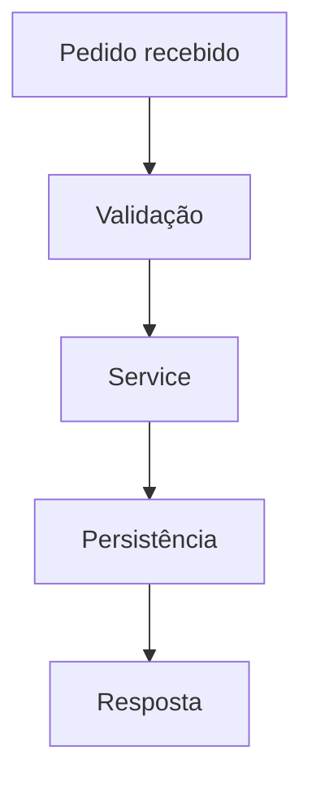

# SimplyFood Backend - Technical Guide

<!--
Este documento consolida a visão técnica do backend do projeto SimplyFood.
Ele serve como referência principal para arquitetura, fluxo de desenvolvimento,
API, autenticação, modelos de dados, testes e convenções de manutenção.
-->

## 1. Project Overview

### Objetivo
O backend do SimplyFood é responsável por fornecer a API principal do sistema, concentrando a regra de negócio, autenticação, validação, persistência e integração com serviços externos.

### Escopo
- autenticação e autorização
- gestão de clientes
- gestão de produtos
- gestão de pedidos
- integração com serviços externos
- exposição de endpoints JSON para o frontend

### Arquitetura geral
O backend segue uma abordagem de arquitetura limpa com separação em camadas, priorizando controllers finos, services para regra de negócio e abstração de persistência.



### Responsabilidades do Backend
- processar requisições HTTP
- validar entradas
- aplicar regras de negócio em Services/UseCases
- persistir dados via Eloquent
- proteger endpoints por middleware e papéis
- padronizar respostas da API

### Convenções adotadas
- controllers finos
- services para regras de negócio
- models como camada de domínio
- repositories para abstração de persistência
- testes obrigatórios via TDD

### Baseline SDD (Spec-Driven Development)
<!--
Este AGENTS.md é a especificação técnica viva do backend.
A evolução deve manter rastreabilidade entre Sprint -> Feature -> API -> Modelos -> Testes.
-->
- Fonte de verdade de endpoints: routes/api.php
- Fonte de verdade de middleware/aliases: bootstrap/app.php
- Fonte de verdade de fluxos de negócio: app/Application/Services
- Fonte de verdade de contratos HTTP: app/Http/Controllers, app/Http/Requests, app/Http/Resources
- Fonte de verdade de persistência: app/Infrastructure/Repositories

---

## 2. Sprints

### Sprint 01 - Fundação e autenticação
- ID: S01
- Nome: Foundation & Auth
- Objetivo: estruturar a base da API e disponibilizar autenticação inicial
- Status: Em andamento
- Responsável: Backend Team
- Dependências: Laravel, Docker, banco de dados
- Checklist:
  - [x] estrutura base do Laravel
  - [x] rotas públicas de autenticação
  - [x] middleware de validação de token
  - [ ] cobertura completa de testes de auth
- Prioridade: Alta
- Entregues: login, registro, health check
- Pendentes: testes e refinamento de permissões
- Riscos: inconsistência entre papéis e permissões
- Bloqueios: nenhum

### Sprint 02 - Gestão operacional
- ID: S02
- Nome: Customers, Products and Orders
- Objetivo: disponibilizar os fluxos principais de gestão operacional
- Status: Planejado
- Responsável: Backend Team
- Dependências: S01
- Checklist:
  - [ ] CRUD de clientes
  - [ ] CRUD de produtos
  - [ ] fluxo de pedidos
  - [ ] alteração de status de pedido
- Prioridade: Alta
- Entregues: estrutura inicial
- Pendentes: implementação completa
- Riscos: mudanças de regra de negócio
- Bloqueios: dependência de integração com frontend

### Backlog consolidado (Sprints)
- S01: ampliar cobertura de testes para autenticação
- S02: consolidar CRUD completo de customers/products/orders com critérios de aceite
- S02: reduzir riscos de divergência de contratos entre API e frontend

### Roadmap incremental (Sprints)
- Curto prazo: estabilização de autenticação e autorização por role
- Médio prazo: fechamento dos fluxos operacionais principais
- Evolução contínua: atualização da matriz SDD a cada endpoint ou teste novo

### Exemplo de rastreabilidade em JSON
```json
{
  "sprint": "S02",
  "feature": "FEAT-BE-003",
  "endpoints": ["POST /api/customers", "GET /api/customers/{id}"],
  "camadas": ["Presentation", "Application", "Domain", "Infrastructure"],
  "status": "parcialmente implementado"
}
```

---

## 3. Features

<!--
Cada feature abaixo representa um fluxo funcional documentado para manutenção.
Não alterar a responsabilidade de cada módulo sem revisar os impactos de autenticação,
validação e contratos de API.
-->

### Feature 1 - Health Check
- Nome: Health Check
- ID de rastreio: FEAT-BE-001
- Descrição: endpoint para verificar a disponibilidade da API
- Objetivo: validar se a aplicação responde corretamente
- Escopo: verificação simples de disponibilidade da aplicação
- Fluxo: requisição simples -> resposta JSON
- Dependências: nenhuma
- Arquivos envolvidos: routes/api.php
- Controllers: nenhum
- Services: nenhum
- Models: nenhum
- Endpoints: GET /api/health
- Status: Ativo

### Feature 2 - Autenticação
- Nome: Authentication
- ID de rastreio: FEAT-BE-002
- Descrição: login e registro do sistema
- Objetivo: gerar sessão/autenticação para uso das rotas protegidas
- Escopo: autenticação, geração de token e controle de acesso
- Fluxo: cliente envia credenciais -> AuthController -> AuthService -> token/usuário
- Dependências: banco de dados, usuário
- Arquivos envolvidos: app/Http/Controllers/AuthController.php, app/Application/Services/AuthService.php
- Controllers: AuthController
- Services: AuthService
- Models: User
- Endpoints: POST /api/auth/login, POST /api/auth/register
- Status: Ativo

### Feature 3 - Gestão de Clientes
- Nome: Customer Management
- ID de rastreio: FEAT-BE-003
- Descrição: cadastro, consulta e atualização de clientes
- Objetivo: centralizar dados de clientes para operações comerciais
- Escopo: CRUD de clientes com validação e autorização
- Fluxo: requisição -> controller -> service -> repository -> model
- Dependências: autenticação, permissões por role
- Arquivos envolvidos: app/Http/Controllers/CustomerController.php, app/Application/Services/CustomerService.php
- Controllers: CustomerController
- Services: CustomerService
- Models: Customer
- Endpoints: GET /api/customers, GET /api/customers/{id}, PUT /api/customers/{id}, DELETE /api/customers/{id}
- Status: Parcialmente implementado

### Feature 4 - Gestão de Produtos
- Nome: Product Management
- ID de rastreio: FEAT-BE-004
- Descrição: manipulação de catálogo de produtos
- Objetivo: permitir manutenção do cardápio ou catálogo base
- Escopo: listagem, ativação e cadastro de produtos
- Fluxo: requisição -> controller -> service -> persistence
- Dependências: autenticação e papéis
- Arquivos envolvidos: app/Http/Controllers/ProductController.php
- Controllers: ProductController
- Services: ProductService
- Models: Product
- Endpoints: GET /api/products, GET /api/products/active, POST /api/products
- Status: Parcialmente implementado

### Feature 5 - Gestão de Pedidos
- Nome: Order Management
- ID de rastreio: FEAT-BE-005
- Descrição: criação, consulta e atualização de pedidos
- Objetivo: controlar ciclo operacional e status do pedido
- Escopo: criação, consulta e alteração de status em pedidos
- Fluxo: pedido criado -> status alterado -> consulta do pedido
- Dependências: clientes, produtos, autenticação
- Arquivos envolvidos: app/Http/Controllers/OrderController.php, app/Application/Services/OrderService.php
- Controllers: OrderController
- Services: OrderService
- Models: Order
- Endpoints: GET /api/orders, GET /api/orders/{id}, POST /api/orders, PATCH /api/orders/{id}/status
- Status: Parcialmente implementado

---

## 4. Feature Layer

<!--
A Feature Layer organiza cada fluxo funcional em um conjunto coeso de arquivos e responsabilidades.
Essa abordagem facilita rastreabilidade entre requisito, API e implementação sem misturar regra de negócio com transporte HTTP.
-->

### Padrão adotado
Cada feature deve manter um escopo claro e reutilizável, com foco em:
- Objetivo
- Escopo
- Fluxo
- Componentes envolvidos
- Services
- Controllers
- Requests
- Models
- Repositories
- Interfaces
- Rotas relacionadas
- Dependências
- Responsabilidades

### Estrutura sugerida por feature
- Presentation: controllers, requests e resources
- Application: services e use cases
- Domain: models, value objects e regras centrais
- Infrastructure: repositories, integrations e persistência

### Exemplo de contrato de feature em JSON
```json
{
  "featureId": "FEAT-BE-005",
  "name": "Order Management",
  "flow": [
    "OrderController",
    "OrderService",
    "OrderRepository",
    "Order model"
  ],
  "statusTransition": "PATCH /api/orders/{id}/status"
}
```

### Feature map detalhado (estado atual)

#### Feature FEAT-BE-001 - Health Check
<!--
Feature de observabilidade mínima para disponibilidade de API.
Não concentra regra de negócio.
-->
- Objetivo: verificar disponibilidade básica da API
- Escopo: resposta JSON simples
- Fluxo: request -> closure route -> JSON
- Componentes envolvidos: routes/api.php
- Services: N/A
- Controllers: N/A
- Requests: N/A
- Models: N/A
- Repositories: N/A
- Interfaces: N/A
- Rotas relacionadas: GET /api/health
- Dependências: framework HTTP do Laravel
- Responsabilidades: health probe para integração e monitoramento

#### Feature FEAT-BE-002 - Authentication
<!--
Feature responsável por login/registro e emissão de token mock (valid-{id}).
Controllers devem apenas validar entrada e delegar ao service.
-->
- Objetivo: autenticar e registrar usuários
- Escopo: login, register e retorno de token/user
- Fluxo: route -> AuthController -> AuthService -> User model -> response
- Componentes envolvidos: AuthController, AuthService
- Services: AuthService
- Controllers: AuthController
- Requests: validação inline no controller (Request::validate)
- Models: User (app/Domains/Auth/User/User.php)
- Repositories: N/A dedicado no fluxo atual
- Interfaces: N/A dedicada no fluxo atual
- Rotas relacionadas: POST /api/auth/login, POST /api/auth/register, POST /api/login, POST /api/register
- Dependências: Hash, banco de usuários
- Responsabilidades: autenticação e criação de usuário

#### Feature FEAT-BE-003 - Customer Management
<!--
Feature de clientes com criação pública e operações protegidas.
Regras de negócio permanecem em CustomerService.
-->
- Objetivo: gerenciar ciclo de vida de clientes
- Escopo: create, list, show, update e delete
- Fluxo: route -> CustomerController -> CustomerService -> CustomerRepository -> model/resource
- Componentes envolvidos: CustomerController, StoreCustomerRequest, CustomerResource
- Services: CustomerService
- Controllers: CustomerController
- Requests: StoreCustomerRequest
- Models: Customer (domínio de Customer)
- Repositories: CustomerRepository, AddressRepository
- Interfaces: N/A dedicada no fluxo atual
- Rotas relacionadas: POST /api/customers (pública), GET/PUT/PATCH/DELETE /api/customers/{id} (protegidas)
- Dependências: middleware token.valid e auth.system
- Responsabilidades: persistência de cliente e resposta padronizada

#### Feature FEAT-BE-004 - Product Management
<!--
Feature de catálogo com operações protegidas e filtro de ativos.
-->
- Objetivo: gerenciar produtos e disponibilidade
- Escopo: get, getActive, show, post, update e delete
- Fluxo: route -> ProductController -> ProductService -> ProductRepository -> model
- Componentes envolvidos: ProductController
- Services: ProductService
- Controllers: ProductController
- Requests: StoreProductRequest (quando aplicável no fluxo de criação/edição)
- Models: Product (domínio de Product)
- Repositories: ProductRepository, CategoryRepository
- Interfaces: N/A dedicada no fluxo atual
- Rotas relacionadas: GET /api/products, GET /api/products/active, GET /api/products/{id}, POST /api/products, PUT/PATCH /api/products/{id}, DELETE /api/products/{id}
- Dependências: autenticação e autorização por role
- Responsabilidades: catálogo, disponibilidade e atualização de produtos

#### Feature FEAT-BE-005 - Order Management
<!--
Feature operacional de pedidos com alteração de status e validação semântica.
-->
- Objetivo: gerenciar pedidos e transições de status
- Escopo: get, show, post, update, changeStatus e delete
- Fluxo: route -> OrderController -> OrderService -> OrderRepository/OrderItemRepository -> model
- Componentes envolvidos: OrderController
- Services: OrderService
- Controllers: OrderController
- Requests: StoreOrderRequest (quando aplicável no fluxo de criação/edição)
- Models: Order, OrderItem (domínio de Order)
- Repositories: OrderRepository, OrderItemRepository
- Interfaces: N/A dedicada no fluxo atual
- Rotas relacionadas: GET /api/orders, GET /api/orders/{id}, POST /api/orders, PUT/PATCH /api/orders/{id}, PATCH /api/orders/{id}/status, DELETE /api/orders/{id}
- Dependências: clientes, produtos, autenticação e autorização
- Responsabilidades: ciclo operacional do pedido e consistência de status

### Comentário de arquitetura
<!--
Controllers devem permanecer finos; regras de negócio devem residir em services ou use cases.
Persistência e integrações externas devem ser isoladas em repositories e adapters.
-->

---

## 5. Acceptance Criteria

### Autenticação
- Given um usuário válido
- When enviar credenciais corretas
- Then deve receber token e dados do usuário

- Given credenciais inválidas
- When tentar autenticar
- Then deve receber 401 Unauthorized

- Given usuário sem permissão
- When acessar rota protegida
- Then deve receber 403 Forbidden

### Gestão de Clientes
- Checklist funcional:
  - [ ] cadastro com dados válidos
  - [ ] rejeição de dados inválidos
  - [ ] consulta por identificador
  - [ ] atualização de dados
  - [ ] remoção lógica ou física conforme regra vigente

### Gestão de Pedidos
- Checklist funcional:
  - [ ] pedido criado com sucesso
  - [ ] status alterado corretamente
  - [ ] validação de status inválido
  - [ ] resposta semântica em caso de erro

---

## 6. API Specification

### Endpoints principais

| Endpoint | Method | Controller | Action | Middleware | Autenticação |
| --- | --- | --- | --- | --- | --- |
| /api/health | GET | - | closure | - | Pública |
| /api/auth/login | POST | AuthController | login | - | Pública |
| /api/auth/register | POST | AuthController | register | - | Pública |
| /api/login | POST | AuthController | login | - | Pública |
| /api/register | POST | AuthController | register | - | Pública |
| /api/customers | POST | CustomerController | store | - | Pública |
| /api/customers | GET | CustomerController | get | token.valid, auth.system | Privada |
| /api/customers/{id} | GET | CustomerController | show | token.valid, auth.system | Privada |
| /api/customers/{id} | PUT | CustomerController | update | token.valid, auth.system | Privada |
| /api/customers/{id} | PATCH | CustomerController | update | token.valid, auth.system | Privada |
| /api/customers/{id} | DELETE | CustomerController | deleted | token.valid, auth.system | Privada |
| /api/products | GET | ProductController | get | token.valid, auth.system | Privada |
| /api/products/active | GET | ProductController | getActive | token.valid, auth.system | Privada |
| /api/products/{id} | GET | ProductController | show | token.valid, auth.system | Privada |
| /api/products | POST | ProductController | post | token.valid, auth.system | Privada |
| /api/products/{id} | PUT | ProductController | update | token.valid, auth.system | Privada |
| /api/products/{id} | PATCH | ProductController | update | token.valid, auth.system | Privada |
| /api/products/{id} | DELETE | ProductController | deleted | token.valid, auth.system | Privada |
| /api/orders | GET | OrderController | get | token.valid, auth.system | Privada |
| /api/orders/{id} | GET | OrderController | show | token.valid, auth.system | Privada |
| /api/orders | POST | OrderController | post | token.valid, auth.system | Privada |
| /api/orders/{id} | PUT | OrderController | update | token.valid, auth.system | Privada |
| /api/orders/{id} | PATCH | OrderController | update | token.valid, auth.system | Privada |
| /api/orders/{id}/status | PATCH | OrderController | changeStatus | token.valid, auth.system | Privada |
| /api/orders/{id} | DELETE | OrderController | deleted | token.valid, auth.system | Privada |

### Autenticação e autorização (estado atual)
- token.valid: valida bearer token no request
- auth.system: aplica autorização por role (ADMIN, MANAGER, OPERATOR)
- rotas de autenticação possuem versões com prefixo /auth e sem prefixo

### Payload example - Login
```json
{
  "email": "admin@email.com",
  "password": "********"
}
```

### Response example - Login
```json
{
  "status": "success",
  "data": {
    "token": "...",
    "user": {
      "id": 1,
      "name": "Administrador",
      "email": "admin@email.com",
      "role": "ADMIN"
    }
  },
  "message": "Login realizado com sucesso!"
}
```

### Status codes
- 200 OK: sucesso em consultas e autenticações válidas
- 201 Created: criação realizada com sucesso
- 204 No Content: quando aplicável
- 400 Bad Request: payload inválido ou erro de cadastro
- 401 Unauthorized: token ausente ou inválido
- 403 Forbidden: sem permissão para o papel exigido
- 404 Not Found: recurso inexistente
- 422 Unprocessable Entity: payload semântico inválido
- 500 Internal Server Error: erro inesperado

---

## 7. Data Models

### Modelos principais
- User
- Customer
- Product
- Order
- OrderItem

### Relacionamentos principais


### Model - User
- atributos: id, name, email, password, role
- constraints: email único, senha obrigatória
- regras: autenticação e autorização por role

### Model - Customer
- atributos: id, name, email, phone, whatsapp, cpf_cnpj
- constraints: campos obrigatórios conforme regra de negócio
- relacionamentos: possui pedidos

### Model - Product
- atributos: id, name, price, description, status
- regras: catálogo e disponibilidade

### Model - Order
- atributos: id, customer_id, status, total
- regras: fluxo de status e validação

### Rastreio por camadas (resumo)
- Presentation: controllers + requests + resources
- Application: services em app/Application/Services
- Domain: entidades em app/Domains
- Infrastructure: repositories em app/Infrastructure/Repositories

---

## 8. Stack

### Backend
- Laravel 12
- PHP 8.2+
- Composer
- MySQL
- Docker Compose

### Infraestrutura
- Docker
- Nginx
- Redis
- Git
- GitHub

### Qualidade
- Pest
- PHPUnit
- Pint

---

## 9. Coder Agent

### Backend Agent
- Agent ID: BACKEND-AGENT
- Nome: Backend Engineer
- Responsabilidade: manter APIs, services, controllers, models e regras de negócio
- Escopo: app/, routes/, database/, tests/
- Permissões: leitura e escrita em código funcional
- Arquivos protegidos: rotas críticas, middlewares, políticas de segurança
- Prioridade: Alta

### Documentation Agent
- Agent ID: DOC-AGENT
- Nome: Documentation Maintainer
- Responsabilidade: manter esta documentação atualizada
- Escopo: AGENTS.md, README.md, DOCKER.md, HOW_TO_USE.md
- Permissões: editar documentação
- Arquivos protegidos: documentação de arquitetura e políticas
- Prioridade: Média

---

## 10. File Structure

```text
backend/
  app/
    Application/
    Domains/
    Http/
    Infrastructure/
    Shared/
  database/
  routes/
  tests/
  public/
  config/
  resources/
```

### Comentários de estrutura
- app/Application: orchestration e regras de aplicação
- app/Domains: entidades e regras de domínio
- app/Http: controllers, requests, middleware, resources
- app/Infrastructure: integrações e persistência abstrata
- database: migrations e seeders
- routes: definição de endpoints HTTP
- tests: testes unitários e feature

---

## 11. Authentication

### Fluxo de autenticação


### Regras atuais
- rotas públicas: /api/health, /api/auth/login, /api/auth/register
- rotas protegidas: customers, products, orders
- middleware: token.valid e auth.system:ADMIN,MANAGER,OPERATOR
- aliases de middleware definidos em bootstrap/app.php

### Exemplo de retorno de erro (autorização)
```json
{
  "status": "error",
  "message": "Forbidden: You do not have the required permissions."
}
```

### Respostas esperadas
- 401 Unauthorized: token ausente ou inválido
- 403 Forbidden: papel não autorizado

---

## 12. Validation

### Validações de autenticação
- email: required, email
- password: required, string

### Validações de cadastro
- name: required
- email: required, email, unique
- password: required, min:6

### Validações de pedidos
- status: obrigatório quando houver alteração
- payload: deve ser semanticamente válido

---

## 13. Fluxos principais

### Fluxo de login


### Fluxo de pedido


---

## 14. Clean Architecture

<!--
A arquitetura do backend preserva separação entre entrada HTTP, aplicação, domínio e infraestrutura.
Essa divisão favorece evolução incremental, testes e menor acoplamento entre camadas.
-->

### Presentation Layer
- routes, controllers, requests e resources
- responsabilidade: receber requisições e formatar respostas

### Feature Layer
- fluxos funcionais organizados por feature
- responsabilidade: coordenar services, requests, models e integrações para um caso de uso

### Application Layer
- services e use cases
- responsabilidade: encapsular regras de aplicação e orquestração de fluxo

### Domain Layer
- models, entidades e regras centrais
- responsabilidade: representar o negócio e garantir consistência interna

### Infrastructure Layer
- repositories, adapters e integração com serviços externos
- responsabilidade: isolar dependências tecnológicas e persistência

### Comunicação entre camadas
- controllers não devem conter regra de negócio
- services orquestram o fluxo principal
- repositories isolam acesso à persistência
- middleware protege entradas sensíveis

---

## 15. Auditoria Estrutural do Projeto

### Relatório de auditoria recomendada
| Arquivo | Motivo | Dependências | Impacto | Pode ser removido? |
| --- | --- | --- | --- | --- |
| arquivos temporários | geralmente gerados por execução local | dependem do ambiente | baixo | Sim, se não forem funcionais |
| caches de build | artefatos de compilação | não devem ser versionados | baixo | Sim |
| arquivos de ambiente locais | segredos e configuração local | não devem ser compartilhados | alto | Não, sem revisão |
| arquivos de storage público | podem ser gerados automaticamente | dependem do runtime | médio | Sim, se não forem parte do source |

### Limpeza estrutural
- remover apenas diretórios vazios, caches, artefatos temporários e arquivos gerados automaticamente
- não remover arquivos funcionais sem confirmação explícita
- priorizar segurança e preservação da estrutura atual

### Códigos de erro possíveis nas autenticações e retornos

- 401 Unauthorized
  - Utilizado quando o token não é enviado, é inválido ou não passa pela validação de token.valid.
  - Exemplo de retorno:
    ```json
    {
      "message": "Unauthorized: Token is missing or invalid.",
      "status": "error"
    }
    ```

- 400 Bad Request
  - Utilizado no endpoint de registro quando os dados enviados não passam na validação ou no fluxo de criação.

- 403 Forbidden
  - Esperado quando o usuário está autenticado, mas não possui um dos papéis permitidos (ADMIN, MANAGER ou OPERATOR) para acessar uma rota protegida.

- 422 Unprocessable Entity
  - Utilizado em operações específicas, como alteração de status de pedido, quando o payload recebido é semanticamente inválido.

### Regras de negócio para as rotas protegidas

- As rotas protegidas devem sempre ser tratadas como operações sensíveis e exigirem autenticação explícita.
- A validação de token ocorre antes de qualquer execução de controller.
- A autorização por role ocorre depois da validação de identidade.
- Controllers continuam finos; a lógica de negócio deve permanecer em Services/UseCases.

---

## 16. TDD e Qualidade

### Princípios do TDD no SimplifyFood

1. Red → Green → Refactor
2. Testes como especificação executável
3. Isolamento total com mocks quando necessário
4. Cobertura mínima de 80% em Application e Domain
5. Todo novo código deve ser precedido por testes

### Observação de consistência
<!--
O nome do projeto aparece como SimplyFood e SimplifyFood em partes históricas da documentação.
Para manutenção, considerar SimplyFood como nomenclatura canônica, preservando referências históricas existentes.
-->

### Estrutura Recomendada de Testes

```bash
tests/
├── Unit/
│   ├── Application/
│   │   ├── Services/
│   │   │   ├── CustomerServiceTest.php
│   │   │   ├── OrderServiceTest.php
│   │   │   └── PaymentServiceTest.php
│   │   └── UseCases/
│   │       └── ProcessPaymentUseCaseTest.php
│   ├── Domains/
│   │   ├── Customer/
│   │   │   ├── CustomerTest.php
│   │   │   └── AddressTest.php
│   │   └── Order/
│   │       └── OrderTest.php
│   └── Infrastructure/
│       └── Repositories/
│           └── CustomerRepositoryTest.php
├── Feature/
│   ├── Customer/
│   │   └── CustomerApiTest.php
│   ├── Order/
│   │   └── OrderApiTest.php
│   └── Payment/
│       └── PaymentFlowTest.php
└── Architecture/
    └── CleanArchitectureTest.php
```

### Comandos Úteis

```bash
# Testes Unitários
php artisan test --filter CustomerServiceTest

# Testes de Feature
php artisan test --testsuite=Feature

# Cobertura de Código
php artisan test --coverage

# Watch mode (com Pest)
./vendor/bin/pest --watch
```

---

## 17. Ambiente e Configuração

### Variáveis recomendadas no .env

```env
# App
APP_NAME=SimplifyFood
APP_ENV=local
APP_KEY=
APP_DEBUG=true
APP_URL=http://localhost
APP_TIMEZONE=America/Sao_Paulo

# Database
DB_CONNECTION=pgsql
DB_HOST=127.0.0.1
DB_PORT=5432
DB_DATABASE=simplifyfood
DB_USERNAME=postgres
DB_PASSWORD=password

# Cache / Queue / Session
CACHE_DRIVER=redis
QUEUE_CONNECTION=redis
SESSION_DRIVER=redis

# Redis
REDIS_HOST=127.0.0.1
REDIS_PASSWORD=null
REDIS_PORT=6379

# External services
VIACEP_BASE_URL=https://viacep.com.br/ws
MERCADOPAGO_PUBLIC_KEY=TEST-...
MERCADOPAGO_ACCESS_TOKEN=TEST-...

# Mail
MAIL_MAILER=smtp
MAIL_HOST=smtp.mailtrap.io
MAIL_PORT=2525
MAIL_USERNAME=null
MAIL_PASSWORD=null
MAIL_ENCRYPTION=null
MAIL_FROM_ADDRESS="no-reply@simplifyfood.com.br"
MAIL_FROM_NAME="${APP_NAME}"

# Sanctum / Auth
SANCTUM_STATEFUL_DOMAINS=localhost:3000,127.0.0.1:8000

# Testing
TEST_DB_DATABASE=simplifyfood_test
TEST_DB_USERNAME=postgres
TEST_DB_PASSWORD=password
```

### Comandos de configuração por ambiente

#### Ambiente Local
```bash
cp .env.example .env
composer install
php artisan key:generate
php artisan migrate
```

#### Ambiente de Homologação / Produção
```bash
cp .env.example .env
composer install --no-dev --optimize-autoloader
php artisan config:cache
php artisan route:cache
php artisan view:cache
php artisan migrate --force
```

#### Ambiente de Testes
```bash
php artisan test
```

---

## 18. Matriz de Rastreabilidade (SDD)

| Sprint | Feature | Endpoints principais | Models | Testes relacionados |
| --- | --- | --- | --- | --- |
| S01 | FEAT-BE-001 Health | GET /api/health | N/A | tests/Feature (health quando aplicável) |
| S01 | FEAT-BE-002 Authentication | POST /api/auth/login, /api/auth/register, /api/login, /api/register | User | testes de auth (parciais) |
| S02 | FEAT-BE-003 Customers | /api/customers* | Customer | tests/Feature/Customer/CustomerApiTest.php |
| S02 | FEAT-BE-004 Products | /api/products* | Product | testes pendentes/refinamento |
| S02 | FEAT-BE-005 Orders | /api/orders* | Order, OrderItem | testes pendentes/refinamento |

### Diretriz de atualização da matriz
<!--
Sempre atualizar esta matriz quando houver nova rota, alteração de contrato, inclusão de model
ou criação de teste de feature/unit para manter rastreabilidade entre requisito e implementação.
-->

---