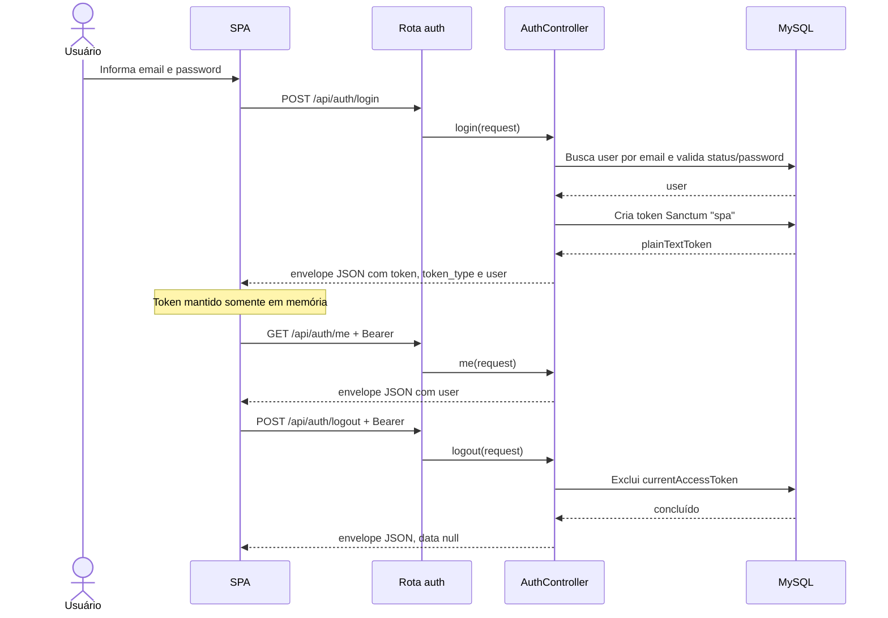

# Autenticar usuário

## Ator e papéis permitidos / 403

Login: usuário com cadastro `ACTIVE`, sem Bearer prévio. `me` e logout: `ADMIN`, `MANAGER`, `CASHIER`, `WAITER` e `KITCHEN` autenticados. Estas rotas não aplicam middleware de papel; não há 403 por papel.

## Pré-condições

- Login recebe `email` e `password`.
- `me` e logout recebem `Authorization: Bearer {token}`.
- A SPA mantém o token Sanctum somente em memória. `localStorage` e `sessionStorage` são proibidos; recarregar a página encerra a sessão local.

## Rotas canônicas

- `POST /api/auth/login`
- `GET /api/auth/me`
- `POST /api/auth/logout`

## Sequência

`AuthController` executa este fluxo diretamente; não existe Service de autenticação.

## Pós-condição

No login, um token Sanctum é criado e fica em memória na SPA. No logout, o token atual é revogado e removido da memória.

## Erros existentes

- 401: credenciais inválidas, usuário inativo ou Bearer ausente/inválido nas rotas autenticadas.
- 422: `email` ou `password` ausente/inválido.
- 403 e 409: não são produzidos pelas regras deste caso de uso.
