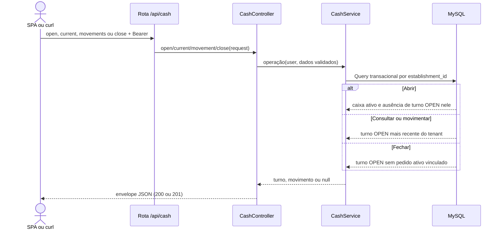

# Operar turno de caixa

## Ator e papéis permitidos / 403

`ADMIN`, `MANAGER`, `CASHIER`. `WAITER` e `KITCHEN` recebem 403.

## Pré-condições

Bearer válido. O caixa informado na abertura deve estar ativo e pertencer à loja. Movimento e fechamento exigem turno `OPEN` no tenant.

## Rotas canônicas

- `POST /api/cash/open`
- `GET /api/cash/current`
- `POST /api/cash/movements`
- `POST /api/cash/close`

## Sequência

## Pós-condição

A abertura cria turno `OPEN`; o movimento cria `BLEED` ou `SUPPLEMENT`; o fechamento grava saldo, horário e status `CLOSED`. `current` não altera dados.

## Erros existentes

- 401: Bearer ausente ou inválido.
- 403: papel sem permissão.
- 409: caixa já possui turno `OPEN`; movimento/fechamento sem turno aberto; fechamento com pedido ativo.
- 422: caixa inválido/de outra loja/inativo ou payload financeiro inválido.
