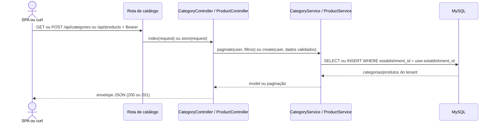

# Consultar e cadastrar catálogo

## Ator e papéis permitidos / 403

Consulta: `ADMIN`, `MANAGER`, `CASHIER`, `WAITER`. Cadastro: `ADMIN`, `MANAGER`. `CASHIER`, `WAITER` e `KITCHEN` recebem 403 no cadastro; `KITCHEN` também recebe 403 na consulta.

## Pré-condições

Bearer Sanctum válido. No produto, `category_id` deve pertencer à loja; nome e preço são obrigatórios. Toda leitura e gravação usa o `establishment_id` do usuário.

## Rotas canônicas

- `GET /api/categories`
- `POST /api/categories`
- `GET /api/products`
- `POST /api/products`

## Sequência

## Pós-condição

Na consulta, somente registros da loja são listados. No cadastro, categoria ou produto é criado com o `establishment_id` autenticado.

## Erros existentes

- 401: Bearer ausente ou inválido.
- 403: papel fora do grupo permitido.
- 422: campos inválidos, categoria fora da loja/inexistente, ou `sku` repetido na loja.
- 409: não há conflito de negócio implementado nestas quatro rotas.
