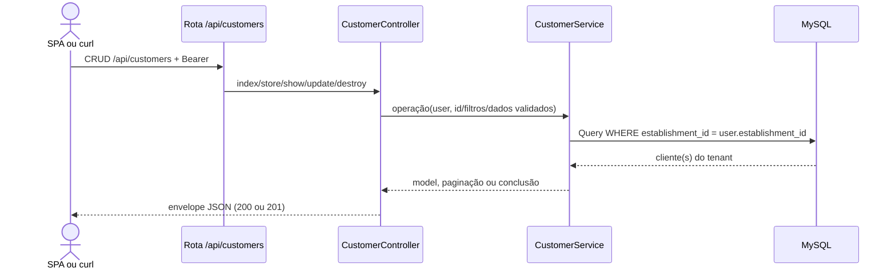

# Gerenciar clientes

## Ator e papéis permitidos / 403

Listar e consultar: `ADMIN`, `MANAGER`, `CASHIER`, `WAITER`. Criar, atualizar e excluir: `ADMIN`, `MANAGER`, `WAITER`. `KITCHEN` recebe 403 em todo o CRUD; `CASHIER` recebe 403 nas mutações.

## Pré-condições

Bearer válido. IDs e buscas ficam no tenant. Quando informado, `phone` deve ser único por `establishment_id`; a atualização ignora o próprio cliente.

## Rotas canônicas

- `GET /api/customers`
- `POST /api/customers`
- `GET /api/customers/{customer}`
- `PATCH /api/customers/{customer}`
- `DELETE /api/customers/{customer}`

## Sequência

## Pós-condição

O cliente é listado, criado, atualizado ou removido por soft delete somente na loja autenticada.

## Erros existentes

- 401: Bearer ausente ou inválido.
- 403: papel sem permissão.
- 422: dados inválidos, inclusive telefone repetido na mesma loja.
- 409: não há conflito de negócio implementado no CRUD.
