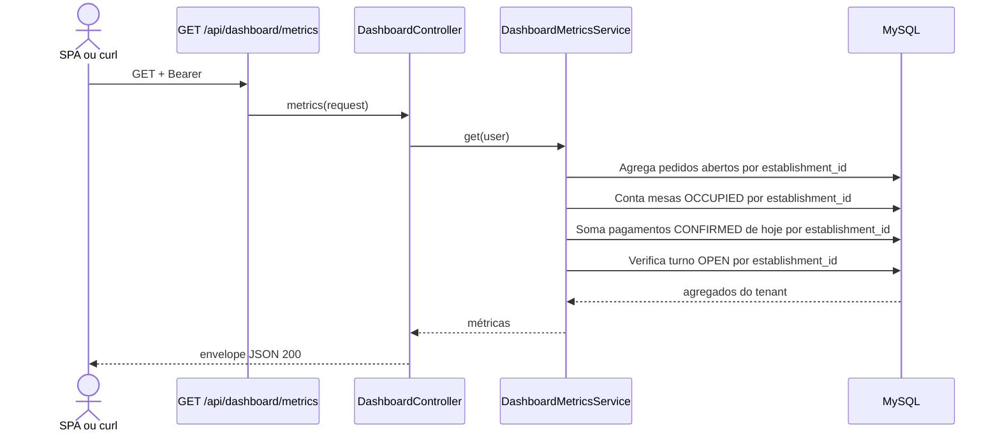

# Consultar métricas do dashboard

## Ator e papéis permitidos / 403

`ADMIN`, `MANAGER`, `CASHIER`, `WAITER`. `KITCHEN` recebe 403.

## Pré-condições

Bearer Sanctum válido e usuário ligado a um `establishment_id`.

## Rota canônica

`GET /api/dashboard/metrics`

## Sequência

## Pós-condição

Nenhum dado é alterado. A resposta contém `open_orders`, `occupied_tables`, `today_revenue` e `open_shift` somente da loja autenticada.

## Erros existentes

- 401: Bearer ausente ou inválido.
- 403: papel sem permissão.
- 409 e 422: não são produzidos pelas regras desta rota.
