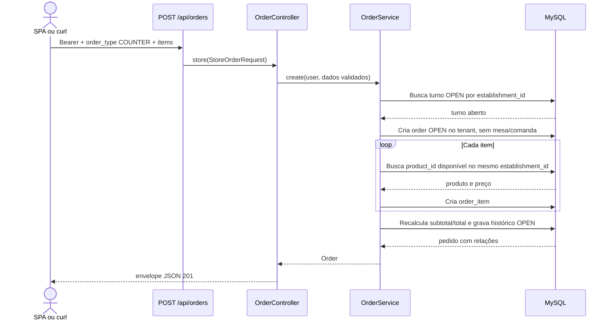

# Criar pedido COUNTER

## Ator e papéis permitidos / 403

`ADMIN`, `MANAGER`, `CASHIER`, `WAITER`. `KITCHEN` recebe 403.

## Pré-condições

Bearer válido; existe turno de caixa `OPEN` na loja; `order_type` é `COUNTER`; `table_id` e `command_id` são proibidos; há ao menos um item; cada `product_id` pertence à mesma loja e está disponível.

## Rota canônica

`POST /api/orders`

## Sequência

## Pós-condição

Pedido `COUNTER` fica `OPEN`, ligado ao turno e ao usuário, com totais calculados a partir dos preços atuais dos produtos; `table_id` e `command_id` ficam nulos.

## Erros existentes

- 401: Bearer ausente ou inválido.
- 403: papel sem permissão.
- 409: não existe turno de caixa `OPEN`.
- 422: tipo/payload inválido, IDs fora da loja, produto indisponível ou inexistente, quantidade inválida, ou uso de mesa/comanda em `COUNTER`.
