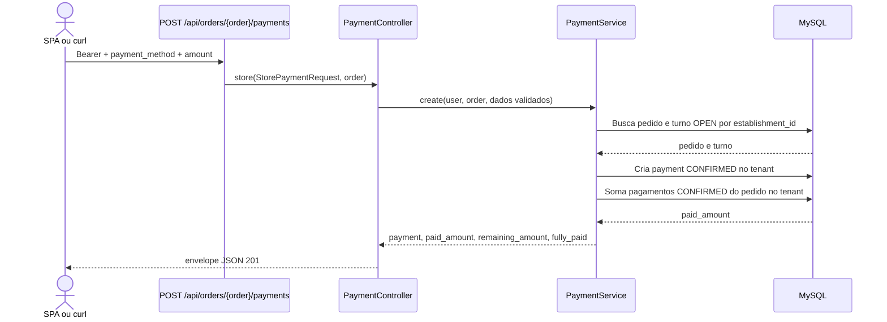

# Registrar pagamento

## Ator e papéis permitidos / 403

`ADMIN`, `MANAGER`, `CASHIER`. `WAITER` e `KITCHEN` recebem 403.

## Pré-condições

Bearer válido. O pedido pertence ao tenant, não está `CLOSED`/`CANCELLED` e o turno ligado ao pedido continua `OPEN`. O campo é `payment_method`; `method` não é aceito.

## Rota canônica

`POST /api/orders/{order}/payments`

## Sequência

## Pós-condição

Pagamento `CONFIRMED` é criado. `fully_paid` é verdadeiro quando `paid_amount >= total_amount`; portanto também é verdadeiro na igualdade pedida pelo contrato.

## Erros existentes

- 401: Bearer ausente ou inválido.
- 403: papel sem permissão.
- 409: pedido encerrado ou turno do pedido não está aberto.
- 422: `payment_method` ausente/fora da enumeração, uso de `method`, ou `amount` inválido.
