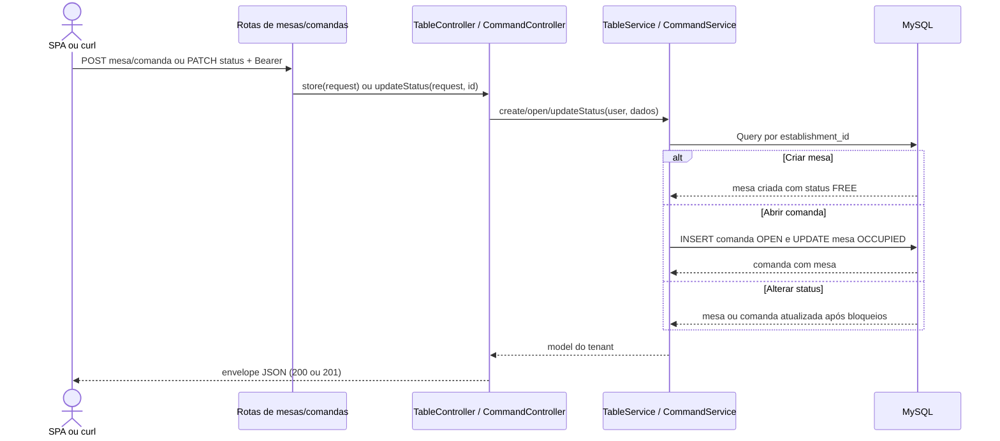

# Gerenciar mesas e comandas

## Ator e papéis permitidos / 403

Criar mesa, abrir comanda e alterar status: `ADMIN`, `MANAGER`, `WAITER`. `CASHIER` e `KITCHEN` recebem 403. As consultas permitem também `CASHIER`, mas não fazem parte das rotas desenhadas abaixo.

## Pré-condições

Bearer válido. Mesa e comanda pertencem ao tenant. A abertura exige `code` único por loja e `table_id`; a mesa não pode estar `BILLING`.

## Rotas canônicas

- `POST /api/tables`
- `PATCH /api/tables/{table}/status`
- `POST /api/commands`
- `PATCH /api/commands/{command}/status`

## Sequência

## Pós-condição

Mesa nova fica `FREE`. Comanda nova fica `OPEN`, sempre vinculada a `table_id`, e a mesa fica `OCCUPIED`. Alterações de status persistem após as verificações de pedidos/comandas ativos.

## Erros existentes

- 401: Bearer ausente ou inválido.
- 403: papel sem permissão.
- 409: abrir comanda em mesa `BILLING`; liberar mesa com comanda ou pedido ativo; fechar comanda com pedido `OPEN`/`IN_PREPARATION`; reabertura fora das condições do service.
- 422: payload/status inválido, mesa fora da loja ou `code` repetido na loja.
