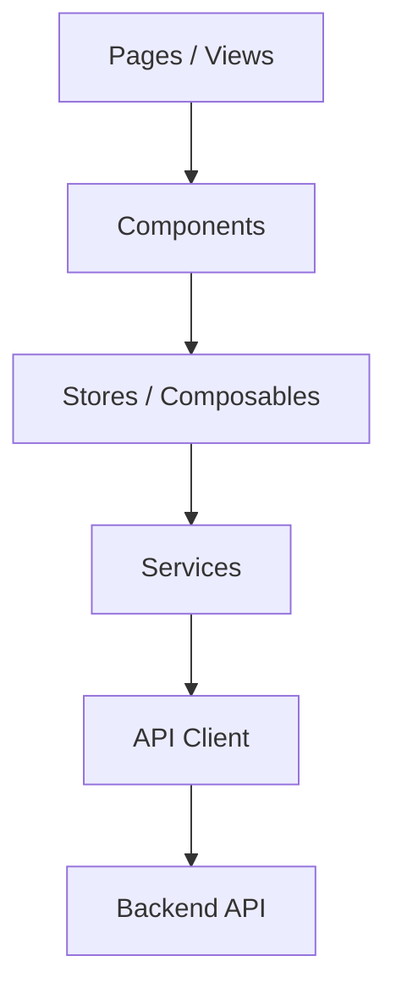
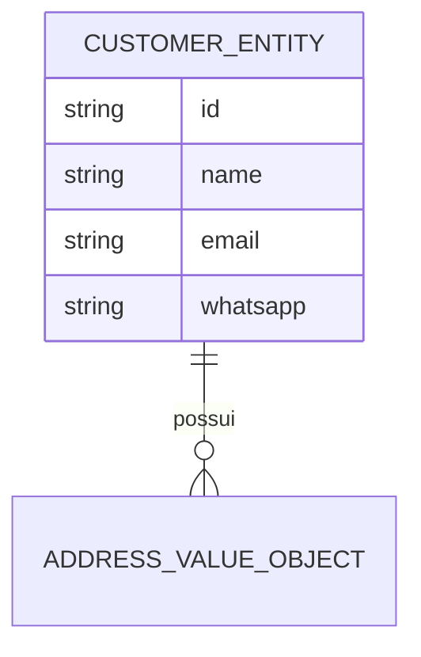
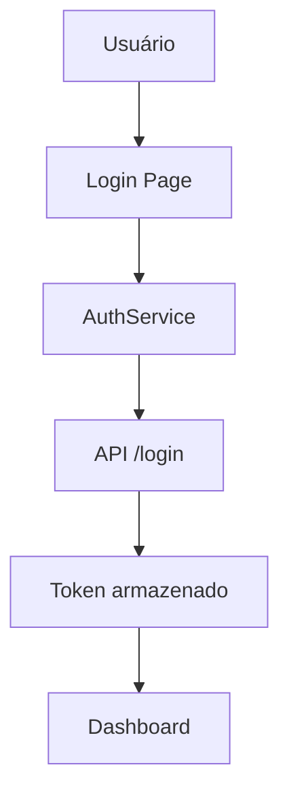

# SimplyFood Frontend - Technical Guide

<!--
Este documento consolida a visão técnica do frontend do projeto SimplyFood.
Ele serve como referência para arquitetura, módulos, fluxos, integração com a API,
autenticação, testes e manutenção da interface.
-->

## 1. Project Overview

### Objetivo
O frontend do SimplyFood é responsável por oferecer a experiência visual e interativa para os usuários do sistema, consumindo a API do backend e organizando o fluxo de navegação por módulos.

### Escopo
- autenticação de usuários
- cadastro e gestão de clientes
- gestão de produtos e pedidos
- painéis e telas operacionais
- integração com a API Laravel

### Arquitetura geral
O frontend utiliza uma estrutura modular com Vue 3, TypeScript, Pinia e Vue Router, favorecendo separação por feature e reuso de componentes.



### Responsabilidades do Frontend
- renderizar telas e componentes
- encapsular regras de apresentação
- consumir endpoints da API
- tratar estados de loading, erro e sucesso
- preservar experiência de usuário em fluxos críticos

### Convenções adotadas
- módulos por feature
- componentes reutilizáveis em shared
- stores para estado global
- services para integração HTTP
- testes com Vitest

### Baseline SDD (Spec-Driven Development)
<!--
Este AGENTS.md funciona como especificação viva do frontend.
Toda evolução deve manter rastreabilidade entre Sprint -> Feature -> API -> Modelo.
-->
- Fonte de verdade de navegação: src/app/router/index.ts
- Fonte de verdade de integração HTTP: src/shared/api/client.ts
- Fonte de verdade de estado de autenticação: src/shared/stores/auth.ts
- Fonte de verdade de contratos de feature: src/modules/*

---

## 2. Sprints

### Sprint 01 - Base da interface
- ID: F01
- Nome: UI Foundation
- Objetivo: estruturar o frontend e disponibilizar telas base
- Status: Em andamento
- Responsável: Frontend Team
- Dependências: backend inicial
- Checklist:
  - [x] estrutura base do Vue 3
  - [x] configuração de rotas
  - [x] layout base
  - [ ] integração completa com autenticação
- Prioridade: Alta
- Entregues: layout inicial, rotas, componentes compartilhados
- Pendentes: fluxos completos de autenticação e módulos de negócio
- Riscos: divergência entre contratos da API e UI
- Bloqueios: dependência de endpoints estáveis

### Sprint 02 - Módulos operacionais
- ID: F02
- Nome: Business Modules
- Objetivo: entregar fluxos de clientes, produtos e pedidos na interface
- Status: Planejado
- Responsável: Frontend Team
- Dependências: F01
- Checklist:
  - [ ] módulo de clientes
  - [ ] módulo de produtos
  - [ ] módulo de pedidos
  - [ ] dashboard principal
- Prioridade: Alta

### Backlog consolidado (Sprints)
- F01: finalizar integração completa de autenticação
- F02: expandir navegação para módulos além de customers e dashboard
- F02: conectar fluxos de products e orders já catalogados em src/modules

### Roadmap incremental (Sprints)
- Curto prazo: estabilizar contratos de auth e customers
- Médio prazo: conectar products e orders ao router e aos serviços
- Evolução contínua: manter matriz SDD atualizada por feature entregue

### Exemplo de rastreabilidade em JSON
```json
{
  "sprint": "F02",
  "feature": "FEAT-FE-002",
  "rota_ui": "/customers",
  "api": ["POST /api/customers", "GET /api/customers?whatsapp={value}"],
  "status": "ativo"
}
```

---

## 3. Features

<!--
As features abaixo representam os principais fluxos da interface.
Qualquer alteração deve preservar a experiência do usuário e o contrato com a API.
-->

### Feature 1 - Autenticação
- Nome: Authentication Flow
- ID de rastreio: FEAT-FE-001
- Descrição: tela de login e fluxo de acesso ao sistema
- Objetivo: autenticar usuários e redirecionar para o painel
- Escopo: login, validação, armazenamento de sessão e redirecionamento pós-login
- Fluxo: login -> validação -> token -> dashboard
- Dependências: backend auth, auth store, router guard
- Arquivos envolvidos: src/modules/auth
- Componentes: LoginForm, AuthLayout
- Stores / composables: auth store
- Services: AuthService
- Rotas relacionadas: rotas protegidas e fluxo pós-login
- Responsabilidades: orquestrar entrada, feedback visual e integração com autenticação
- Status: Parcialmente implementado

### Feature 2 - Cadastro de Clientes
- Nome: Customer Registration
- ID de rastreio: FEAT-FE-002
- Descrição: formulário de cadastro de cliente
- Objetivo: capturar informações do cliente e enviar à API
- Escopo: formulário, validação, persistência e feedback de sucesso/erro
- Fluxo: formulário -> validação -> API -> feedback
- Dependências: backend customers
- Arquivos envolvidos: src/modules/customers
- Componentes: CustomerForm
- Stores / composables: estado local da página + validação de formulário
- Services: CustomerApi
- Rotas relacionadas: cadastro e consulta de clientes
- Responsabilidades: coletar dados, validar entrada e comunicar-se com o backend
- Status: Parcialmente implementado

### Feature 3 - Dashboard
- Nome: Dashboard
- ID de rastreio: FEAT-FE-003
- Descrição: painel principal com visão geral do sistema
- Objetivo: concentrar indicadores e ações rápidas
- Escopo: visão consolidada do sistema e navegação para operações principais
- Dependências: dados da API
- Arquivos envolvidos: src/modules/dashboard
- Componentes: DashboardPage
- Responsabilidades: apresentar informações agregadas e direcionar o usuário para ações críticas
- Status: Parcialmente implementado

---

## 4. Feature Layer

<!--
A Feature Layer organiza cada fluxo funcional em um conjunto coeso de arquivos e responsabilidades.
Essa abordagem favorece rastreabilidade entre requisito, interface e integração com a API.
-->

### Padrão adotado
Cada feature deve manter um escopo claro e reutilizável, com foco em:
- Objetivo
- Escopo
- Fluxo
- Componentes envolvidos
- Services
- Stores / composables
- Requests / rotas
- Dependências
- Responsabilidades

### Estrutura sugerida por feature
- Presentation: páginas, layouts e componentes visuais
- Feature state: stores, composables e estado de tela
- Integration: services e cliente HTTP
- Routing: navegação específica da feature

### Feature map detalhado (estado atual)

### Exemplo de contrato de feature em JSON
```json
{
  "featureId": "FEAT-FE-001",
  "name": "Authentication Flow",
  "layers": {
    "presentation": ["LoginPage.vue"],
    "application": ["AuthService"],
    "infrastructure": ["AuthApi", "apiClient"],
    "domain": ["UserState"]
  }
}
```

#### Feature FEAT-FE-001 - Authentication Flow
<!--
Feature responsável pelo gerenciamento de acesso do usuário.
A regra de orquestração de login/logout deve permanecer no service + store.
-->
- Objetivo: autenticar usuário e manter sessão local
- Escopo: login, logout, persistência de token e user em storage
- Fluxo: LoginPage -> AuthService -> AuthApi -> apiClient -> backend
- Componentes envolvidos: LoginPage.vue, BaseForm.vue, BaseInput.vue, BaseButton.vue
- Services: AuthService
- Controllers: N/A (frontend)
- Requests: payload de login/register em AuthApi
- Models: UserState (store), dados de auth em JSON
- Repositories: N/A (frontend)
- Interfaces: UserState
- Rotas relacionadas: /auth/login, guard de rotas com meta.requiresAuth
- Dependências: Pinia, Vue Router, Axios
- Responsabilidades: autenticação e proteção de navegação

#### Feature FEAT-FE-002 - Customer Registration
<!--
Feature responsável pelo cadastro de clientes.
A validação local deve ocorrer antes do envio do payload para API.
-->
- Objetivo: cadastrar cliente e mapear resposta para entidade de domínio
- Escopo: formulário, validação, consulta por whatsapp e criação
- Fluxo: CustomerForm -> zod schema -> CreateCustomerService -> CustomerApi -> API
- Componentes envolvidos: CustomerPage.vue, CustomerForm.vue
- Services: CreateCustomerService
- Controllers: N/A (frontend)
- Requests: CreateCustomerDto
- Models: CustomerEntity, AddressValueObject
- Repositories: N/A (frontend)
- Interfaces: CreateCustomerDto, CustomerFormInput
- Rotas relacionadas: /customers
- Dependências: Zod, Axios, mapper de domínio
- Responsabilidades: consistência do payload e feedback visual

#### Feature FEAT-FE-003 - Dashboard
<!--
Feature responsável pela visão inicial pós-login.
No estado atual os indicadores são locais e servem como baseline visual.
-->
- Objetivo: exibir visão consolidada para acesso rápido
- Escopo: cards de métricas e atalhos de navegação
- Fluxo: DashboardPage -> estado local de métricas -> render
- Componentes envolvidos: DashboardPage.vue, DashboardLayout.vue
- Services: N/A no fluxo atual
- Controllers: N/A (frontend)
- Requests: N/A no fluxo atual
- Models: UserState (exibição de nome/role)
- Repositories: N/A (frontend)
- Interfaces: N/A específica
- Rotas relacionadas: /dashboard
- Dependências: auth store
- Responsabilidades: experiência de entrada e roteamento de ações rápidas

#### Features catalogadas e parcialmente conectadas
- products, orders, categories, deliveries, financial, payments, tickets, users, settings
- Observação: os diretórios existem em src/modules, porém as rotas ativas no router atual concentram-se em auth, dashboard e customers.

### Comentário de arquitetura
<!--
Controllers e páginas não devem concentrar regra de negócio.
A lógica de fluxo deve permanecer em services, stores e composables, de forma previsível.
-->

---

## 5. Acceptance Criteria

### Autenticação
- Dado um usuário cadastrado
- Quando preencher senha válida
- Então deve ser autenticado e redirecionado

- Dado usuário inválido
- Quando tentar entrar
- Então deve receber mensagem de erro

### Cadastro de Clientes
- Checklist funcional:
  - [ ] formulário valida campos obrigatórios
  - [ ] exibe erro para dados inválidos
  - [ ] envia dados à API corretamente
  - [ ] mostra feedback de sucesso ou falha

---

## 6. API Specification

### Integrações principais
| Endpoint consumido | Method | Cliente | Feature | Status |
| --- | --- | --- | --- | --- |
| /api/login | POST | AuthService | FEAT-FE-001 | Ativo |
| /api/register | POST | AuthService | FEAT-FE-001 | Ativo |
| /api/customers | POST | CreateCustomerService/CustomerApi | FEAT-FE-002 | Ativo |
| /api/customers?whatsapp={value} | GET | CreateCustomerService/CustomerApi | FEAT-FE-002 | Ativo |

### Contratos disponíveis no backend (referência)
<!--
Os endpoints abaixo existem no backend e são relevantes para evolução do frontend,
mas nem todos estão conectados na navegação atual.
-->
- /api/auth/login (POST)
- /api/auth/register (POST)
- /api/products/*
- /api/orders/*

### Exemplo de payload
```json
{
  "email": "admin@email.com",
  "password": "********"
}
```

### Exemplo de resposta
```json
{
  "status": "success",
  "data": {
    "token": "...",
    "user": {
      "id": 1,
      "name": "Administrador"
    }
  }
}
```

---

## 7. Data Models

### Modelo de domínio principal
- CustomerEntity
- AddressValueObject
- AuthUser

### Mapeamentos usados no estado atual
- UserState (store de autenticação)
- CreateCustomerDto (entrada da feature de clientes)
- CustomerMapper (normalização API -> entidade)

### Estrutura conceitual


---

## 8. Stack

### Frontend
- Vue 3
- TypeScript
- Vite
- Pinia
- Vue Router
- Tailwind
- Axios
- Vitest

### Infraestrutura
- Docker Compose
- Nginx
- Git
- GitHub

---

## 9. Coder Agent

### Frontend Agent
- Agent ID: FRONTEND-AGENT
- Nome: Frontend Engineer
- Responsabilidade: manter a interface, componentes, stores e integração com API
- Escopo: src/app, src/modules, src/shared, src/types
- Permissões: leitura e escrita em componentes e páginas
- Arquivos protegidos: rotas, layouts e integrações críticas
- Prioridade: Alta

### Documentation Agent
- Agent ID: DOC-AGENT
- Nome: Documentation Maintainer
- Responsabilidade: manter esta documentação atualizada
- Escopo: AGENTS.md, README.md
- Permissões: editar documentação
- Arquivos protegidos: estrutura e regras de arquitetura
- Prioridade: Média

---

## 10. File Structure

```text
frontend/
  src/
    app/
    modules/
    shared/
    assets/
    types/
    tests/
  public/
```

### Comentários de estrutura
- src/app: configuração global, roteamento e layouts
- src/modules: módulos por feature
- src/shared: componentes, stores e utilidades reaproveitáveis
- src/tests: testes unitários e de integração

### Módulos mapeados em src/modules
- auth
- categories
- customers
- dashboard
- deliveries
- financial
- orders
- payments
- products
- settings
- tickets
- users

---

## 11. Authentication

### Fluxo de autenticação


### Contrato de autenticação (request/response)
```json
{
  "request": {
    "email": "admin@email.com",
    "password": "********"
  },
  "response": {
    "status": "success",
    "data": {
      "token": "valid-1",
      "user": {
        "id": 1,
        "name": "Administrador",
        "role": "ADMIN"
      }
    }
  }
}
```

### Regras atuais
- login com e-mail e senha
- token armazenado no cliente
- rotas protegidas devem exigir autenticação
- redirecionamento para login quando meta.requiresAuth e usuário não autenticado

---

## 12. Validation

### Validações de formulário
- e-mail: obrigatório e formatado
- senha: obrigatória
- nome: obrigatório em cadastros
- whatsapp: padrão 55 + DDD + número
- cep: 8 dígitos para auto-complete via ViaCEP

---

## 13. Fluxos principais

### Fluxo de cadastro de cliente


---

## 14. Clean Architecture

<!--
A arquitetura do frontend preserva separação entre apresentação, estado, integração e navegação.
Essa divisão facilita evolução incremental sem acoplar fluxo de negócio à camada visual.
-->

### Presentation Layer
- páginas, layouts e componentes de interface
- responsabilidade: renderizar e capturar eventos do usuário

### Feature Layer
- módulos e fluxos de negócio organizados por feature
- responsabilidade: coordenar interação entre estado, componente e integração

### Application Layer
- stores, composables e services de uso da aplicação
- responsabilidade: conter lógica de orquestração e estado compartilhado

### Infrastructure Layer
- cliente HTTP, integrações com backend e utilidades externas
- responsabilidade: encapsular dependências técnicas e comunicação remota

### Comunicação entre camadas
- components delegam eventos para stores/services
- services isolam comunicação com a API
- stores centralizam estado de tela e autenticação

### Domain Layer
- entidades e value objects em src/shared/domain
- responsabilidade: modelar objetos de negócio usados pela interface

### Regras de fronteira entre camadas
<!--
Presentation não deve conter regras de integração HTTP sensíveis.
Application coordena fluxo. Infrastructure encapsula cliente HTTP.
Domain mantém estruturas sem dependência de UI.
-->

---

## 15. Matriz de Rastreabilidade (SDD)

| Sprint | Feature | Rotas/UI | API | Modelos/Tipos |
| --- | --- | --- | --- | --- |
| F01 | FEAT-FE-001 Authentication | /auth/login, guard do router | /api/login, /api/register | UserState |
| F02 | FEAT-FE-002 Customers | /customers | /api/customers (POST/GET query) | CreateCustomerDto, CustomerEntity, AddressValueObject |
| F02 | FEAT-FE-003 Dashboard | /dashboard | N/A (estado local atual) | UserState |

### Observação de consistência
<!--
Esta matriz deve ser atualizada sempre que uma feature nova for ligada a rota, serviço ou endpoint.
Evitar duplicar conteúdo já detalhado nas seções 3, 4 e 6.
-->

---

## 16. Auditoria Estrutural do Projeto

### Relatório de auditoria recomendada
| Arquivo | Motivo | Dependências | Impacto | Pode ser removido? |
| --- | --- | --- | --- | --- |
| arquivos temporários | gerados localmente | dependem do ambiente | baixo | Sim |
| caches de build | artefatos de compilação | não versionados | baixo | Sim |
| arquivos de ambiente | configuração local | não devem ser compartilhados | alto | Não |
| dependências não utilizadas | podem aumentar o custo de manutenção | revisão manual | médio | Talvez |

### Limpeza estrutural
- remover apenas artefatos locais e temporários
- não remover módulos funcionais sem avaliação explícita
- priorizar manutenção e rastreabilidade

