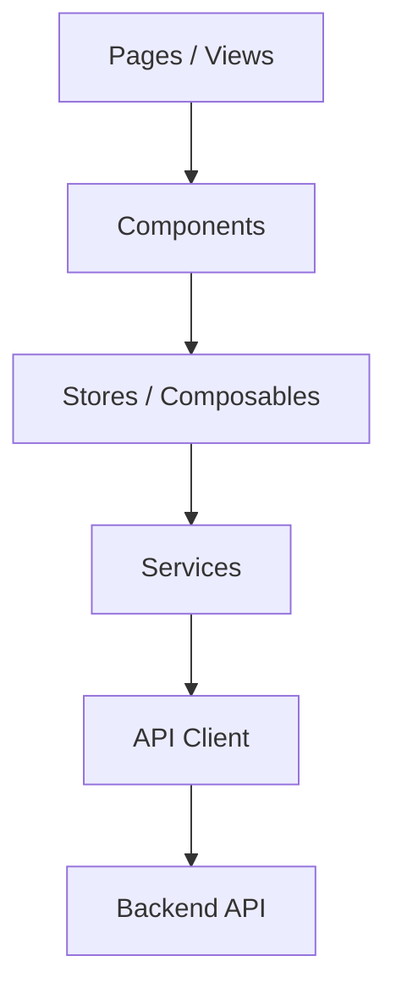
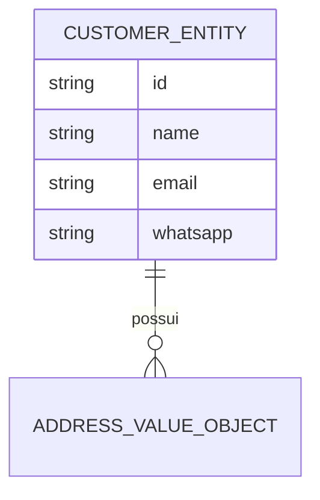
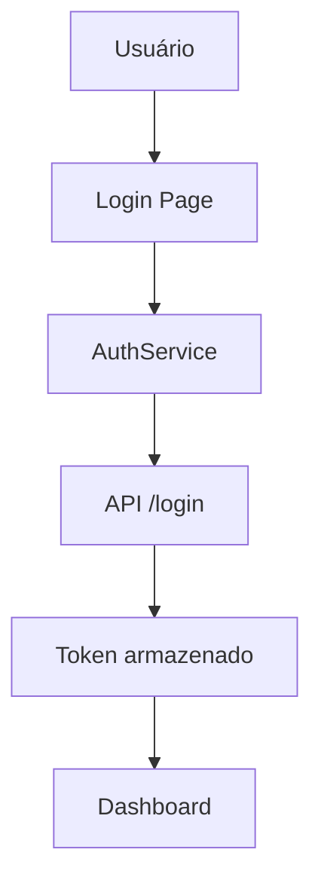
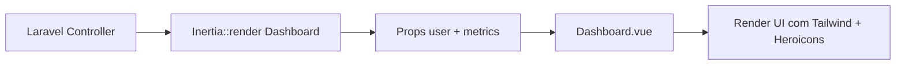

# SimplyFood Frontend - Technical Guide

<!--
Este documento consolida a visão técnica do frontend do projeto SimplyFood.
Ele serve como referência para arquitetura, módulos, fluxos, integração com a API,
autenticação, testes e manutenção da interface.
-->

## 1. Project Overview

### Objetivo
O frontend do SimplyFood é responsável por oferecer a experiência visual e interativa para os usuários do sistema, consumindo a API do backend e organizando o fluxo de navegação por módulos.

### Escopo
- autenticação de usuários
- cadastro e gestão de clientes
- gestão de produtos e pedidos
- painéis e telas operacionais
- integração com a API Laravel

### Arquitetura geral
O frontend utiliza uma estrutura modular com Vue 3, TypeScript, Pinia e Vue Router, favorecendo separação por feature e reuso de componentes.



### Responsabilidades do Frontend
- renderizar telas e componentes
- encapsular regras de apresentação
- consumir endpoints da API
- tratar estados de loading, erro e sucesso
- preservar experiência de usuário em fluxos críticos

### Convenções adotadas
- módulos por feature
- componentes reutilizáveis em shared
- stores para estado global
- services para integração HTTP
- testes com Vitest

### Baseline SDD (Spec-Driven Development)
<!--
Este AGENTS.md funciona como especificação viva do frontend.
Toda evolução deve manter rastreabilidade entre Sprint -> Feature -> API -> Modelo.
-->
- Fonte de verdade de navegação: src/app/router/index.ts
- Fonte de verdade de integração HTTP: src/shared/api/client.ts
- Fonte de verdade de estado de autenticação: src/shared/stores/auth.ts
- Fonte de verdade de contratos de feature: src/modules/*

---

## 2. Sprints

### Sprint 01 - Base da interface
- ID: F01
- Nome: UI Foundation
- Objetivo: estruturar o frontend e disponibilizar telas base
- Status: Em andamento
- Responsável: Frontend Team
- Dependências: backend inicial
- Checklist:
  - [x] estrutura base do Vue 3
  - [x] configuração de rotas
  - [x] layout base
  - [ ] integração completa com autenticação
- Prioridade: Alta
- Entregues: layout inicial, rotas, componentes compartilhados
- Pendentes: fluxos completos de autenticação e módulos de negócio
- Riscos: divergência entre contratos da API e UI
- Bloqueios: dependência de endpoints estáveis

### Sprint 02 - Módulos operacionais
- ID: F02
- Nome: Business Modules
- Objetivo: entregar fluxos de clientes, produtos e pedidos na interface
- Status: Planejado
- Responsável: Frontend Team
- Dependências: F01
- Checklist:
  - [ ] módulo de clientes
  - [ ] módulo de produtos
  - [ ] módulo de pedidos
  - [ ] dashboard principal
- Prioridade: Alta

### Backlog consolidado (Sprints)
- F01: finalizar integração completa de autenticação
- F02: expandir navegação para módulos além de customers e dashboard
- F02: conectar fluxos de products e orders já catalogados em src/modules

### Roadmap incremental (Sprints)
- Curto prazo: estabilizar contratos de auth e customers
- Médio prazo: conectar products e orders ao router e aos serviços
- Evolução contínua: manter matriz SDD atualizada por feature entregue

### Exemplo de rastreabilidade em JSON
```json
{
  "sprint": "F02",
  "feature": "FEAT-FE-002",
  "rota_ui": "/customers",
  "api": ["POST /api/customers", "GET /api/customers?whatsapp={value}"],
  "status": "ativo"
}
```

---

## 3. Features

<!--
As features abaixo representam os principais fluxos da interface.
Qualquer alteração deve preservar a experiência do usuário e o contrato com a API.
-->

### Feature 1 - Autenticação
- Nome: Authentication Flow
- ID de rastreio: FEAT-FE-001
- Descrição: tela de login e fluxo de acesso ao sistema
- Objetivo: autenticar usuários e redirecionar para o painel
- Escopo: login, validação, armazenamento de sessão e redirecionamento pós-login
- Fluxo: login -> validação -> token -> dashboard
- Dependências: backend auth, auth store, router guard
- Arquivos envolvidos: src/modules/auth
- Componentes: LoginForm, AuthLayout
- Stores / composables: auth store
- Services: AuthService
- Rotas relacionadas: rotas protegidas e fluxo pós-login
- Responsabilidades: orquestrar entrada, feedback visual e integração com autenticação
- Status: Parcialmente implementado

### Feature 2 - Cadastro de Clientes
- Nome: Customer Registration
- ID de rastreio: FEAT-FE-002
- Descrição: formulário de cadastro de cliente
- Objetivo: capturar informações do cliente e enviar à API
- Escopo: formulário, validação, persistência e feedback de sucesso/erro
- Fluxo: formulário -> validação -> API -> feedback
- Dependências: backend customers
- Arquivos envolvidos: src/modules/customers
- Componentes: CustomerForm
- Stores / composables: estado local da página + validação de formulário
- Services: CustomerApi
- Rotas relacionadas: cadastro e consulta de clientes
- Responsabilidades: coletar dados, validar entrada e comunicar-se com o backend
- Status: Parcialmente implementado

### Feature 3 - Dashboard
- Nome: Dashboard
- ID de rastreio: FEAT-FE-003
- Descrição: painel principal com visão geral do sistema
- Objetivo: concentrar indicadores e ações rápidas
- Escopo: visão consolidada do sistema e navegação para operações principais
- Dependências: dados da API
- Arquivos envolvidos: src/modules/dashboard
- Componentes: DashboardPage
- Responsabilidades: apresentar informações agregadas e direcionar o usuário para ações críticas
- Status: Parcialmente implementado

---

## 4. Feature Layer

<!--
A Feature Layer organiza cada fluxo funcional em um conjunto coeso de arquivos e responsabilidades.
Essa abordagem favorece rastreabilidade entre requisito, interface e integração com a API.
-->

### Padrão adotado
Cada feature deve manter um escopo claro e reutilizável, com foco em:
- Objetivo
- Escopo
- Fluxo
- Componentes envolvidos
- Services
- Stores / composables
- Requests / rotas
- Dependências
- Responsabilidades

### Estrutura sugerida por feature
- Presentation: páginas, layouts e componentes visuais
- Feature state: stores, composables e estado de tela
- Integration: services e cliente HTTP
- Routing: navegação específica da feature

### Feature map detalhado (estado atual)

### Exemplo de contrato de feature em JSON
```json
{
  "featureId": "FEAT-FE-001",
  "name": "Authentication Flow",
  "layers": {
    "presentation": ["LoginPage.vue"],
    "application": ["AuthService"],
    "infrastructure": ["AuthApi", "apiClient"],
    "domain": ["UserState"]
  }
}
```

#### Feature FEAT-FE-001 - Authentication Flow
<!--
Feature responsável pelo gerenciamento de acesso do usuário.
A regra de orquestração de login/logout deve permanecer no service + store.
-->
- Objetivo: autenticar usuário e manter sessão local
- Escopo: login, logout, persistência de token e user em storage
- Fluxo: LoginPage -> AuthService -> AuthApi -> apiClient -> backend
- Componentes envolvidos: LoginPage.vue, BaseForm.vue, BaseInput.vue, BaseButton.vue
- Services: AuthService
- Controllers: N/A (frontend)
- Requests: payload de login/register em AuthApi
- Models: UserState (store), dados de auth em JSON
- Repositories: N/A (frontend)
- Interfaces: UserState
- Rotas relacionadas: /auth/login, guard de rotas com meta.requiresAuth
- Dependências: Pinia, Vue Router, Axios
- Responsabilidades: autenticação e proteção de navegação

#### Feature FEAT-FE-002 - Customer Registration
<!--
Feature responsável pelo cadastro de clientes.
A validação local deve ocorrer antes do envio do payload para API.
-->
- Objetivo: cadastrar cliente e mapear resposta para entidade de domínio
- Escopo: formulário, validação, consulta por whatsapp e criação
- Fluxo: CustomerForm -> zod schema -> CreateCustomerService -> CustomerApi -> API
- Componentes envolvidos: CustomerPage.vue, CustomerForm.vue
- Services: CreateCustomerService
- Controllers: N/A (frontend)
- Requests: CreateCustomerDto
- Models: CustomerEntity, AddressValueObject
- Repositories: N/A (frontend)
- Interfaces: CreateCustomerDto, CustomerFormInput
- Rotas relacionadas: /customers
- Dependências: Zod, Axios, mapper de domínio
- Responsabilidades: consistência do payload e feedback visual

##### Atualização incremental - Menu Clientes em modo List
- Objetivo: no menu `/customers`, exibir exclusivamente lista de clientes do ambiente autenticado.
- Mudanças de fluxo:
  - `CustomerPage.vue` refatorada para listagem com filtros (`nome`, `whatsapp`, `cidade`).
  - ações por item: editar/atualizar e excluir.
  - consumo de API protegido: `GET /api/customers`, `PUT /api/customers/{id}`, `DELETE /api/customers/{id}`.
- Camada de integração atualizada:
  - `CustomerApi` recebeu métodos `getAll`, `update`, `delete` e tipagem `CustomerDto`.
- Comportamento preservado:
  - contratos existentes de autenticação e cliente HTTP (`apiClient`) mantidos.
  - sem alteração de identidade visual global, apenas adaptação da página para gestão em lista.

##### Atualização incremental - Auditoria Service Layer (Backend Customer)
- Contexto: camada backend Customer foi alinhada ao contrato `BaseService::post(...)`.
- Impacto no frontend: nenhum ajuste funcional necessário.
- Contratos preservados: `POST /api/customers` e `GET /api/customers?whatsapp={value}` sem mudança de payload/response.
- Resultado: `CreateCustomerService` e `CustomerApi` permanecem compatíveis.

#### Feature FEAT-FE-003 - Dashboard
<!--
Feature responsável pela visão inicial pós-login.
No estado atual os indicadores são locais e servem como baseline visual.
-->
- Objetivo: exibir visão consolidada para acesso rápido
- Escopo: cards de métricas e atalhos de navegação
- Fluxo: DashboardPage -> useDashboardMetrics -> GetDashboardMetricsService -> DashboardApi -> /api/dashboard/metrics
- Componentes envolvidos: DashboardPage.vue, DashboardLayout.vue
- Services: GetDashboardMetricsService
- Controllers: N/A (frontend)
- Requests: GET /api/dashboard/metrics
- Models: UserState (fallback de nome/role), DashboardMetric, DashboardPayload
- Repositories: N/A (frontend)
- Interfaces: DashboardMetric, DashboardPayload, DashboardMetricsResponse, DashboardUserSummary
- Rotas relacionadas: /dashboard
- Dependências: auth store, apiClient (axios)
- Responsabilidades: carregar métricas reais com loading, erro e atualização reativa

##### Atualização incremental - Dashboard Metrics Refinement (F02)
<!--
Refino incremental para manter o Dashboard aderente ao papel de visão gerencial e evitar duplicidade de fluxo operacional.
-->
- Sprint afetada: F02 (Business Modules)
- Feature afetada: FEAT-FE-003 (Dashboard)
- Regras de negócio atualizadas:
  - ação rápida `Novo Pedido` removida do Dashboard por redundância;
  - criação/gerenciamento de pedidos permanece exclusivamente no módulo lateral `Pedidos`;
  - dashboard mantém ações rápidas de `Novo Cliente` e `Novo Produto`.
- Integração Backend -> Frontend atualizada:
  - cards passam a consumir chaves de métricas refinadas (`customers`, `orders_active`, `revenue_total`, `average_ticket`);
  - frontend continua sem cálculo de negócio local, apenas renderização do payload da API.
- Ajustes arquiteturais:
  - `DashboardPage.vue` simplificada para evitar duplicidade de fluxo de pedidos;
  - modal de criação rápida de produto preservado e mantido independente;
  - atualização automática das métricas após criação rápida de produto e cliente via `loadMetrics()`.
- Compatibilidade e contratos:
  - sem mudança no endpoint consumido (`GET /api/dashboard/metrics`);
  - sem alteração de autenticação, client HTTP ou estrutura modular por feature.
- Critérios de aceite atendidos:
  - Dashboard com indicadores reais e consistentes;
  - remoção de ação redundante sem regressão dos módulos operacionais;
  - atualização reativa das métricas após ações diretas no Dashboard.

#### Feature FEAT-FE-004 - Orders Management
<!--
Feature responsável pelo gerenciamento de pedidos no ambiente autenticado.
Inclui criação, edição, exclusão, detalhamento e listagem com totais reativos.
-->
- Objetivo: operacionalizar o ciclo de pedidos do usuário autenticado
- Escopo: list, create, update, delete, details, filtros por status/cliente
- Fluxo: OrderPage -> OrderApi -> apiClient -> /api/orders*
- Componentes envolvidos: OrderPage.vue
- Services: OrderApi
- Controllers: N/A (frontend)
- Requests: payload OrderPayload (customer_id, status, items, total)
- Models: OrderDto, OrderItemDto, OrderItemInput
- Repositories: N/A (frontend)
- Interfaces: OrderPayload, OrderDto, OrderItemDto
- Rotas relacionadas: /orders
- Dependências: CustomerApi (seleção de clientes), apiClient, Vue Router
- Responsabilidades: manter consistência visual e funcional de pedidos com feedback de loading/erro/sucesso

##### Atualização incremental - Navegação e integração
- Router atualizado: `src/app/router/index.ts` com rota protegida `/orders`.
- Menu lateral atualizado: `DashboardLayout.vue` com entrada "Pedidos".
- Dashboard atualizado: ação rápida para gestão de pedidos.

##### Atualização incremental - Reorganização Dashboard x Módulos
<!--
Refatoração de experiência para separar atalho de criação (Dashboard) e gestão completa (módulos).
Sem alteração de contrato HTTP e sem alteração de autenticação existente.
-->
- Dashboard simplificado em `DashboardPage.vue`:
  - seção "Ações Rápidas" agora expõe somente `Novo Cliente` e `Novo Pedido`.
  - atalhos navegam com query `action=create` para iniciar fluxo de cadastro, sem assumir listagem, filtros, edição ou exclusão.
- Customers centralizado em `CustomerPage.vue`:
  - gerenciamento completo no módulo: cadastro, listagem, pesquisa/filtros, visualização, edição e exclusão.
  - componente reutilizado: `CustomerForm.vue` para criação.
  - service reutilizado: `CreateCustomerService` para regra de criação e validação de whatsapp.
- Orders centralizado em `OrderPage.vue`:
  - mantém gestão completa no módulo (create/list/filter/detail/update/delete).
  - suporte a início de cadastro por atalho do Dashboard via `action=create`.
- Resultado arquitetural:
  - Dashboard permanece orientado a indicadores, métricas e atalhos rápidos.
  - módulos permanecem responsáveis por manutenção e operações de negócio.

##### Atualização incremental - Fluxo de criação direta sem listagem
<!--
Aprimoramento de navegação para impedir que atalhos do Dashboard caiam em listagens durante criação.
Mantém gerenciamento completo apenas nos módulos laterais.
-->
- Dashboard:
  - `Novo Cliente` -> `/customers?action=create`
  - `Novo Pedido` -> `/orders?action=create`
- Customers (`CustomerPage.vue`):
  - quando `action=create`, exibe apenas fluxo de cadastro (formulário) e oculta filtros/lista/edição/detalhes.
  - criação reutiliza `CustomerForm` + `CreateCustomerService`.
  - opção explícita para voltar ao gerenciamento completo pelo menu/contexto.
- Orders (`OrderPage.vue`):
  - quando `action=create`, exibe diretamente formulário manual de pedido e oculta listagem/filtros/detalhes.
  - mantém associação de pedido a customer dentro do próprio módulo Orders.
  - opção explícita para voltar ao gerenciamento completo.
- Compatibilidade:
  - sem mudanças de contrato API; fluxo de autenticação (`apiClient` + token) preservado.

##### Atualização incremental - Dashboard com modais flutuantes para criação
<!--
Evolução de UX para manter o usuário na tela inicial enquanto executa criação rápida.
-->
- Dashboard (`DashboardPage.vue`) deixou de navegar para `/customers?action=create` e `/orders?action=create` ao clicar nos atalhos.
- Novo comportamento:
  - `Novo Cliente` abre modal flutuante com todos os campos de cadastro de cliente.
  - `Novo Pedido` abre modal flutuante com campos de pedido e seção de cadastro rápido de produto.
- Fluxos de ação nos modais:
  - botão `Salvar` persiste o registro usando os mesmos services/adapters existentes;
  - botão `Cancelar` fecha o modal e descarta o preenchimento local.
- Reuso arquitetural:
  - criação de cliente reutiliza `CustomerForm` + `CreateCustomerService`;
  - criação de pedido reutiliza `OrderApi` e `ProductApi` para pedido/produto no mesmo fluxo rápido.
- Resultado arquitetural:
  - camada de apresentação evoluída sem alteração de contratos backend;
  - dashboard continua orientado a ações rápidas e métricas.

##### Atualização incremental - Pós-criação com retorno automático ao gerenciamento
<!--
Melhoria de UX no quick-create para fechar o ciclo sem ambiguidade de navegação.
-->
- Após sucesso no quick-create iniciado pelo Dashboard:
  - Customers redireciona automaticamente para `/customers?highlight={id}`.
  - Orders redireciona automaticamente para `/orders?highlight={id}`.
- Destaque visual do registro criado aplicado na listagem do módulo de gerenciamento.
- No fluxo rápido, o registro criado também é aberto em contexto (detalhe selecionado quando aplicável).

##### Atualização incremental - Cadastro manual de Produto no fluxo Novo Pedido
<!--
Evolução orientada a operação: permitir criação de produto quando o seletor de itens estiver vazio.
Mantém separação entre criação rápida (Dashboard -> Novo Pedido) e gestão completa no módulo Pedidos.
-->
- No formulário de pedido (`OrderPage.vue`), seção Itens do Pedido recebeu ação `Cadastrar Produto`.
- Fluxo adicionado:
  - cadastro manual de produto (nome, preço e descrição opcional);
  - persistência via endpoint protegido de produtos;
  - recarga automática da lista de produtos ativos;
  - seleção automática do produto recém-criado no item atual do pedido.
- Camada reutilizada:
  - cliente HTTP autenticado (`apiClient`);
  - nova API de produto no frontend: `src/modules/products/api/ProductApi.ts`.
- Responsabilidade preservada:
  - Dashboard continua apenas iniciando criação rápida;
  - gerenciamento completo do pedido e associações permanece em `/orders`.

## Modal de Cadastro

Diretrizes de UI/UX para cadastro rápido corporativo de produto:
- abrir centralizado;
- possuir largura confortável;
- ser responsivo;
- utilizar duas colunas em desktop;
- utilizar uma coluna em mobile;
- possuir espaçamento consistente;
- utilizar componentes reutilizáveis.

Diretrizes de ergonomia:
- nunca utilizar telas excessivamente carregadas;
- priorizar clareza;
- priorizar rapidez;
- reduzir carga cognitiva;
- manter aparência de ERP corporativo.

### FEATURE - Cadastro Corporativo de Produtos (FEAT-FE-005)
- Modal dedicado para criação rápida de produto reutilizado nos fluxos operacionais.
- Consome dados dinâmicos do backend para categorias, unidades, defaults e mensagens de validação.
- Mantém arquitetura de composição (`Composition API`) e tipagem forte (`TypeScript`).
- Preserva contratos existentes de `ProductApi` com extensão compatível para payload multipart.

##### Atualização incremental - Auditoria de conformidade (UX e consistência visual)
<!--
Hardening aplicado após auditoria SDD para restaurar comportamentos especificados sem alterar contratos HTTP.
-->
- `DashboardPage.vue` alinhado com o seletor CSS correto (`.dashboard-container`) para garantir aplicação de layout e animação.
- `CustomerPage.vue` com restauração do filtro visual de `whatsapp`, mantendo consistência entre estado de filtro e interface.
- `OrderPage.vue` com restauração do gatilho visível `Cadastrar Produto` na seção de itens durante o fluxo `action=create`.
- `DashboardLayout.vue` atualizado com `background-clip: text` para compatibilidade cross-browser no logotipo.
- Resultado arquitetural: correções restritas à camada de apresentação, preservando Services, Stores, composables e contratos de API.

##### Atualização incremental - Reaplicação de consistência no filtro de Clientes
<!--
Correção de regressão externa detectada após edição fora do fluxo de implementação.
-->
- `CustomerPage.vue` recebeu novamente o campo visual `Filtrar por WhatsApp` no painel de filtros.
- Impacto: restaura paridade entre estado interno (`filters.whatsapp`) e interface renderizada.
- Compatibilidade: nenhuma alteração de contrato API, somente camada de apresentação.

##### Atualização incremental - Performance de leitura (impacto percebido)
<!--
Otimizações aplicadas no backend por indexação e ajuste de predicados temporais.
Sem necessidade de alteração no consumo da API pelo frontend.
-->
- Impacto esperado em UX:
  - carregamento mais responsivo das métricas do Dashboard em consultas por dia.
  - melhor tempo de resposta em listagens de Pedidos com filtros por status/cliente.
  - lookup de clientes por whatsapp mais eficiente em fluxos de cadastro.
  - listagem de produtos ativos mais consistente em bases maiores.
- Compatibilidade frontend:
  - nenhum contrato HTTP alterado;
  - nenhuma mudança obrigatória em componentes/composables/services de consumo.

##### Atualização incremental - Totais reativos no formulário
- O total do pedido é recalculado em tempo real a partir de `quantity * price` por item.
- O subtotal e a quantidade total de itens são atualizados em cada adição/remoção/edição.
- Mudança de produto preenche preço automaticamente com base em `/api/products`.

#### Features catalogadas e parcialmente conectadas
- products, orders, categories, deliveries, financial, payments, tickets, users, settings
- Observação: o router ativo já contempla auth, dashboard, customers e orders.

#### Feature FEAT-FE-006 - Cash Register
<!--
Módulo de caixa integrado de forma incremental, sem alterar os fluxos existentes do MVP.
-->
- Objetivo: habilitar visibilidade e operações iniciais de caixa no frontend
- Escopo: visualização de caixa atual, histórico e operações de abertura/movimentação/fechamento via adapter
- Fluxo: CashRegisterPage -> CashRegisterApi -> apiClient -> `/api/cash/*`
- Componentes envolvidos: `CashRegisterPage.vue`
- Services: `CashRegisterApi`
- Interfaces: `CashRegisterDto`, `CashTransactionDto`
- Rotas relacionadas: `/cash-register`

#### Feature FEAT-FE-007 - Tables
<!--
Módulo de mesas para atendimento presencial.
-->
- Objetivo: disponibilizar visão inicial de mesas e status operacional
- Escopo: listagem e integração para criação/alteração de status
- Fluxo: TablesPage -> TableApi -> apiClient -> `/api/tables*`
- Componentes envolvidos: `TablesPage.vue`
- Services: `TableApi`
- Interfaces: `RestaurantTableDto`
- Rotas relacionadas: `/tables`

#### Feature FEAT-FE-008 - Commands
<!--
Módulo de comanda desacoplado do gerenciamento de pedidos.
-->
- Objetivo: separar atendimento em comandas vinculadas às mesas
- Escopo: listagem, abertura e atualização de status de comandas
- Fluxo: CommandsPage -> CommandApi -> apiClient -> `/api/commands*`
- Componentes envolvidos: `CommandsPage.vue`
- Services: `CommandApi`
- Interfaces: `CommandDto`
- Rotas relacionadas: `/commands`

#### Feature FEAT-FE-009 - Recipes and Ingredients
<!--
Módulo de fichas técnicas para base de controle de estoque.
-->
- Objetivo: fornecer camada de integração para ingredientes, receitas e consumo
- Escopo: leitura e criação de ingredientes/receitas; integração de consumo
- Fluxo: RecipesPage -> RecipeApi -> apiClient -> `/api/ingredients*` e `/api/recipes*`
- Componentes envolvidos: `RecipesPage.vue`
- Services: `RecipeApi`
- Interfaces: `IngredientDto`, `RecipeDto`
- Rotas relacionadas: `/recipes`

##### Atualização incremental - Sprint 3.1.0 Professional Expansion
- Sprint afetada: F03 (Professional Expansion)
- Ajustes de navegação:
  - `DashboardLayout.vue` recebeu entradas de menu para `Caixa`, `Mesas`, `Comandas` e `Receitas`.
  - `router/index.ts` recebeu rotas protegidas para os novos módulos.
- Camada de integração adicionada:
  - `src/modules/cash-register/api/CashRegisterApi.ts`
  - `src/modules/tables/api/TableApi.ts`
  - `src/modules/commands/api/CommandApi.ts`
  - `src/modules/recipes/api/RecipeApi.ts`
- Compatibilidade preservada:
  - nenhum contrato de Auth, Dashboard, Customers, Products ou Orders foi quebrado;
  - módulos novos consomem contratos backend adicionais via adapters dedicados.

### Comentário de arquitetura
<!--
Controllers e páginas não devem concentrar regra de negócio.
A lógica de fluxo deve permanecer em services, stores e composables, de forma previsível.
-->

---

## 5. Acceptance Criteria

### Autenticação
- Dado um usuário cadastrado
- Quando preencher senha válida
- Então deve ser autenticado e redirecionado

- Dado usuário inválido
- Quando tentar entrar
- Então deve receber mensagem de erro

### Cadastro de Clientes
- Checklist funcional:
  - [x] formulário valida campos obrigatórios
  - [x] exibe erro para dados inválidos
  - [x] envia dados à API corretamente
  - [x] mostra feedback de sucesso ou falha

---

## 6. API Specification

### Integrações principais
| Endpoint consumido | Method | Cliente | Feature | Status |
| --- | --- | --- | --- | --- |
| /api/login | POST | AuthService | FEAT-FE-001 | Ativo |
| /api/register | POST | AuthService | FEAT-FE-001 | Ativo |
| /api/customers | POST | CreateCustomerService/CustomerApi | FEAT-FE-002 | Ativo |
| /api/customers?whatsapp={value} | GET | CreateCustomerService/CustomerApi | FEAT-FE-002 | Ativo |
| /api/dashboard/metrics | GET | GetDashboardMetricsService/DashboardApi | FEAT-FE-003 | Ativo |
| /api/orders | GET | OrderApi | FEAT-FE-004 | Ativo |
| /api/orders | POST | OrderApi | FEAT-FE-004 | Ativo |
| /api/orders/{id} | PUT/PATCH | OrderApi | FEAT-FE-004 | Ativo |
| /api/orders/{id} | DELETE | OrderApi | FEAT-FE-004 | Ativo |
| /api/products/active | GET | ProductApi | FEAT-FE-004 | Ativo |
| /api/products | POST | ProductApi | FEAT-FE-004 | Ativo |

### Contratos disponíveis no backend (referência)
<!--
Os endpoints abaixo existem no backend e são relevantes para evolução do frontend,
mas nem todos estão conectados na navegação atual.
-->
- /api/auth/login (POST)
- /api/auth/register (POST)
- /api/dashboard/metrics (GET)
- /api/products/*
- /api/orders/*

### Exemplo de payload
```json
{
  "email": "admin@email.com",
  "password": "********"
}
```

### Exemplo de resposta
```json
{
  "status": "success",
  "data": {
    "token": "...",
    "user": {
      "id": 1,
      "name": "Administrador"
    }
  }
}
```

---

## 7. Data Models

### Modelo de domínio principal
- CustomerEntity
- AddressValueObject
- AuthUser

### Mapeamentos usados no estado atual
- UserState (store de autenticação)
- CreateCustomerDto (entrada da feature de clientes)
- CustomerMapper (normalização API -> entidade)

### Estrutura conceitual


---

## 8. Stack

### Frontend
- Vue 3
- TypeScript
- Vite
- Pinia
- Vue Router
- Tailwind
- Axios
- Vitest

### Infraestrutura
- Docker Compose
- Nginx
- Git
- GitHub

---

## 9. Coder Agent

### Frontend Agent
- Agent ID: FRONTEND-AGENT
- Nome: Frontend Engineer
- Responsabilidade: manter a interface, componentes, stores e integração com API
- Escopo: src/app, src/modules, src/shared, src/types
- Permissões: leitura e escrita em componentes e páginas
- Arquivos protegidos: rotas, layouts e integrações críticas
- Prioridade: Alta

### Documentation Agent
- Agent ID: DOC-AGENT
- Nome: Documentation Maintainer
- Responsabilidade: manter esta documentação atualizada
- Escopo: AGENTS.md, README.md
- Permissões: editar documentação
- Arquivos protegidos: estrutura e regras de arquitetura
- Prioridade: Média

---

## 10. File Structure

```text
frontend/
  src/
    app/
    modules/
    shared/
    assets/
    types/
    tests/
  public/
```

### Comentários de estrutura
- src/app: configuração global, roteamento e layouts
- src/modules: módulos por feature
- src/shared: componentes, stores e utilidades reaproveitáveis
- src/tests: testes unitários e de integração

### Módulos mapeados em src/modules
- auth
- categories
- customers
- dashboard
- deliveries
- financial
- orders
- payments
- products
- settings
- tickets
- users

---

## 11. Authentication

### Fluxo de autenticação


### Contrato de autenticação (request/response)
```json
{
  "request": {
    "email": "admin@email.com",
    "password": "********"
  },
  "response": {
    "status": "success",
    "data": {
      "token": "valid-1",
      "user": {
        "id": 1,
        "name": "Administrador",
        "role": "ADMIN"
      }
    }
  }
}
```

### Regras atuais
- login com e-mail e senha
- token armazenado no cliente
- rotas protegidas devem exigir autenticação
- redirecionamento para login quando meta.requiresAuth e usuário não autenticado

---

## 12. Validation

### Validações de formulário
- e-mail: obrigatório e formatado
- senha: obrigatória
- nome: obrigatório em cadastros
- whatsapp: padrão 55 + DDD + número
- cep: 8 dígitos para auto-complete via ViaCEP

---

## 13. Fluxos principais

### Fluxo de cadastro de cliente


---

## 14. Clean Architecture

<!--
A arquitetura do frontend preserva separação entre apresentação, estado, integração e navegação.
Essa divisão facilita evolução incremental sem acoplar fluxo de negócio à camada visual.
-->

### Presentation Layer
- páginas, layouts e componentes de interface
- responsabilidade: renderizar e capturar eventos do usuário

### Feature Layer
- módulos e fluxos de negócio organizados por feature
- responsabilidade: coordenar interação entre estado, componente e integração

### Application Layer
- stores, composables e services de uso da aplicação
- responsabilidade: conter lógica de orquestração e estado compartilhado

### Infrastructure Layer
- cliente HTTP, integrações com backend e utilidades externas
- responsabilidade: encapsular dependências técnicas e comunicação remota

### Comunicação entre camadas
- components delegam eventos para stores/services
- services isolam comunicação com a API
- stores centralizam estado de tela e autenticação

### Domain Layer
- entidades e value objects em src/shared/domain
- responsabilidade: modelar objetos de negócio usados pela interface

### Regras de fronteira entre camadas
<!--
Presentation não deve conter regras de integração HTTP sensíveis.
Application coordena fluxo. Infrastructure encapsula cliente HTTP.
Domain mantém estruturas sem dependência de UI.
-->

---

## 15. Matriz de Rastreabilidade (SDD)

| Sprint | Feature | Rotas/UI | API | Modelos/Tipos |
| --- | --- | --- | --- | --- |
| F01 | FEAT-FE-001 Authentication | /auth/login, guard do router | /api/login, /api/register | UserState |
| F02 | FEAT-FE-002 Customers | /customers | /api/customers (POST/GET query) | CreateCustomerDto, CustomerEntity, AddressValueObject |
| F02 | FEAT-FE-003 Dashboard | /dashboard | /api/dashboard/metrics (GET) | UserState, DashboardMetric, DashboardPayload |

### Observação de consistência
<!--
Esta matriz deve ser atualizada sempre que uma feature nova for ligada a rota, serviço ou endpoint.
Evitar duplicar conteúdo já detalhado nas seções 3, 4 e 6.
-->

---

## 16. Auditoria Estrutural do Projeto

### Relatório de auditoria recomendada
| Arquivo | Motivo | Dependências | Impacto | Pode ser removido? |
| --- | --- | --- | --- | --- |
| arquivos temporários | gerados localmente | dependem do ambiente | baixo | Sim |
| caches de build | artefatos de compilação | não versionados | baixo | Sim |
| arquivos de ambiente | configuração local | não devem ser compartilhados | alto | Não |
| dependências não utilizadas | podem aumentar o custo de manutenção | revisão manual | médio | Talvez |

### Limpeza estrutural
- remover apenas artefatos locais e temporários
- não remover módulos funcionais sem avaliação explícita
- priorizar manutenção e rastreabilidade

---

## 17. Integração Laravel + Inertia (Painel)

### Objetivo da implementação
- exibir no painel dados vindos do backend via Inertia
- eliminar necessidade de request HTTP adicional para dados iniciais do dashboard
- manter padrão de consumo por props com `defineProps`

### Arquitetura utilizada
- Backend entrega página Inertia em `backend/resources/js/Pages/Dashboard.vue`
- Frontend da página recebe dados em `defineProps({ user, metrics })`
- Contrato de dados permanece mínimo e focado em exibição

### Fluxo Backend -> Inertia -> Frontend


### Responsabilidades de cada camada
- Backend: autenticar, autorizar e agregar dados
- Inertia: transportar props com payload enxuto
- Vue: renderizar dados recebidos sem axios no carregamento inicial

### Services e componentes
- Services do backend utilizados: `DashboardService`
- Componente/página nova para Inertia: `backend/resources/js/Pages/Dashboard.vue`
- Ícones utilizados: Heroicons (`@heroicons/vue`)

### Regras de negócio e autorização
- rota protegida por middlewares de autenticação/autorização no backend
- usuário só acessa painel com perfil permitido
- dados sensíveis não são expostos no payload de props

### Dependências utilizadas
- `@inertiajs/vue3`
- `@heroicons/vue`

### Exemplo de consumo com props
```vue
<script setup>
defineProps({
  user: { type: Object, required: true },
  metrics: { type: Array, required: true }
})
</script>
```

### Atualizacao incremental - Dashboard SPA via API
<!--
Integracao incremental aplicada sem remover o fluxo Inertia existente.
No frontend modular (src/modules), o dashboard agora consome somente dados reais da API.
-->
- Fluxo consolidado: DashboardPage -> useDashboardMetrics -> GetDashboardMetricsService -> DashboardApi -> apiClient -> GET /api/dashboard/metrics
- Componentes reutilizados: DashboardLayout.vue (sem alteracao de responsabilidade)
- Composables adicionados: `src/modules/dashboard/composables/useDashboardMetrics.ts`
- Services adicionados: `src/modules/dashboard/services/GetDashboardMetricsService.ts`
- API adapter adicionado: `src/modules/dashboard/api/DashboardApi.ts`
- Tipos adicionados: `src/modules/dashboard/types/DashboardMetrics.ts`
- Estado de tela: `loading`, `errorMessage`, `metrics`, `user`
- Tratamento de erro: fallback de mensagem + acao de retry (`loadMetrics`)
- Estrategia de reutilizacao:
  - reuso de `apiClient` para autenticacao via interceptor
  - reuso de `auth store` como fallback de nome do usuario no cabecalho
  - nenhuma regra de negocio no componente de pagina

---

## 20. Consolidacao SDD Incremental (Single Source of Truth)

<!--
Secao incremental adicionada para padronizar leitura por topicos obrigatorios sem remover conteudo historico.
Referencia cruzada: secoes 2 a 19 deste documento.
-->

### 1. SPRINTS
- Objetivo: rastrear evolucao funcional do frontend por entregas incrementais.
- Responsabilidades: registrar status, dependencias e riscos de cada sprint.
- Fluxo: backlog -> implementacao por feature -> validacao -> atualizacao de matriz SDD.
- Dependencias: backend contracts, router protegido, auth store.
- Observacoes tecnicas: manter rastreabilidade com secoes 2 e 15.

### 2. FEATURES
- Objetivo: mapear capacidades do frontend por feature layer.
- Responsabilidades: delimitar escopo de UI, services, composables e stores.
- Fluxo: rota -> pagina -> service/composable -> apiClient -> API.
- Dependencias: Vue Router, Pinia, Axios, validadores.
- Observacoes tecnicas: features ativas no ambiente SPA: Auth, Dashboard, Customers e Orders.

### 3. ACCEPTANCE CRITERIA
- Objetivo: garantir comportamento verificavel por feature.
- Responsabilidades: definir criterios funcionais e de UX sem acoplamento ao backend interno.
- Fluxo: Given/When/Then -> implementacao -> teste manual/automatizado.
- Dependencias: testes Vitest, testes de integracao com API e validacoes locais.
- Observacoes tecnicas: criterios devem refletir comportamento real de tela e nao apenas contrato teorico.

### 4. API SPEC
- Objetivo: consolidar endpoints efetivamente consumidos no frontend.
- Responsabilidades: documentar metodo, objetivo e camada consumidora.
- Fluxo: service -> adapter API -> endpoint protegido/publico.
- Dependencias: headers de autenticacao no `apiClient` e middlewares backend.
- Observacoes tecnicas: lista principal permanece na secao 6 e foi expandida para Orders/Products.

### 5. DATA MODELS
- Objetivo: explicitar modelos de UI e DTOs para consistencia de tipagem.
- Responsabilidades: manter fronteira clara entre entidade de dominio e payload de API.
- Fluxo: DTO de entrada -> service -> mapper -> entidade de frontend.
- Dependencias: Zod, interfaces TypeScript e mappers compartilhados.
- Observacoes tecnicas: evitar duplicacao entre `CustomerDto` e `CustomerEntity` quando responsabilidade divergir.

### 6. STACK
- Objetivo: manter inventario tecnologico real do frontend e camadas associadas.
- Responsabilidades: registrar runtime e bibliotecas realmente ativas.
- Fluxo: bootstrap (`main.ts`) -> router -> layouts/pages -> services.
- Dependencias: Vue 3, Composition API, Vite, Pinia, Axios, Tailwind CSS.
- Observacoes tecnicas: frontend SPA principal nao usa Inertia; Inertia existe no frontend acoplado ao backend (`backend/resources/js`).

### 7. CODER AGENT ID
- Objetivo: manter governanca de manutencao por papel de agente.
- Responsabilidades: preservar escopo de alteracao, arquivos criticos e prioridade.
- Fluxo: analise -> implementacao incremental -> documentacao -> validacao.
- Dependencias: AGENTS frontend/backend, README raiz.
- Observacoes tecnicas: IDs atuais permanecem `FRONTEND-AGENT` e `DOC-AGENT`.

### 8. FILE STRUCTURE
- Objetivo: formalizar estrutura atual por dominio funcional.
- Responsabilidades: garantir localizacao previsivel de pages/components/services/stores.
- Fluxo: `src/app` (bootstrap) -> `src/modules` (features) -> `src/shared` (reuso).
- Dependencias: alias `@` em `vite.config.ts`.
- Observacoes tecnicas: estrutura ativa permanece modular por feature.

## 21. Ambientes de Negocio (Frontend)

### Ambiente Administrativo
- Objetivo: gestao completa e governanca de dados mestres.
- Modulos atuais no frontend: `users`, `settings`, `categories`, `products`, `financial`, `payments`, `tickets` (status: planejado/parcial no roteamento principal).
- Responsabilidades: configuracao, cadastros globais, relatorios e operacoes gerenciais.
- Fluxo: login autenticado -> dashboard gerencial -> modulos administrativos.
- Dependencias: autorizacao por role no backend (`ADMIN`, `MANAGER`).
- Observacoes tecnicas: varios modulos estao catalogados em `src/modules`, mas nao todos expostos no router principal atual.

### Ambiente Operacional
- Objetivo: execucao diaria de atendimento e pedidos.
- Modulos ativos no frontend: `dashboard`, `customers`, `orders`.
- Responsabilidades: cadastro de cliente, abertura de pedido, acompanhamento de pedidos do usuario autenticado.
- Fluxo: Dashboard -> acao rapida (`action=create`) -> modulo de gerenciamento.
- Dependencias: `apiClient`, `auth store`, rotas protegidas.
- Observacoes tecnicas: quick-create permanece separado de gerenciamento completo para reduzir friccao operacional.

## 22. Camadas Complementares

### Feature Layer
- Objetivo: agrupar fluxo por dominio funcional.
- Responsabilidades: coesao entre page, service, composable e tipos.
- Fluxo: evento de UI -> comando de feature -> atualizacao de estado.
- Dependencias: router, stores, adapters API.
- Observacoes tecnicas: evitar logica de negocio complexa diretamente em componentes.

### Architecture Decisions
- Objetivo: registrar decisoes tecnicas que evitam regressao arquitetural.
- Responsabilidades: justificar trade-offs de navegacao, acoplamento e contratos.
- Fluxo: decisao -> impacto -> validacao -> documentacao.
- Dependencias: AGENTS frontend/backend.
- Observacoes tecnicas:
  - dashboard orientado a atalhos/metricas;
  - gerenciamento completo concentrado em modulos;
  - consumo HTTP centralizado no `apiClient`.

### Security Layer
- Objetivo: proteger sessao, navegacao e chamadas autenticadas.
- Responsabilidades: guardar token, injetar bearer token, bloquear rota sem sessao.
- Fluxo: login -> persistencia local -> guard do router -> interceptor Axios.
- Dependencias: Pinia auth store, router `meta.requiresAuth`.
- Observacoes tecnicas: logout limpa storage e evita persistencia indevida de credenciais.

### Exception Layer
- Objetivo: padronizar tratamento de erro na experiencia do usuario.
- Responsabilidades: mapear erros Axios, exibir mensagens previsiveis e fallback seguro.
- Fluxo: falha na API -> captura no service/page -> mensagem amigavel -> opcao de retry.
- Dependencias: Axios error shape, padrao de resposta backend.
- Observacoes tecnicas: evitar expor detalhes internos de stack trace na UI.

### Validation Layer
- Objetivo: garantir integridade de entrada antes de enviar para API.
- Responsabilidades: validacao de formularios e normalizacao de dados.
- Fluxo: input -> schema local -> DTO -> request.
- Dependencias: Zod e validadores por feature.
- Observacoes tecnicas: validacao local nao substitui validacao backend.

### Event Layer
- Objetivo: preparar fronteira para reatividade em tempo real sem quebrar arquitetura atual.
- Responsabilidades: definir pontos de extensao para eventos de pedidos e dashboard.
- Fluxo planejado: evento backend -> canal realtime -> atualizacao de store/composable.
- Dependencias: backend broadcasting/reverb (planejado).
- Observacoes tecnicas: no estado atual, polling/manual refresh permanece estrategia ativa.

### Queue Layer
- Objetivo: documentar dependencia de processamento assincrono no backend e impacto na UI.
- Responsabilidades: refletir estados de processamento (pendente, concluido, falha) quando aplicavel.
- Fluxo: acao usuario -> API -> job/queue backend -> retorno consolidado.
- Dependencias: contratos de status da API.
- Observacoes tecnicas: ainda sem tela dedicada de monitoramento de fila no SPA principal.

### Documentation Layer
- Objetivo: manter AGENTS e README sincronizados com implementacao real.
- Responsabilidades: registrar alteracoes incrementais e decisoes arquiteturais.
- Fluxo: mudanca tecnica -> validacao -> atualizacao documental.
- Dependencias: docs de backend e infraestrutura.
- Observacoes tecnicas: nao remover historico; complementar com secoes incrementais.

### Integration Layer
- Objetivo: isolar comunicacao com backend e evitar acoplamento entre views e endpoints.
- Responsabilidades: concentrar chamadas em adapters (`AuthApi`, `CustomerApi`, `OrderApi`, `ProductApi`, `DashboardApi`).
- Fluxo: page/composable -> service -> api adapter -> `apiClient`.
- Dependencias: Axios, baseURL por ambiente.
- Observacoes tecnicas: padronizar payload/response evita regressao entre modulos.

### Testing Layer
- Objetivo: validar comportamento de services, stores e fluxo de tela.
- Responsabilidades: cobrir cenarios felizes e de erro.
- Fluxo: teste unitario/integracao -> assert de contrato -> manutencao de regressao.
- Dependencias: Vitest, mocks de API.
- Observacoes tecnicas: ampliar cobertura para quick-create e highlight em roadmap.

### Future Roadmap
- Objetivo: registrar evolucoes sem prometer implementacoes inexistentes.
- Responsabilidades: diferenciar estado ativo de estado planejado.
- Fluxo: descoberta -> priorizacao -> sprint futura.
- Dependencias: capacidade de backend e alinhamento de produto.
- Observacoes tecnicas: modulos administrativos avancados permanecem `Planejado` ate publicacao no router principal.

## 23. Qualidade de Software (Frontend)

- SOLID: services pequenos e com responsabilidade unica por fluxo de integracao.
- Clean Code: nomes orientados a dominio e funcoes focadas por acao.
- Separation of Concerns: pages tratam UX; services tratam integracao; stores tratam estado global.
- Low Coupling: componentes desacoplados de endpoints diretos.
- High Cohesion: cada modulo organiza seus tipos, API e regras de apresentacao.
- Dependency Inversion: pages dependem de contratos de service/adapters, nao de implementacao HTTP crua.
- DTO/Resources/Requests: DTOs tipados no frontend e compativeis com Requests/Resources backend.

## 24. Roadmap Tecnico (Sprints Futuras)

### Sprint F03 - Operacao em Tempo Real (Planejado)
- Objetivo: preparar atualizacao reativa de pedidos e dashboard.
- Features: assinaturas de eventos de pedido/KDS e refresh seletivo de metricas.
- Criterios de aceite: atualizacao de status sem reload manual e fallback resiliente.
- Impacto arquitetural: extensao de composables e stores para eventos.
- Dependencias: backend com broadcasting/reverb ativo.
- Estimativa tecnica: media.
- Riscos: sincronizacao de estado e ordem de eventos.

### Sprint F04 - Consolidaçao Administrativa (Planejado)
- Objetivo: expor modulos administrativos catalogados no router principal.
- Features: categories, products avançado, users/settings, financial/payments.
- Criterios de aceite: permissao por role e navegacao consistente.
- Impacto arquitetural: ampliacao controlada de rotas e layout.
- Dependencias: contratos backend estaveis e politicas de autorizacao.
- Estimativa tecnica: alta.
- Riscos: acoplamento indevido entre ambiente operacional e administrativo.

### Sprint F05 - Qualidade e Testabilidade (Planejado)
- Objetivo: aumentar cobertura automatizada do frontend.
- Features: testes de regressao para quick-create, filtros e fluxos de erro.
- Criterios de aceite: suites verdes para cenarios criticos de operacao.
- Impacto arquitetural: padronizacao de mocks e fixtures por feature.
- Dependencias: estabilidade dos contratos de API.
- Estimativa tecnica: media.
- Riscos: flakes em testes de interface sem isolamento adequado.

## 25. Atualizacao Incremental - Orders Management Only

<!--
Refatoracao funcional aplicada para separar completamente criacao e gerenciamento.
Criacao rapida continua no Dashboard; menu Pedidos passa a operar apenas em modo gestao.
-->

### Objetivo
- concentrar o menu `/orders` no fluxo de gerenciamento operacional
- preservar criacao rapida no Dashboard sem regressao de contrato API

### Escopo funcional aplicado
- `OrderPage.vue` reescrita para modo gerenciamento-only
- filtros dinamicos adicionados: numero, cliente, operador, status, tipo, data, valor minimo e valor maximo
- tabela paginada adicionada com colunas operacionais:
  - numero do pedido
  - cliente
  - operador
  - tipo
  - itens
  - total
  - status
  - criado em
  - atualizado em
- drawer operacional reutilizavel com:
  - dados gerais
  - timeline
  - resumo financeiro
  - associacao de cliente por autocomplete
  - alteracao de status

### Componentes/composables/services novos
- `src/modules/orders/components/OrdersFilterBar.vue`
- `src/modules/orders/components/OrdersTable.vue`
- `src/modules/orders/components/OrderManagementDrawer.vue`
- `src/modules/orders/components/CustomerAssociateAutocomplete.vue`
- `src/modules/orders/composables/useOrderManagement.ts`
- `src/modules/orders/services/OrderManagementService.ts`
- `src/modules/orders/hooks/useOrdersRealtimeSync.ts`
- `src/modules/orders/types/OrderManagement.ts`

### Contratos consumidos
- `GET /api/orders/management`
- `GET /api/orders/{id}`
- `GET /api/orders/{id}/timeline`
- `PATCH /api/orders/{id}/associate-customer`
- `PATCH /api/orders/{id}/status`

### Decisoes arquiteturais
- Feature Layer preservada: pagina -> composable -> service -> api adapter
- sem logica de negocio no componente de pagina
- sem alteracao de autenticao/headers/interceptors
- separacao Dashboard x Orders consolidada:
  - Dashboard: criacao rapida
  - Orders (menu lateral): gerenciamento completo

### Criterios de aceite atendidos
- menu Pedidos nao expoe mais formulario de criacao manual
- gerenciamento lista e detalha pedidos com paginação e filtros
- alteracao de status e associacao de cliente atualizam lista e timeline
- build do frontend validado apos refatoracao

## 26. Fluxo Operacional de Produtos e Pedidos

<!--
Regra de UX e arquitetura para separar o fluxo de produto do fluxo de pedido.
O modal de cadastro rápido de produto é único e reutilizado por Dashboard e por qualquer fluxo operacional que o invoque.
-->

### Objetivo
- manter Produto como entidade independente da experiência de Pedido
- garantir que Pedido consuma apenas produtos previamente cadastrados
- centralizar o cadastro rápido de produto em um único modal reutilizável

### Regras de negócio consolidadas
- Produto pertence ao módulo Produtos
- Pedido não é responsável pelo cadastro principal de produtos
- o botão Novo Produto abre diretamente o modal corporativo de produto
- o botão Novo Pedido abre exclusivamente o modal de pedido
- o botão Cadastrar Produto Rapidamente dentro do pedido abre exatamente o mesmo modal corporativo usado no Dashboard
- nenhum módulo deve duplicar o formulário, a lógica ou a UI de cadastro de produto
- após salvar um produto, as listagens dependentes são atualizadas automaticamente e o contexto do usuário é preservado

### Feature correspondente
- **FEAT-FE-005 - Cadastro Corporativo de Produtos**
- escopo: cadastro rápido, modal reutilizável, componentes reutilizáveis, validação em tempo real pela UI e atualização automática das listas relacionadas
- componentes reutilizados: `ProductQuickCreateModal`, `ProductForm`, `ProductCategorySelect`, `ProductUnitSelect`, `ProductSwitchGroup`, `ProductImageUpload`

### Sprint correspondente
- **F02.1 - Cadastro Corporativo de Produtos**
- objetivo: consolidar a separação entre criação de produto e criação de pedido no frontend
- foco: permitir Novo Produto independente no Dashboard e manter Novo Pedido restrito ao consumo de produtos existentes

### Impacto arquitetural
- preserva o padrão Feature Layer no frontend
- evita duplicação de modal e de lógica de cadastro de produto
- mantém Vue 3 + TypeScript + Composition API + TailwindCSS como base do fluxo
- mantém o frontend sincronizado com os contratos Laravel já existentes

