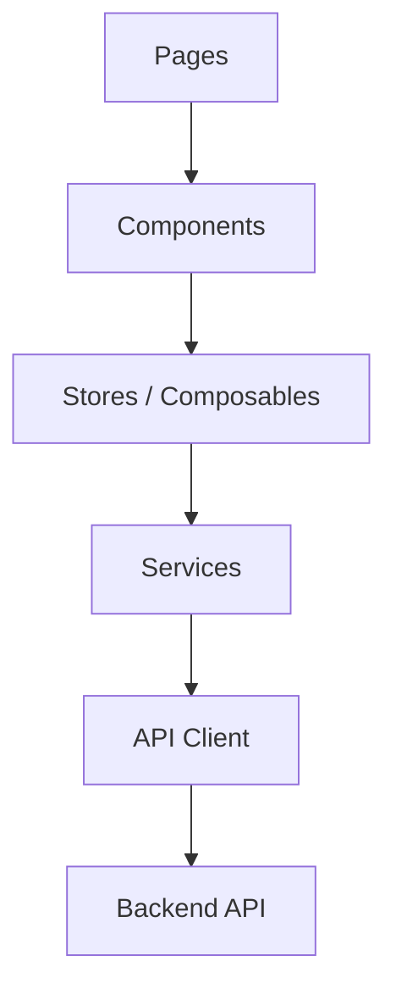
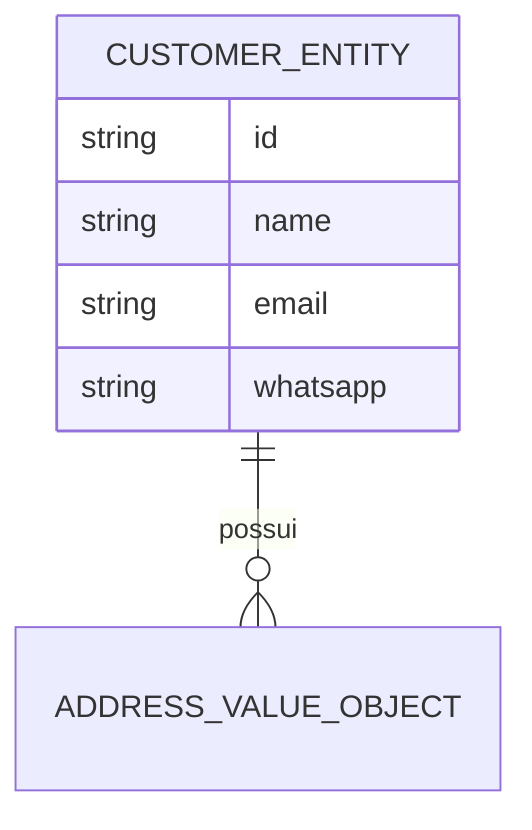
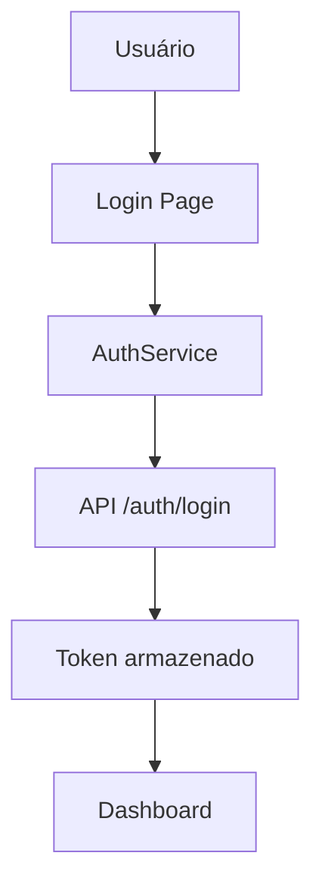
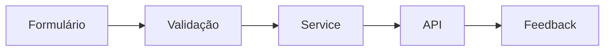

# SimplyFood Frontend - Technical Guide

<!--
Este documento consolida a visão técnica do frontend do projeto Simplify Food.
Ele serve como referência para arquitetura, módulos, fluxos, integração com a API,
autenticação e manutenção da interface.
-->

## 1. Project Overview

### Objetivo
O frontend do SimplyFood é responsável por oferecer a experiência visual e interativa para os usuários do sistema, consumindo a API do backend e organizando o fluxo de navegação por módulos.

### Escopo
- autenticação de usuários
- cadastro e gestão de clientes
- gestão de produtos e pedidos
- painéis e telas operacionais
- integração com a API Laravel

### Arquitetura geral
O frontend utiliza uma estrutura modular com Vue 3, TypeScript e Pinia para organização de estado.



### Responsabilidades do Frontend
- renderizar telas e componentes
- encapsular regras de apresentação
- consumir endpoints da API
- tratar estados de loading, erro e sucesso
- preservar experiência de usuário em fluxos críticos

### Convenções adotadas
- módulos por feature
- componentes reutilizáveis em shared
- stores para estado global
- services para integração HTTP
- testes com Vitest

---

## 2. Sprints

### Sprint 01 - Base da interface
- ID: F01
- Nome: UI Foundation
- Objetivo: estruturar o frontend e disponibilizar telas base
- Status: Em andamento
- Responsável: Frontend Team
- Dependências: backend inicial
- Checklist:
  - [x] estrutura base do Vue 3
  - [x] configuração de rotas
  - [x] layout base
  - [ ] integração completa com autenticação
- Prioridade: Alta
- Entregues: layout inicial, rotas, componentes compartilhados
- Pendentes: fluxos completos de autenticação e módulos de negócio
- Riscos: divergência entre contratos da API e UI
- Bloqueios: dependência de endpoints estáveis

### Sprint 02 - Módulos operacionais
- ID: F02
- Nome: Business Modules
- Objetivo: entregar fluxos de clientes, produtos e pedidos na interface
- Status: Planejado
- Responsável: Frontend Team
- Dependências: F01
- Checklist:
  - [ ] módulo de clientes
  - [ ] módulo de produtos
  - [ ] módulo de pedidos
  - [ ] dashboard principal
- Prioridade: Alta

---

## 3. Features

<!--
As features abaixo representam os principais fluxos da interface.
Qualquer alteração deve preservar a experiência do usuário e o contrato com a API.
-->

### Feature 1 - Autenticação
- Nome: Authentication Flow
- Descrição: tela de login e fluxo de acesso ao sistema
- Objetivo: autenticar usuários e redirecionar para o painel
- Fluxo: login -> validação -> token -> dashboard
- Dependências: backend auth
- Arquivos envolvidos: src/modules/auth
- Componentes: LoginForm, AuthLayout
- Stores: auth store
- Services: AuthService
- Status: Parcialmente implementado

### Feature 2 - Cadastro de Clientes
- Nome: Customer Registration
- Descrição: formulário de cadastro de cliente
- Objetivo: capturar informações do cliente e enviar à API
- Fluxo: formulário -> validação -> API -> feedback
- Dependências: backend customers
- Arquivos envolvidos: src/modules/customers
- Componentes: CustomerForm
- Stores: customer store
- Services: CustomerApi
- Status: Parcialmente implementado

### Feature 3 - Dashboard
- Nome: Dashboard
- Descrição: painel principal com visão geral do sistema
- Objetivo: concentrar indicadores e ações rápidas
- Dependências: dados da API
- Arquivos envolvidos: src/modules/dashboard
- Componentes: DashboardPage
- Status: Parcialmente implementado

---

## 4. Acceptance Criteria

### Autenticação
- Dado um usuário cadastrado
- Quando preencher senha válida
- Então deve ser autenticado e redirecionado

- Dado usuário inválido
- Quando tentar entrar
- Então deve receber mensagem de erro

### Cadastro de Clientes
- Checklist funcional:
  - [ ] formulário valida campos obrigatórios
  - [ ] exibe erro para dados inválidos
  - [ ] envia dados à API corretamente
  - [ ] mostra feedback de sucesso ou falha

---

## 5. API Specification

### Integrações principais
| Endpoint | Method | Cliente | Status |
| --- | --- | --- | --- |
| /api/auth/login | POST | AuthService | Ativo |
| /api/auth/register | POST | AuthService | Ativo |
| /api/customers | GET/POST | CustomerApi | Parcial |
| /api/products | GET/POST | ProductApi | Parcial |
| /api/orders | GET/POST | OrderApi | Parcial |

### Exemplo de payload
```json
{
  "email": "admin@email.com",
  "password": "********"
}
```

### Exemplo de resposta
```json
{
  "status": "success",
  "data": {
    "token": "...",
    "user": {
      "id": 1,
      "name": "Administrador"
    }
  }
}
```

---

## 6. Data Models

### Modelo de domínio principal
- CustomerEntity
- AddressValueObject
- AuthUser

### Estrutura conceitual


---

## 7. Stack

### Frontend
- Vue 3
- TypeScript
- Vite
- Pinia
- Vue Router
- Tailwind
- Axios
- Vitest

### Infraestrutura
- Docker Compose
- Nginx
- Git
- GitHub

---

## 8. Coder Agent

### Frontend Agent
- Agent ID: FRONTEND-AGENT
- Nome: Frontend Engineer
- Responsabilidade: manter a interface, componentes, stores e integração com API
- Escopo: src/app, src/modules, src/shared, src/types
- Permissões: leitura e escrita em componentes e páginas
- Arquivos protegidos: rotas, layouts e integrações críticas
- Prioridade: Alta

### Documentation Agent
- Agent ID: DOC-AGENT
- Nome: Documentation Maintainer
- Responsabilidade: manter esta documentação atualizada
- Escopo: AGENTS.md, README.md
- Permissões: editar documentação
- Arquivos protegidos: estrutura e regras de arquitetura
- Prioridade: Média

---

## 9. File Structure

```text
frontend/
  src/
    app/
    modules/
    shared/
    assets/
    types/
    tests/
  public/
```

### Comentários de estrutura
- src/app: configuração global, roteamento e layouts
- src/modules: módulos por feature
- src/shared: componentes, stores e utilidades reaproveitáveis
- src/tests: testes unitários e de integração

---

## 10. Authentication

### Fluxo de autenticação


### Regras atuais
- login com e-mail e senha
- token armazenado no cliente
- rotas protegidas devem exigir autenticação

---

## 11. Validation

### Validações de formulário
- e-mail: obrigatório e formatado
- senha: obrigatória
- nome: obrigatório em cadastros

---

## 12. Fluxos principais

### Fluxo de cadastro de cliente


---

## 13. Arquitetura

### Arquitetura Frontend
- camada de apresentação: páginas e componentes
- camada de aplicação: stores, composables e services
- camada de infraestrutura: cliente HTTP e integração com backend

### Comunicação entre camadas
- components delegam eventos para stores/services
- services isolam comunicação com a API
- stores centralizam estado de tela e autenticação

---

## 14. Auditoria Estrutural do Projeto

### Relatório de auditoria recomendada
| Arquivo | Motivo | Dependências | Impacto | Pode ser removido? |
| --- | --- | --- | --- | --- |
| arquivos temporários | gerados localmente | dependem do ambiente | baixo | Sim |
| caches de build | artefatos de compilação | não versionados | baixo | Sim |
| arquivos de ambiente | configuração local | não devem ser compartilhados | alto | Não |
| dependências não utilizadas | podem aumentar o custo de manutenção | revisão manual | médio | Talvez |

### Limpeza estrutural
- remover apenas artefatos locais e temporários
- não remover módulos funcionais sem avaliação explícita
- priorizar manutenção e rastreabilidade

